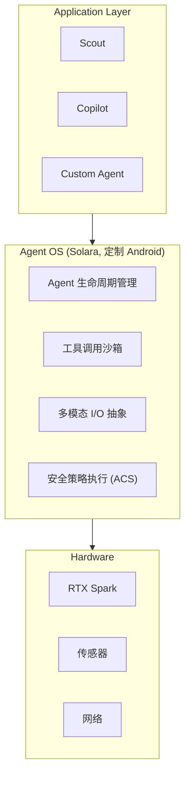

## 定义

专为 AI Agent 运行而设计的操作系统，提供 Agent 生命周期管理、设备控制、安全隔离和用户交互的底层基础设施。

与传统操作系统的核心区别：
- **Agent-first 设计**：UI/UX 围绕 Agent 交互而非人类直接操作
- **安全沙箱**：Agent 的工具调用和资源访问在受控环境中执行
- **多模态输入**：原生支持语音、视觉、触觉等多种 Agent 交互通道
- **持续运行**：Agent 作为常驻服务而非一次性进程

## 典型实现

### Microsoft Project Solara (2026)

Build 2026 发布的 Agent OS，基于 Android 而非 Windows。

**设计哲学**：
- "built from the ground up to power agent-driven experiences"
- 放弃 Windows 的传统桌面范式，选择 Android 的移动/嵌入式优势

**概念设备**：

1. **Desk Concept**
   - 类 Amazon Echo Show 的桌面设备
   - 面部识别解锁
   - 持续监听用户指令
   - 视觉反馈 Agent 状态

2. **Badge Concept**
   - 可穿戴工牌形态
   - 内置摄像头 + 指纹扫描
   - 低功耗唤醒 Agent
   - 企业级身份认证

**技术栈推测**：
- Android 内核 + 定制 Agent 运行时
- 本地 LLM 推理（结合 Surface RTX Spark）
- 云端 Agent 编排（Azure AI）
- 设备间 Agent 迁移协议

### Nvidia RTX Spark 生态

配合 Agent OS 的硬件基础：
- Arm-based RTX Spark 芯片
- 128GB 统一内存架构
- 100W 散热包络
- 针对本地 AI 模型推理优化

**意义**：Agent OS + 本地推理硬件 = 离线可用的 Agent 设备，降低对云端的依赖。

## 与 [[ai-agent]] 的关系

[[ai-agent]] 定义了 Agent 的逻辑架构（LLM + Planning + Memory + Tools），而 Agent OS 提供物理执行环境：

## 与 [[evaluation-benchmark]] 的关系

Agent OS 需要内置评估机制：
- **运行时监控**：跟踪 Agent 的工具调用、资源消耗、响应延迟
- **行为审计**：记录 Agent 决策轨迹，支持事后分析
- **回归测试**：ASERT 等框架可集成到 OS 层，自动验证 Agent 行为符合预期

## 设计挑战

1. **安全与能力的平衡**
   - Agent 需要广泛的工具访问权限
   - 但必须防止恶意行为和数据泄露
   - 解决：分层权限 + 动态沙箱

2. **实时性要求**
   - 语音交互需要 <500ms 响应
   - 本地推理 vs 云端调用的延迟权衡
   - 解决：混合架构（本地小模型 + 云端大模型）

3. **多 Agent 协作**
   - 同一设备上多个 Agent 如何共享资源
   - 如何避免冲突和死锁
   - 解决：Agent 调度器 + 资源配额

4. **用户体验**
   - Agent 状态可视化（思考中、执行中、等待中）
   - 中断和恢复机制
   - 解决：统一的状态指示 API

## 相关概念

- [[ai-agent]] — Agent OS 运行的核心实体
- [[evaluation-benchmark]] — Agent 行为验证和监控
- [[rag]] — Agent OS 可内置向量数据库支持
- [[fine-tuning]] — 本地 Agent 可针对用户数据微调

## 未来方向

- **跨设备 Agent 迁移**：Agent 状态在手机、桌面、车载之间无缝切换
- **联邦学习集成**：本地 Agent 贡献梯度但不上传原始数据
- **硬件加速**：专用 NPU 针对 Agent 工作负载优化（注意力计算、KV cache 管理）
- **Agent 应用商店**：类似 iOS App Store 的 Agent 分发平台

> 来源: [The Verge 2026-06-02](https://www.theverge.com/news/941830/microsoft-project-solara-os-ai-agent-gadgets) | [The Verge Dev Box](https://www.theverge.com/news/941271/microsoft-surface-rtx-spark-dev-box-specs-availability)
