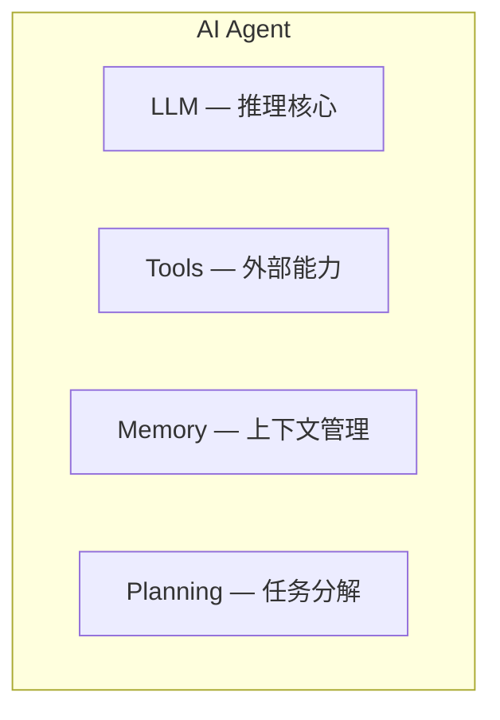

## 定义

以 [[language-model]] (LLM) 为"大脑"，具备**感知环境、制定计划、使用工具、执行行动**的自主 AI 系统。Agent 不仅仅是对话——它能够与环境交互，迭代完成任务。

## 核心组件

> AI Agent 由四大核心组件构成：LLM 作为推理核心，Tools 扩展外部能力，Memory 管理上下文，Planning 负责任务分解。

- **LLM (Reasoning Core)**: 基于 [[transformer]] 架构的语言模型，负责理解意图和生成行动计划
- **Tools**: 搜索引擎、代码执行、API 调用等外部工具——扩展 LLM 的能力边界
- **Memory**: 短期（对话上下文）和长期（向量数据库）记忆管理
- **Planning**: 将复杂任务分解为可执行的子步骤，类似 [[inference-reasoning]] 中的 chain-of-thought

## 跨课程视角

> 以下课程深入讲解了 AI Agent，点击课程名查看完整笔记。

### [[hylee-genai-ml-2025|李宏毅 GenAI 2025]] (第2讲 Context Engineering)

从上下文工程角度讲解 Agent 设计——如何通过精心构造的 prompt 和上下文让 LLM 有效执行 Agent 任务。Context Engineering 是构建可靠 Agent 的核心技术。

^[raw/transcripts/hylee-genai-2025/02-Context-Engineering.md]

### [[hylee-ml-2025|李宏毅 ML 2025]] (第2讲 AI Agent)

Agent 的三大核心能力：
1. **经验调整** — 从历史交互中学习
2. **工具使用** — 调用外部 API 和工具
3. **规划** — 将复杂目标分解为行动序列

^[raw/transcripts/hylee-ml-2025/02-ai_agent.md]

### [[karpathy-llm-talks|Karpathy LLM Talks]] (L3 How I use LLMs)

Karpathy 个人的 LLM 使用工作流，展示了 Agent 思维在日常工作中的应用——将 LLM 作为可编程的智能助手，通过 prompt 设计和工具集成实现复杂任务的自动化。

^[raw/transcripts/karpathy-llm-talks/03-how-i-use-llms-fE9fSxOaNxQ.md]

## Agent Paradigms

- **ReAct** (Reasoning + Acting): 交替进行推理和行动，每步生成 thought → action → observation
- **Tool-use**: LLM 输出结构化的工具调用指令，由外部系统执行
- **Code Agent**: LLM 直接生成代码来完成任务（如 Open Interpreter）
- **Multi-Agent**: 多个 Agent 协作完成复杂任务（如 CrewAI、AutoGen）

## 与 RAG 的关系

[[rag]] 可以看作 Agent 的一种**工具**——检索增强本质上是通过外部知识库扩展 Agent 的信息获取能力。而 Agent 是更通用的框架：

$$\text{Agent} = \text{LLM} + \text{Planning} + \text{Memory} + \text{Tools (包括 RAG)}$$

## 与 [[fine-tuning]] 的关系

Agent 的能力可以通过 [[fine-tuning]] 增强：
- 用 Agent 交互轨迹数据微调 LLM，提升工具调用准确性
- 针对特定领域的 Agent 行为进行 SFT (Supervised Fine-Tuning)
- 通过 RLHF 对齐 Agent 的行为偏好

## Agent 治理与控制（2026 新进展）

### Agent Control Specification (ACS)

Microsoft 在 Build 2026 发布的开放规范，允许开发者、合规和安全团队通过**便携式策略文件（portable policy files）**定义 Agent 行为策略。

核心思路：
- **策略即代码**：Agent 的行为约束不硬编码在模型或框架中，而是用独立的策略文件描述
- **可移植**：策略文件可跨平台、跨 Agent 框架复用
- **角色分离**：开发者定义能力边界，合规团队定义数据策略，安全团队定义访问控制——三者独立维护

与 [[ai-agent]] 的关系：ACS 是 Agent 从原型走向生产环境的必要基础设施。企业级部署需要审计、合规和可解释性，ACS 提供了标准化的实现路径。

### ASERT 评估框架

Microsoft 同期发布的开源框架（Adaptive Spec-driven Scoring for Evaluation and Regression Testing），用**文本描述**即可创建 AI 行为测试用例。

核心价值：降低 Agent 评估的门槛——不需要写测试代码，用自然语言描述期望行为即可生成回归测试。

> 来源: [TechCrunch 2026-06-02](https://techcrunch.com/2026/06/02/microsoft-offers-devs-a-better-way-to-control-ai-agent-behavior/) | [TechCrunch ASERT](https://techcrunch.com/2026/06/02/new-microsoft-tool-lets-devs-spin-up-ai-behavior-tests-using-text-descriptions/)

## Agent OS 与设备层（2026 新进展）

### Project Solara

Microsoft Build 2026 发布的全新操作系统，**基于 Android（非 Windows）**，专为 AI Agent 设备设计。

概念设备：
- **Desk Concept**：类 Echo Show 的桌面设备，面部识别解锁，接入 AI Agent
- **Badge Concept**：可穿戴工牌设备，内置摄像头和指纹扫描，唤醒 AI Agent

设计哲学："a new platform built from the ground up to power agent-driven experiences"

### Surface RTX Spark Dev Box

面向本地 AI 开发的迷你 Surface PC：
- Nvidia Arm-based RTX Spark 芯片
- 128GB 统一内存
- 100W 散热包络
- 针对本地 AI 模型运行优化

> 来源: [The Verge 2026-06-02](https://www.theverge.com/news/941830/microsoft-project-solara-os-ai-agent-gadgets) | [The Verge Dev Box](https://www.theverge.com/news/941271/microsoft-surface-rtx-spark-dev-box-specs-availability)

## 相关链接

- [[language-model]] — Agent 的推理核心
- [[transformer]] — LLM 的基础架构
- [[fine-tuning]] — 增强 Agent 能力的训练方法
- [[inference-reasoning]] — Agent 的推理和规划过程
- [[evaluation-benchmark]] — ASERT 属于 Agent 评估工具
- [[agent-os]] — Agent 专用操作系统概念
