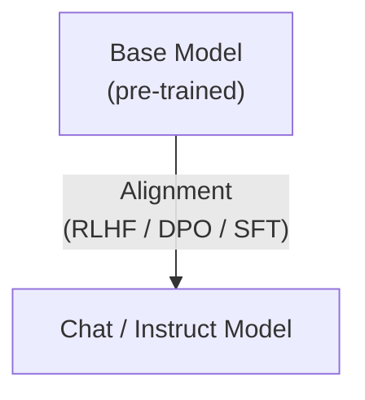
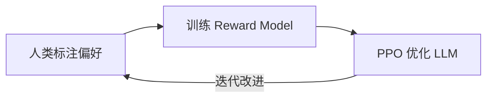

# 对齐 (Alignment)

## 定义

Alignment（对齐）是指让 [[language-model]] 的行为与人类意图 (human intent) 保持一致的过程。一个 pre-trained 的 base model 经过 alignment 后，变成一个能够遵循指令、拒绝有害请求、以人类期望方式回答问题的 chat model 或 instruct model。

Alignment 也可以看作是 [[fine-tuning|Post-training]] 的一种特殊形式——目标不是教模型新领域知识，而是让模型学会「怎么做人」。

## 核心方法

### RLHF (Reinforcement Learning from Human Feedback)

通过人类偏好数据训练一个 **Reward Model**，再用强化学习（如 PPO）优化 [[language-model]] 使其生成 reward model 评分更高的回答。

- **优点**：灵活，可以编码复杂的人类偏好
- **缺点**：训练流程复杂、不稳定，reward model 可能被 [[reward-hacking|hack]]

### DPO (Direct Preference Optimization)

跳过 reward model，直接从人类偏好数据优化 LLM 的策略。数学上等价于隐式地学习一个 reward model，但训练更简单稳定。

- **优点**：无需单独训练 reward model，训练流程更简洁
- **缺点**：对偏好数据质量要求高

### Reward Model（奖励模型）

Reward model 是 RLHF 的核心组件，学习人类对回答质量的判断标准。它评估一个回答的 helpfulness（有用性）和 harmlessness（无害性），输出一个标量分数。

### SFT-based Alignment

用高质量的 instruction-response 数据做 [[fine-tuning|Supervised Fine-Tuning]]，是最基础的 alignment 方法。例如 Alpaca dataset 就是通过 ChatGPT 生成指令数据来对齐模型。

## Helpfulness vs Harmlessness 的权衡

Alignment 面临的核心矛盾：

| 维度 | Helpfulness（有用性） | Harmlessness（无害性） |
|------|----------------------|----------------------|
| 目标 | 尽可能帮用户解决问题 | 拒绝有害请求、不说错话 |
| 风险 | 过度 helpful → 可能输出危险内容 | 过度 harmless → 拒绝合理请求 |
| 例子 | 教用户制作物品（可能被滥用） | 连正常问题都拒绝回答 |

这个 tradeoff 没有完美的解法，需要在训练数据和 reward model 设计中仔细平衡。

## Alignment 的脆弱性：Safety Alignment 最容易被破坏

根据李宏毅教授的课程，**Safety Alignment 是 post-training 中最容易被破坏的能力**：

- 原版 LLaMA-2 Chat 在 ToxiGen 测试中说错话的概率仅 **0.22%**
- 用中文数据做 pre-train style post-training 后，说错话的概率大幅上升
- 即使用干净的 Alpaca 数据做 SFT，safety alignment 也会在多个维度上突然变差
- 仅仅给模型改个名字（ChatGPT → AOA），所有 safety alignment 能力就消失了

> "就像给 AI 做大脑手术——手术成功了，但病人死了。你 focus 在一件你要做的事情，但模型除了你教的东西以外，其他能力都不好使了。"

这本质上是 [[fine-tuning|catastrophic forgetting]]（灾难性遗忘）在 alignment 维度上的体现。

## Alignment Tax（对齐税）

Alignment 并非没有代价。为了让模型「听话」和「安全」，通常需要牺牲一部分原始能力：

- **性能损失**：对齐后的模型可能在某些基准测试上表现不如 base model
- **过度拒绝**：alignment 可能导致模型拒绝本可以回答的合理问题
- **训练开销**：需要额外的人类标注数据和训练流程
- **遗忘风险**：后续 [[fine-tuning|post-training]] 很容易破坏已建立的 alignment

## 跨课程视角

> 以下课程深入讲解了 alignment 相关技术，点击课程名查看完整笔记。

### [[hylee-ml-2025|李宏毅 ML 2025]] (第6讲)

Post-training 与遗忘问题。深入讨论了 alignment 在 post-training 中的脆弱性——为什么 safety alignment 是最容易被破坏的能力，以及 experience replay、self-output、paraphrase 等方法如何帮助保持 alignment。特别指出 RL-based 的 post-training 与 self-output 方法在防止遗忘上有天然的相似性。

^[raw/transcripts/hylee-ml-2025/hylee-ml-2025-06-后训练与遗忘-Z6b5-77EfGk.md]

### [[fine-tuning|微调 (Fine-tuning)]]

Alignment 是 [[fine-tuning|LLM 训练三阶段]] 的最终阶段（Pre-training → SFT → Alignment）。Alignment 本身也可以看作一种特殊的 post-training——foundation model 不一定是 base model，也可以是已经 aligned 的 chat model。

### [[language-model|语言模型 (Language Model)]]

Alignment 的载体。从 base model 到 chat/instruct model 的转变完全依赖 alignment 技术。理解 [[language-model]] 的 next token prediction 机制是理解 RLHF 和 DPO 如何工作的基础。

### [[inference-reasoning|推理 (Inference & Reasoning)]]

RLHF/DPO 等方法也越来越多地被用来增强模型的 [[inference-reasoning|reasoning]] 能力（如 DeepSeek-R1 的 RL 训练），将 alignment 的概念从「安全对齐」扩展到「能力对齐」——让模型的推理过程符合人类期望的思维链模式。

## 相关概念

- [[fine-tuning]] — Alignment 是微调的最终阶段，也是 post-training 的子集
- [[language-model]] — 被对齐的基础模型
- [[neural-network]] — Alignment 训练的底层架构
- [[overfitting-regularization]] — Alignment 训练中同样面临过拟合问题
- [[inference-reasoning]] — RL-based alignment 用于增强推理能力
- [[reward-hacking]] — Reward model 被利用的对抗现象
