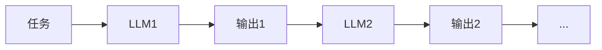
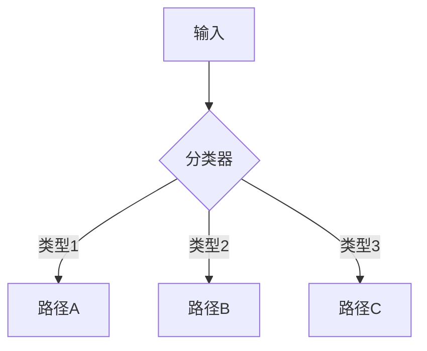
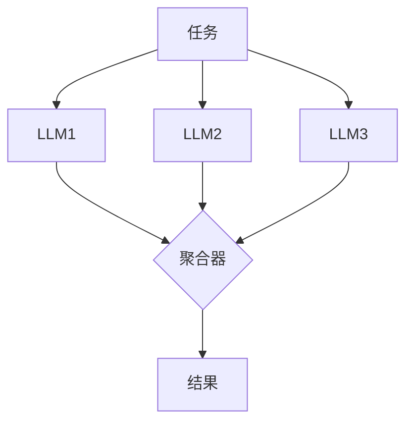
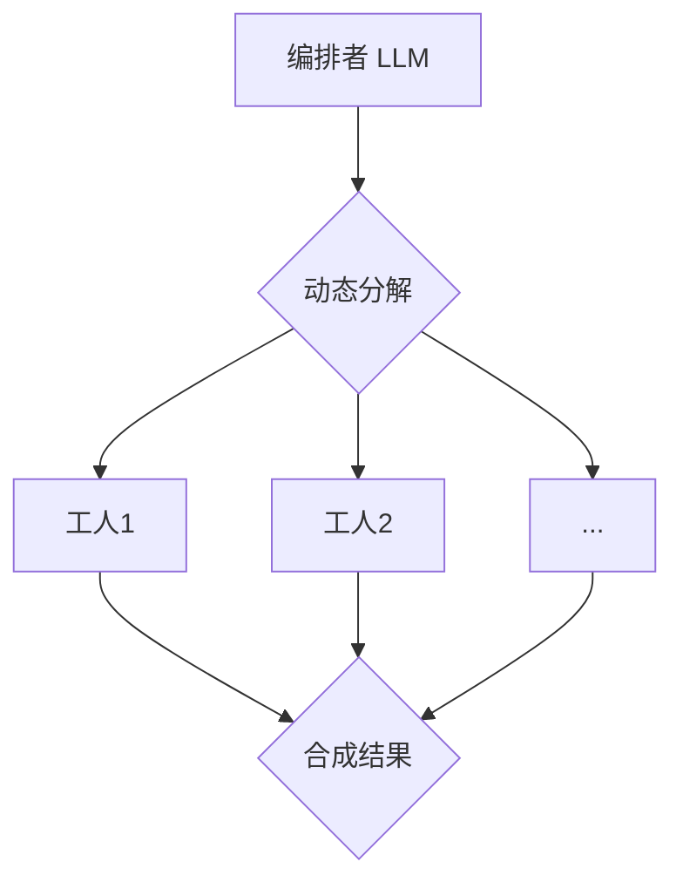
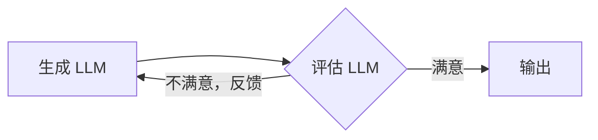

# Building Effective Agents

> Anthropic 在 2024 年 12 月发布的实战指南，总结了与数十个团队合作构建 LLM Agent 的经验。核心观点：**最成功的实现不使用复杂框架，而是用简单、可组合的模式构建**。

## 核心架构模式

### 1. 工作流 vs Agent

**Workflows（工作流）**
- LLM 和工具通过**预定义代码路径**编排
- 确定性、可预测
- 适合明确定义的任务

**Agents（Agent）**
- LLM **动态指导**自己的流程和工具使用
- 灵活性高，但可能不可预测
- 适合需要灵活性和模型驱动决策的场景

**关键洞察**：大多数应用场景，优化单次 LLM 调用 + 检索 + 上下文示例就够了，不需要 Agent。

### 2. 五种工作流模式

#### (1) Prompt Chaining（提示链）

> 提示链模式：将复杂任务分解为顺序步骤，每一步的输出成为下一步的输入。

- 将复杂任务分解为顺序步骤
- 每一步的输出成为下一步的输入
- **适用场景**：文档生成、多步推理

#### (2) Routing（路由）

> 路由模式：根据输入类型动态选择处理流程。

- 根据输入类型选择不同处理流程
- **适用场景**：客服系统（简单问题 vs 复杂问题）

#### (3) Parallelization（并行化）

> 并行化模式：多个 LLM 并行处理同一任务，结果聚合。

- 多个 LLM 并行处理，结果聚合
- **两种子模式**：
  - **Sectioning**：分解任务为独立子任务
  - **Voting**：同一任务多次运行，取共识
- **适用场景**：代码审查、风险评估

#### (4) Orchestrator-Workers（编排者-工人）

> 编排者-工人模式：中央 LLM 动态分解任务并协调工人执行。

- 中央 LLM 动态分解任务并协调工人
- **适用场景**：搜索任务、代码生成

#### (5) Evaluator-Optimizer（评估者-优化者）

> 评估者-优化者模式：生成与评估循环迭代，直到满足质量标准。

- 一个 LLM 生成，另一个评估并提供反馈
- **适用场景**：代码优化、创意写作

### 3. 自主 Agent

当任务需要**复杂探索**、**多步推理**、**信任模型决策**时使用：
- 模型自己决定使用哪些工具
- 自己决定何时停止或继续
- **适用场景**：SWE-bench 任务、复杂对话

**现实检查**：
- Agent 通常通过更复杂的提示实现
- 需要仔细设计工具和权限边界
- 人机协作（human-in-the-loop）通常是必需的

## 关键建议

### 何时不使用 Agent
- 任务明确、流程固定 → 用工作流
- 对延迟敏感 → Agent 增加延迟
- 对成本敏感 → Agent 调用多次 LLM
- 需要可预测性 → Agent 可能不可预测

### 何时使用框架
- **不建议**：LangChain、CrewAI 等框架添加了额外抽象层，可能隐藏底层提示和响应，难以调试
- **建议**：直接使用 LLM API，大多数模式只需几行代码
- 如果使用框架，**确保理解底层代码**

### 设计原则
1. **从简单开始**：先优化单次 LLM 调用
2. **明确定义成功标准**：什么时候 Agent 应该停止？
3. **设计工具接口**：清晰、一致、易于使用
4. **记录错误和边界情况**：为未来改进提供数据
5. **人机协作**：关键决策点加入人类审查

## 实际应用案例

### 案例 1：客户支持
- **工作流**：分类问题 → 路由到对应处理流程
- **Agent**：动态调用知识库、订单系统、退款 API

### 案例 2：代码生成
- **工作流**：生成 → 测试 → 修复（循环）
- **Agent**：自主探索代码库、运行测试、迭代改进

## 与已有知识的关联

### [[eugene-yan-simon-willison]]
- Eugene Yan 提到的 **RAG 模式**与本文的 Routing 模式互补
- Eugene 强调**可观测性**，本文强调**工具设计**，两者结合是完整的 Agent 工程实践

### [[lilian-weng-blog#4. Reward Hacking in RL (2024)]]
- Agent 自主决策时容易出现 reward hacking（例如：生成冗长但无用的回答）
- 需要设计**过程奖励模型**而非仅依赖最终结果

### [[ai-agent]]
- 本文提供了更实用的架构模式，补充了理论层面的 Agent 定义
- **Workflows vs Agents** 的区分是理解 Agent 的关键

## 行动建议

1. **评估现有项目**：是否真的需要 Agent？工作流是否足够？
2. **选择模式**：根据任务特性选择合适的工作流模式
3. **实现 MVP**：直接用 LLM API 实现，避免框架开销
4. **添加可观测性**：记录每次 LLM 调用、工具使用、决策路径
5. **迭代优化**：根据错误日志改进提示和工具设计

## 延伸阅读

- [[eugene-yan-simon-willison]] - LLM 工程实践（评估驱动开发、Guardrails）
- [[lilian-weng-blog]] - Agent 架构深度分析（Planning/Memory/Tool Use）
- [[anthropic-prompt-engineering]] - 提示工程最佳实践

---

**原始文件**：`raw/articles/anthropic-building-agents.md` (20KB)
