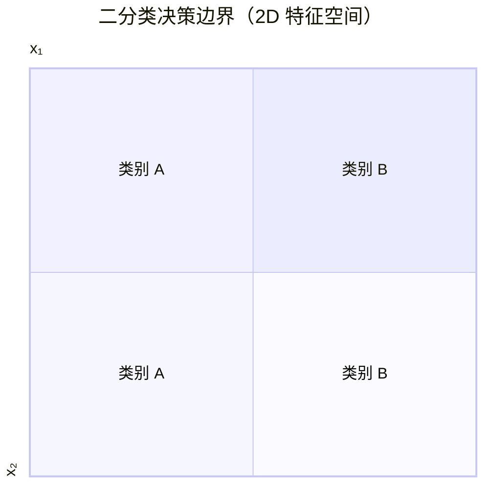
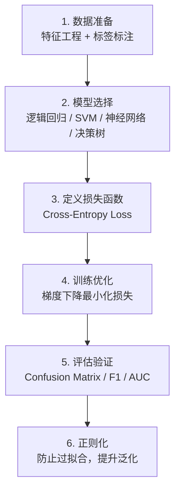

# Classification (分类)

## 定义

Classification（分类）是一种监督学习任务，目标是根据输入数据的特征将其分配到预定义的离散类别中。分类模型学习从特征空间到类别标签的映射关系，是机器学习中最基础也最广泛应用的任务之一。

## 分类类型

### Binary Classification（二分类）

只有两个类别的分类问题，通常标记为正类 (positive) 和负类 (negative)。

- 典型应用：垃圾邮件检测、疾病诊断、信用评估
- 输出层：单个神经元 + [[activation-functions|sigmoid]] 激活函数
- [[loss-function]]：Binary Cross-Entropy (BCE)
- 决策规则：$P(y=1|x) \geq 0.5$ 则预测为正类

### Multiclass Classification（多分类）

类别数 $K > 2$ 的分类问题。

- 典型应用：图像分类（ImageNet 1000 类）、文本主题分类、手写数字识别
- 输出层：$K$ 个神经元 + softmax 激活函数
- [[loss-function]]：Categorical Cross-Entropy
- 策略：
  - **One-vs-Rest (OvR)**：为每个类别训练一个二分类器
  - **Multinomial**：直接建模 $K$ 个类别的概率分布

### Multi-label Classification（多标签分类）

一个样本可以同时属于多个类别（如一张图片同时包含"猫"和"户外"标签）。每个标签独立使用 sigmoid + BCE loss。

## Decision Boundary（决策边界）

决策边界是特征空间中将不同类别分开的超曲面。

- **线性决策边界**：逻辑回归、线性 SVM 产生超平面
- **非线性决策边界**：核 SVM、[[neural-network]]、决策树可产生复杂曲面
- 模型复杂度越高，决策边界越灵活，但也越容易[[overfitting-regularization|过拟合]]

## Evaluation Metrics（评估指标）

### Confusion Matrix（混淆矩阵）

分类结果的完整统计，是所有指标的基础：

| | 预测：正类 (P') | 预测：负类 (N') |
|---|---|---|
| **实际：正类 (P)** | TP (True Positive) | FN (False Negative) |
| **实际：负类 (N)** | FP (False Positive) | TN (True Negative) |

- **TP** = True Positive（正确预测为正类）
- **FP** = False Positive（误判为正类，假阳性）
- **FN** = False Negative（漏判正类，假阴性）
- **TN** = True Negative（正确预测为负类）

### 核心指标

| 指标 | 公式 | 含义 |
|------|------|------|
| **Accuracy** | $\frac{TP+TN}{TP+FP+FN+TN}$ | 总体正确率，类别不平衡时不可靠 |
| **Precision** | $\frac{TP}{TP+FP}$ | 预测为正的样本中有多少是真正的 |
| **Recall (Sensitivity)** | $\frac{TP}{TP+FN}$ | 真正为正的样本中有多少被找到 |
| **F1 Score** | $2 \cdot \frac{Precision \times Recall}{Precision + Recall}$ | Precision 和 Recall 的调和平均 |
| **Specificity** | $\frac{TN}{TN+FP}$ | 负类被正确识别的比例 |

### Precision-Recall Tradeoff

Precision 和 Recall 通常此消彼长。调整分类阈值：
- **高阈值** → 高 Precision、低 Recall（宁可漏判也不误判）
- **低阈值** → 低 Precision、高 Recall（宁可误判也不漏判）

实际应用中根据业务需求选择侧重点：
- 医疗诊断：优先 Recall（宁可误报也不漏诊）
- 垃圾邮件过滤：优先 Precision（宁可漏放也不误删重要邮件）

### Multiclass 指标的扩展

对于多分类问题，需要聚合每个类别的指标：
- **Macro Average**：对每个类别分别计算指标后取平均（每个类别权重相同）
- **Micro Average**：汇总所有类别的 TP/FP/FN 后统一计算（每个样本权重相同）
- **Weighted Average**：按各类别样本数加权平均

### ROC 曲线与 AUC

- **ROC 曲线**：以 False Positive Rate (FPR) 为横轴，True Positive Rate (TPR/Recall) 为纵轴，绘制不同阈值下的分类表现
- **AUC (Area Under Curve)**：ROC 曲线下面积，范围 [0.5, 1.0]，衡量模型在所有阈值下的综合排序能力
- AUC = 0.5 表示随机猜测，AUC = 1.0 表示完美分类

## 分类模型训练流程

## 跨课程视角

### [[andrew-ng-ml-specialization|Andrew Ng ML Specialization]]

课程前两门课深入讲解了分类任务：从逻辑回归（logistic regression）作为二分类的入门模型，到多分类的 softmax 回归，再到使用[[neural-network]]进行分类。强调了[[loss-function|交叉熵损失]]的推导过程和梯度计算，以及如何通过[[overfitting-regularization|正则化]]避免分类模型在训练集上表现过好的问题。

## 与相关概念的关系

分类是许多高级 AI 任务的基础：
- 目标检测 = 分类 + 定位
- 语义分割 = 逐像素分类
- 文本分类 = NLP 中的核心任务之一
- [[language-model]] 的下一个 token 预测本质上也是一个超大规模的多分类问题

## 相关概念

- [[loss-function]] — 分类任务通常使用 Cross-Entropy Loss
- [[neural-network]] — 强大的分类模型架构
- [[overfitting-regularization]] — 分类模型泛化能力的关键
- [[andrew-ng-ml-specialization]] — 系统学习分类的课程资源
- [[activation-functions]] — sigmoid/softmax 用于分类输出层
- [[gradient-descent]] — 训练分类模型的优化方法
