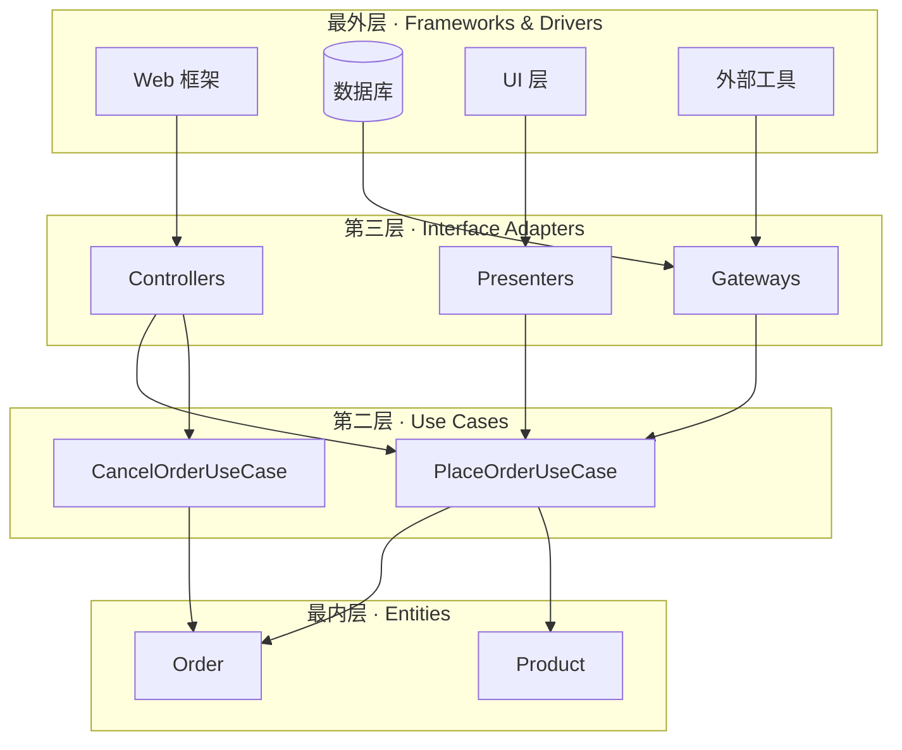

# 整洁架构（Clean Architecture）

## 定义

整洁架构（Clean Architecture）由 Robert C. Martin（Uncle Bob）在2012年提出，是一种以**业务实体（Entity）**为圆心、通过**同心圆分层**组织代码的架构风格。其核心主张：**源代码依赖方向只能从外层指向内层，内层不知道外层的存在。**

整洁架构是对多种"依赖向内"架构思想的统一命名，包括 [[hexagonal-architecture|六边形架构]]、[[onion-architecture|洋葱架构]] 等，本质上都是同一原则的不同表达。

## 核心原则

### 1. 同心圆分层



> 上图展示 Clean Architecture 四层同心圆结构及依赖方向。源代码依赖只能从外层指向内层，内层不知道外层的存在。

从内到外四层：

| 层级 | 名称 | 内容 | 变化频率 |
|------|------|------|----------|
| 最内层 | Entities | 企业业务规则，纯数据+行为 | 最低 |
| 第二层 | Use Cases | 应用级业务规则，编排Entity | 低 |
| 第三层 | Interface Adapters | Controller、Presenter、Gateway | 中 |
| 最外层 | Frameworks & Drivers | Web框架、DB、UI、外部工具 | 最高 |

### 2. 依赖规则（Dependency Rule）

- 外层依赖内层，内层**不能**知道外层
- Entity 不依赖任何东西
- Use Case 只依赖 Entity
- Interface Adapter 依赖 Use Case 和 Entity
- Framework 依赖 Adapter

### 3. 跨边界通信（Boundary Crossing）

- 外层调用内层：直接调用（依赖方向一致）
- 内层调用外层：通过**依赖倒置（Dependency Inversion）**，内层定义接口，外层实现
- 数据穿越边界时，必须是内层定义的简单数据结构（DTO），不能把外层的 ORM Entity 传进内层

### 4. Use Case 作为核心编排单元

```java
// Use Case 示例 —— 纯业务编排，零框架依赖
class PlaceOrderUseCase implements InputBoundary {
    private final OrderRepository repo;       // 出站端口（接口）
    private final OutputBoundary presenter;   // 入站端口（接口）
    
    void execute(PlaceOrderRequest req) {
        Order order = new Order(req.items());  // Entity 业务逻辑
        order.calculateTotal();
        repo.save(order);                      // 通过端口调用外层
        presenter.present(new PlaceOrderResponse(order));
    }
}
```

## 与其他架构模式的比较

| 对比维度 | Clean Architecture | [[hexagonal-architecture]] | [[onion-architecture]] | 传统三层架构 |
|----------|-------------------|---------------------------|----------------------|-------------|
| 提出者 | Robert C. Martin | Alistair Cockburn | Jeffrey Palermo | — |
| 核心隐喻 | 同心圆 | 六边形端口 | 洋葱层 | 水平分层 |
| 分层数量 | 4层（明确命名） | 3概念（Port/Adapter/Domain） | 多层（灵活） | 3层 |
| 关注焦点 | Use Case 编排 | 端口与适配器替换 | 领域模型独立 | 技术分层 |
| 依赖方向 | 向内 | 向内 | 向内 | Service→DAO（向外） |
| 本质差异 | 强调 Use Case 为核心 | 强调可替换的适配器 | 强调领域模型为核心 | 技术驱动 |

> **关键洞察**：Clean Architecture、Hexagonal Architecture、Onion Architecture 三者共享同一个核心原则——**依赖指向内部**，区别仅在于隐喻方式和侧重点。

## 适用场景

**适合使用 Clean Architecture 的场景：**

- 业务规则复杂且频繁变化的企业级应用
- 需要长期维护、技术栈可能演进的项目
- 团队重视可测试性（Use Case 可脱离框架独立测试）
- 多人协作、需要清晰边界的大型项目
- 软考论文中需要展示架构设计能力的案例

**不适合使用的场景：**

- 简单 CRUD 应用（层数过多是负担）
- 原型开发或 MVP 阶段（交付速度优先）
- 团队规模小、沟通成本低的初创项目
- 纯技术工具/脚本类项目

## 与六边形架构的关系

Clean Architecture 与 [[hexagonal-architecture|六边形架构]] 的关系：

- **相同点**：都遵循依赖向内原则，核心业务逻辑与基础设施解耦
- **不同点**：
  - Clean Architecture 更强调 **Use Case** 作为第二层，明确区分"企业规则"和"应用规则"
  - 六边形架构更强调 **Port & Adapter** 的可替换性，以"六边形"隐喻多面接入
  - Clean Architecture 的 Interface Adapter 层 ≈ 六边形的 Adapter
  - Clean Architecture 的 Use Case + Entity ≈ 六边形的 Domain
- **实践建议**：两者可以结合使用——用六边形的 Port/Adapter 概念组织外部依赖，用 Clean Architecture 的 Use Case 概念组织业务编排

## 备考提示

软考可能考的角度：
- Clean Architecture 四层结构的定义和依赖方向
- 依赖倒置原则（DIP）在架构中的应用
- 与 MVC、三层架构的对比分析
- 给出场景，判断某段代码属于哪一层
- 论文素材：你在华为云微服务中如何实践分层解耦

## 相关概念

- [[hexagonal-architecture]] — 端口与适配器架构，Clean Architecture 的"同源兄弟"
- [[onion-architecture]] — 洋葱架构，同样强调依赖向内的同心圆结构
- [[ddd-tactical-patterns]] — DDD 战术模式为 Clean Architecture 的 Entity 和 Use Case 层提供建模工具
- [[microservice-architecture]] — 每个微服务内部可采用 Clean Architecture 组织代码
- [[ruankao-11month-strategy]] — 软考备考策略，架构设计是系统架构设计师/软件设计师的重点考点
