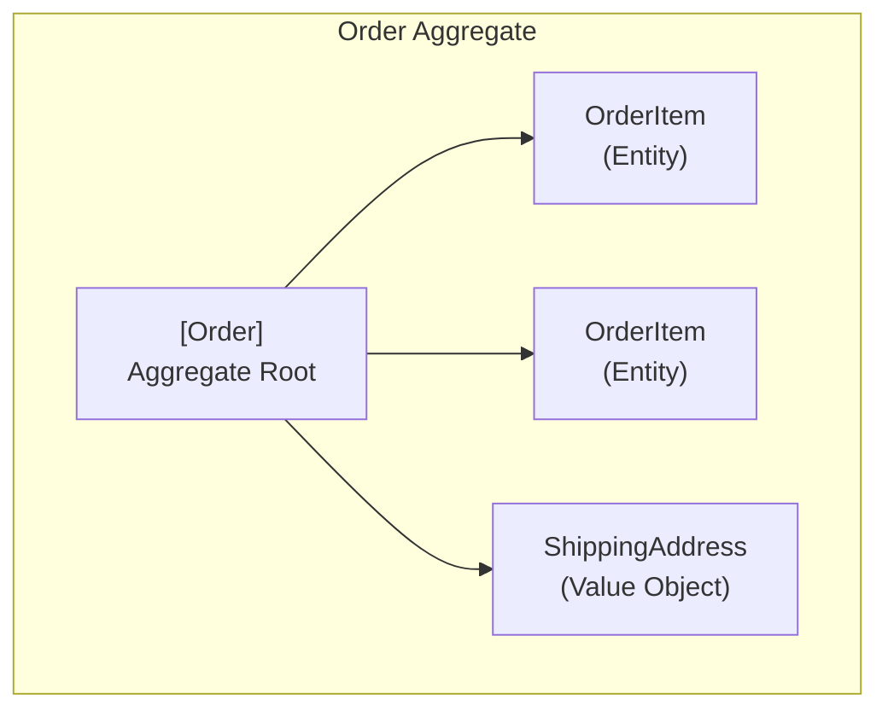
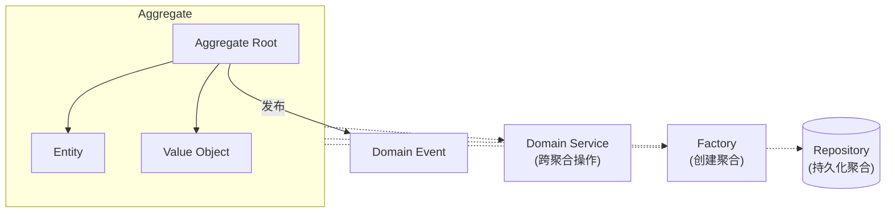

# DDD 战术设计模式（Tactical Patterns）

## 定义

DDD 战术设计模式（Tactical Design Patterns）源自 Eric Evans 2003 年的《Domain-Driven Design》一书，是**在单个 Bounded Context 内部进行领域建模的一组构建块（Building Blocks）**。它们回答了"如何用代码精确表达业务概念"这一问题。

与 DDD 战略设计（Strategic Design）不同，战术设计不关注系统间的划分（Bounded Context、Context Map），而关注**单个限界上下文内部的代码组织**。

## 核心模式

### 1. Entity（实体）

具有**唯一标识**、通过标识区分、具有生命周期的对象。

```java
class Order {  // Entity：有唯一 orderId
    private final String orderId;  // 标识不可变
    private OrderStatus status;
    private Money totalAmount;
    
    void confirm() {
        if (status != OrderStatus.PENDING) 
            throw new IllegalStateException("Only pending order can be confirmed");
        this.status = OrderStatus.CONFIRMED;
    }
    // equals/hashCode 基于 orderId
}
```

**关键特征**：
- 有唯一标识（ID）
- 可变状态（状态随业务流转）
- 相等性基于标识而非属性值

### 2. Value Object（值对象）

**没有唯一标识**、通过属性值相等、**不可变**的对象。

```java
record Money(BigDecimal amount, Currency currency) {
    Money add(Money other) {
        if (!this.currency.equals(other.currency))
            throw new IllegalArgumentException("Currency mismatch");
        return new Money(this.amount.add(other.amount), this.currency);
    }
    // equals/hashCode 基于所有属性
}
```

**关键特征**：
- 无唯一标识
- 不可变（Immutability）
- 相等性基于所有属性值
- 可以自由替换（两个相同的值对象等价）

### 3. Aggregate（聚合）

一组**作为数据修改单元**的相关对象集合，由 **Aggregate Root**（聚合根）统一管控外部访问。



> 外部只能通过 Order（Aggregate Root）操作内部对象。

**关键规则**：
- 外部只引用 Aggregate Root，不直接操作内部对象
- 聚合内部保证业务不变量（Invariants）的一致性
- 聚合之间通过 ID 引用，不通过对象直接引用
- **事务边界 = 聚合边界**（一次事务只修改一个聚合）

### 4. Repository（仓储）

为 Aggregate 提供**持久化抽象**，隐藏底层存储细节。

```java
interface OrderRepository {  // 接口定义在领域层
    void save(Order order);
    Optional<Order> findById(OrderId id);
    // 像操作集合一样操作聚合
}
```

**关键特征**：
- 每个 Aggregate Root 对应一个 Repository
- 接口定义在领域层，实现在基础设施层（依赖倒置）
- 屏蔽数据库细节（SQL/NoSQL/文件）

### 5. Domain Service（领域服务）

**不属于任何 Entity 或 Value Object 的业务操作**，放在 Domain Service 中。

```java
class FundTransferService {  // 跨聚合的业务操作
    void transfer(Account from, Account to, Money amount) {
        from.debit(amount);
        to.credit(amount);
    }
}
```

**使用原则**：
- 只有当操作确实不属于单个 Entity/VO 时才用
- 不要把 Domain Service 变成"万能垃圾桶"
- 操作涉及多个 Aggregate 时适合用 Domain Service

### 6. Domain Event（领域事件）

记录**领域中发生的有意义的的事件**，用于聚合间或系统间的解耦通信。

```java
record OrderConfirmedEvent(String orderId, LocalDateTime timestamp) {}
```

### 7. Factory（工厂）

封装**复杂对象的创建逻辑**，尤其是 Aggregate 的创建。

## 模式之间的关系



## 与其他架构模式的比较

| 对比维度 | DDD 战术模式 | [[clean-architecture]] | [[hexagonal-architecture]] | 传统三层架构 |
|----------|-------------|----------------------|---------------------------|-------------|
| 关注层次 | 领域模型内部 | 整体分层 | 外部接口 | 技术分层 |
| 核心概念 | Entity/VO/Aggregate | Use Case/Entity | Port/Adapter | Controller/Service/DAO |
| 解决的问题 | 如何建模业务 | 如何分层解耦 | 如何隔离外部 | 如何组织代码 |
| 与业务关系 | 直接表达业务 | 保护业务逻辑 | 保护业务逻辑 | 混合业务与技术 |
| 粒度 | 对象/类级别 | 层/模块级别 | 层/模块级别 | 层级别 |

> **关键洞察**：DDD 战术模式解决的是"**内层怎么建**"的问题，而 [[clean-architecture|Clean Architecture]] 和 [[hexagonal-architecture|六边形架构]] 解决的是"**各层怎么排**"的问题。它们是互补关系，不是替代关系。

## 适用场景

**适合使用 DDD 战术模式的场景：**

- 业务逻辑复杂、规则多变的领域（订单、支付、物流）
- 需要建立统一语言（Ubiquitous Language）的团队
- 领域模型是系统核心竞争力的项目
- 团队有能力投入时间进行领域建模
- 长期维护的企业级应用

**不适合使用的场景：**

- 简单 CRUD 应用（Entity 退化为贫血模型，VO 无意义）
- 以数据处理/ETL 为主的系统（没有复杂业务规则）
- 团队对 OOP 和领域建模不熟悉（学习成本高）
- 短期项目或原型验证

## 与六边形架构的关系

DDD 战术模式与 [[hexagonal-architecture|六边形架构]] 是**天然搭配**：

- 六边形架构的 **Domain 层**正是 DDD 战术模式的"主场"
- **Aggregate/Entity/Value Object** 存在于六边形的核心域
- **Repository 接口**就是六边形的**出站端口（Driven Port）**
- **Repository 实现**就是六边形的**出站适配器（Driven Adapter）**
- **Application Service**（编排 Use Case）位于六边形内部、Domain 外围

| 六边形架构 | DDD 战术模式 |
|-----------|-------------|
| 入站适配器 | Application Service |
| 入站端口 | Use Case 接口 |
| 核心域 | Aggregate + Entity + VO + Domain Service |
| 出站端口 | Repository 接口 |
| 出站适配器 | Repository 实现（JPA/MongoDB/Redis） |

## 备考提示

软考可能考的角度：
- Entity 和 Value Object 的区别（标识 vs 值相等）
- Aggregate 的概念和事务边界规则
- Repository 的作用（与 DAO 的区别）
- 给定业务场景，识别 Entity、VO、Aggregate Root
- DDD 四层架构（用户界面层、应用层、领域层、基础设施层）
- 论文素材：你在华为云项目中如何建模领域概念

## 相关概念

- [[hexagonal-architecture]] — 六边形架构是 DDD 战术模式的最佳承载架构
- [[clean-architecture]] — Clean Architecture 的 Entity 层与 DDD 的 Entity/VO 高度对应
- [[onion-architecture]] — 洋葱架构的领域核心层同样适用 DDD 战术模式
- [[microservice-architecture]] — 每个微服务对应一个 Bounded Context，内部用 DDD 战术模式建模
- [[ruankao-11month-strategy]] — 软考备考策略，DDD 是系统架构设计师的高频考点
