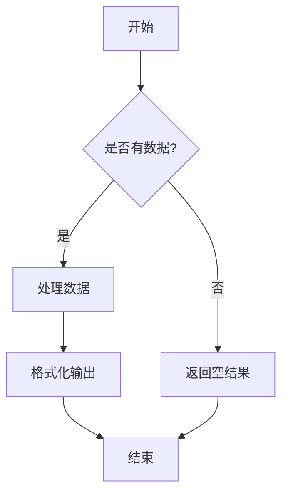
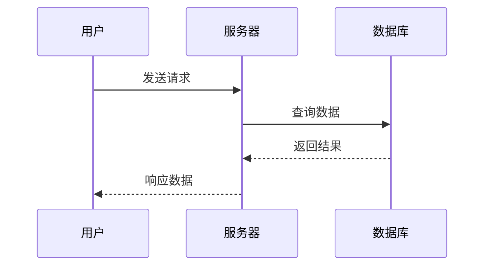
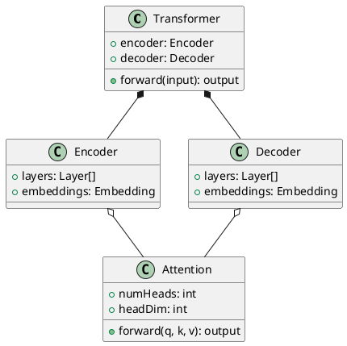
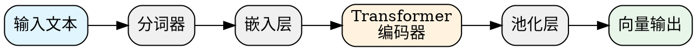

# 图表渲染测试页

测试各种图表格式在 Quartz 中的渲染效果。

## Mermaid 流程图



## Mermaid 时序图



## ASCII 字符图

```ascii
┌─────────────────────────────────────────────────────────────┐
│                    RAG 系统架构                              │
├─────────────────────────────────────────────────────────────┤
│                                                             │
│  ┌──────────┐    ┌──────────┐    ┌──────────┐              │
│  │  用户    │───▶│  检索器  │───▶│ 向量数据库│              │
│  │  查询    │    │ Retriever│    │  Embeddings│             │
│  └──────────┘    └──────────┘    └──────────┘              │
│       │               │                  │                  │
│       │               ▼                  ▼                  │
│       │         ┌──────────┐    ┌──────────┐              │
│       │         │  重排序  │    │  文档块   │              │
│       │         │ Reranker │    │  Chunks  │              │
│       │         └──────────┘    └──────────┘              │
│       │               │                                    │
│       │               ▼                                    │
│       │         ┌──────────┐                               │
│       └────────▶│   LLM    │──▶ 生成回答                   │
│                 │  Generator│                              │
│                 └──────────┘                               │
│                                                             │
└─────────────────────────────────────────────────────────────┘
```

## PlantUML 类图



## GraphViz (DOT) 图



## 简单文本图

```text-diagram
    ┌─────┐     ┌─────┐     ┌─────┐
    │  A  │────▶│  B  │────▶│  C  │
    └─────┘     └─────┘     └─────┘
       │                       │
       │         ┌─────┐       │
       └────────▶│  D  │◀──────┘
                 └─────┘
```
