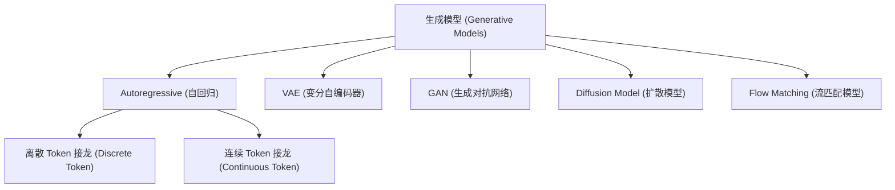

# Generative Model (生成模型)

## 定义

学习数据分布以生成新样本的模型。给定输入条件（如文字描述），生成模型输出符合该条件的新数据——可以是文本、图像、音频或视频。

生成模型的核心问题是：**如何从已知的简单分布（如高斯分布）映射到复杂的目标数据分布？** 不同的生成范式以不同方式回答这个问题。

## 主要类型

> 生成模型可分为五大范式：自回归（Autoregressive）、VAE、GAN、扩散模型和 Flow Matching，其中自回归模型又分为离散 Token 和连续 Token 两种接龙方式。

### Autoregressive Model (自回归模型)

通过逐步生成序列中的元素来构建完整输出。每次生成一个 token，将其加入已有序列，再生成下一个 token——即"接龙"。

$$P(x_1, x_2, \ldots, x_T) = \prod_{t=1}^{T} P(x_t \mid x_1, \ldots, x_{t-1})$$

- **离散 Token 接龙**：输出为概率分布，从中采样得到一个离散 token。每个位置模型输出一组分数（概率分布），采样后得到具体 token。这种方式天然解决了"多答案"问题——模型学习的是分布而非单个正确答案。
- **连续 Token 接龙**：输出为连续向量（如 16 维实数向量）。每个 token 不再是整数编号，而是一个向量。连续 token 的表达能力远超离散 token，但训练时需要特殊处理（不能简单使用 MSE loss，否则多个正确答案会被平均化导致模糊）。

### VAE (变分自编码器)

让生成模型输出概率分布的参数（如多元正态分布的均值 $\mu$ 和协方差 $\Sigma$），然后从该分布中采样得到最终结果。VAE 通过 encoder-decoder 结构和 KL 散度约束隐空间分布。

### GAN (生成对抗网络)

引入 discriminator（判别器）与 generator（生成器）对抗训练。判别器学习区分真实数据和生成数据，生成器学习欺骗判别器。这种 adversarial loss 也广泛应用于 tokenizer 的训练中——训练 tokenizer/detokenizer 使其输出难以被判别器区分于原始数据。

### Diffusion Model (扩散模型)

通过逐步去噪（denoising）过程生成数据。从纯噪声出发，经过多步反向扩散过程，逐步恢复出目标数据。在 2023-2024 年间是图像生成的主流方法。

### Flow Matching (流匹配模型)

将 Source Distribution（如高斯分布）通过向量场（vector field）逐步变换为 Target Distribution。具体做法：

1. 设定步数 $N$（超参数）
2. 从 source 采样 $x_0$，输入 flow matching model（本质是 [[neural-network]]），同时输入当前进度 $t$
3. 模型输出方向向量 $v_t$，沿此方向移动 $\frac{1}{N}$ 步
4. 反复执行直到到达 target 分布

$$x_{t+\Delta t} = x_t + \Delta t \cdot v_t$$

Flow Matching 与 Diffusion Model 可视为"一体两面"。2025 年的主流模型如 Stable Diffusion 3、Flux、Meta Movie Gen 等实际使用的都是 Flow Matching 而非传统 Diffusion。

## Autoregressive 语言模型作为生成模型

[[language-model]] 是最成功的 autoregressive 生成模型。它生成离散 token（文字），每次输出一个概率分布再采样，天然避免了"多答案平均化"问题。

### 从文本到多模态：Token 化 (Tokenization)

将图像和音频也用 token 表示后，即可复用语言模型的 autoregressive 框架：

**音频 Token：**
- 原始音频 16kHz → tokenizer（多层 CNN + Transformer）→ 50Hz token 序列
- 320 个采样点压缩为 1 个 token
- 使用 [[residual-vector-quantization|RVQ]]（Residual Vector Quantization）：多层 tokenizer 逐层编码残差，类似进位制（$200^8$ 种可能）
- Detokenizer 将 token 还原为音频信号
- 代表模型：SoundStream、EnCodec、Mimi

**图像 Token：**
- 2D token 网格：每个 token 对应图像中一个小区域（如 8×8 pixel），如 DALL-E 使用 8192 个 token
- 1D token 序列：如 "An image is worth 32 tokens"——不固定空间对应，token 编码语义信息
- 视频 Token：3D（宽 × 高 × 时间），每个 token 同时表示空间区域和时间范围

### Token 的极限与 Continuous Token

离散 token 对图像做了有损压缩，reconstruction 质量存在上限（与接龙模型大小无关，瓶颈在 tokenizer）。解决方案是 **Continuous Token**——用实数向量代替离散整数，表达能力大幅提升。实验表明：discrete token 存在 FID 上限，continuous token 随模型增大可持续改善。

## 图像/音频生成的特殊策略

### 生成顺序

- **Raster Order**：由左到右、由上到下，逐个生成 token
- **Random Order (MaskGIT)**：每次生成所有 token 但只保留置信度最高的 K 个，其余遮盖后重新生成。生成顺序由模型自适应决定，步数更少
- **Next-Scale Prediction (VAR)**：先小图后大图，多尺度 autoregressive。从 64×64 → 256×256 → 1024×1024，可用同一模型 end-to-end 训练

### 三种"像"的定义（Tokenizer 训练）

| 类型 | 方法 | Loss |
|------|------|------|
| 表面像 (Surface) | 逐采样点/像素比较 | Regression Loss (MSE) |
| 感知像 (Perceptual) | 用预训练模型提取特征比较 | Perceptual Loss |
| 对抗像 (Adversarial) | Discriminator 判别真伪 | Adversarial Loss (GAN) |

实际训练中三种 loss 组合使用。

## Training vs Inference

### 训练阶段

1. **Tokenizer 训练**：训练 tokenizer + detokenizer（autoencoder），使用 VQ-VAE / RVQ 技术产生离散 token，或连续 autoencoder 产生 continuous token。Loss = regression + perceptual + adversarial
2. **生成模型训练**：
   - Autoregressive：给定上文，预测下一个 token（cross-entropy loss 或 MSE loss）
   - Flow Matching/Diffusion：学习将 source 分布变换为 target 分布的向量场

### 推理阶段

1. **Autoregressive**：从输入开始逐 token 生成，每步采样后追加到序列
2. **Flow Matching**：从 source 分布采样，按向量场指引走 N 步到达 target
3. **Detokenization**：将生成的 token 序列还原为图像/音频

## 跨课程视角

> 以下课程深入讲解了生成模型，点击课程名查看完整笔记。

### [[hylee-genai-2025|李宏毅 GenAI 2025]] (第9讲)

影像和声音上的生成策略。从 Pixel RNN/WaveNet 的像素/采样点接龙讲起，到 tokenization（VQ-VAE、RVQ）、autoregressive 图像生成（DALL-E、VideoGPT）、MaskGIT 随机顺序生成、VAR 多尺度生成，再到 continuous token 和 Flow Matching。核心洞察：图像/音频生成可以统一为 token 接龙，但 token 的定义和生成策略决定了最终质量。^[raw/transcripts/hylee-genai-2025/hylee-2025-09-影像和聲音上的生成策略-ccqCDD9LqCA.md]

### [[language-model]]

语言模型是最成熟的 autoregressive 生成模型。离散 token + 概率分布采样的范式天然解决了多答案问题，这一优势在扩展到连续模态（图像、音频）时面临挑战——continuous token 需要特殊的 loss 设计或引入 Flow Matching 等"另一条世界线"的方法。

### [[neural-network]]

所有生成模型的底层都是神经网络。Flow Matching 模型本质是一个带 residual connection 和时间条件的深度网络，多次调用同一网络等价于一个极深的网络。GAN 的对抗训练、VAE 的 encoder-decoder 结构都建立在神经网络基础之上。

### [[transformer]]

现代生成模型普遍使用 Transformer 架构。LLM（GPT 系列）用 Transformer 做文本 autoregressive 生成；图像生成中 Llama 架构直接用于 token 接龙即可超越 Diffusion；MaskGIT 使用 Transformer 做 masked token prediction；tokenizer 也常由 CNN + Transformer 构成。

## 关键模型与里程碑

| 时间 | 模型 | 贡献 |
|------|------|------|
| 2016 | Pixel RNN / Pixel CNN | 首次证明像素接龙可生成图像 |
| 2016 | WaveNet | 采样点接龙生成音频 |
| 2016 | Video Pixel Network | 像素接龙生成视频 |
| 2021 | DALL-E | 8192 个离散 image token + autoregressive |
| 2021 | VideoGPT | 视频 token + Transformer 生成 |
| 2022 | MaskGIT | 随机顺序生成，步数更少 |
| 2023 | Muse | MaskGIT + 多尺度生成 |
| 2024 | VAR | 同一模型多尺度 autoregressive |
| 2024 | NanoBanana Video | 低质量→高质量视频生成 |
| 2024-25 | Flux, SD3 | Flow Matching 取代传统 Diffusion |

## 相关概念

- [[language-model]] — 文本领域的 autoregressive 生成模型
- [[transformer]] — 现代生成模型的核心架构
- [[neural-network]] — 所有生成模型的底层基础
- [[tokenization]] — 将原始数据转化为 token 的过程
- [[fine-tuning]] — 在预训练生成模型上适配特定任务
- [[inference-reasoning]] — 生成模型推理阶段的优化
- [[activation-functions]] — 赋予生成模型非线性表达能力
