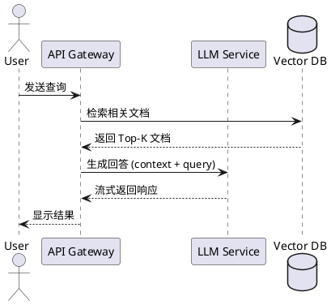
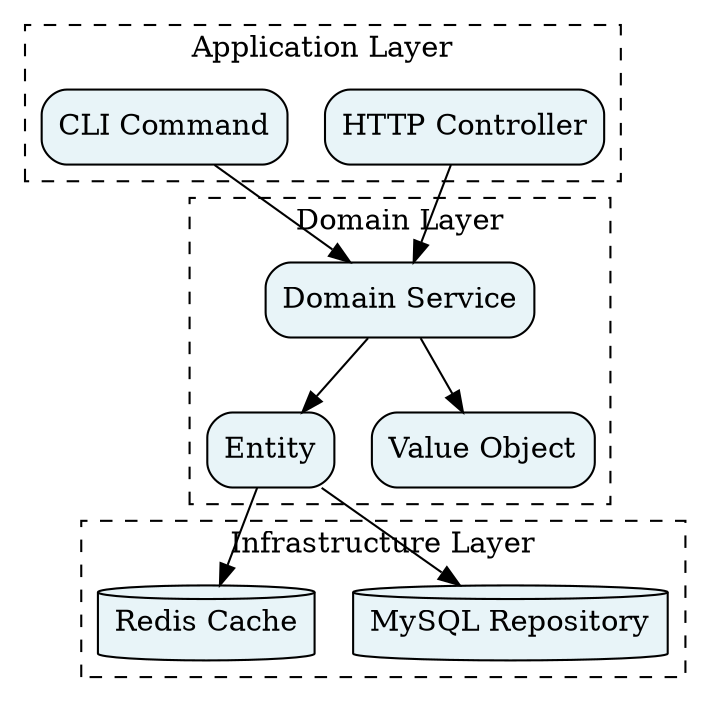
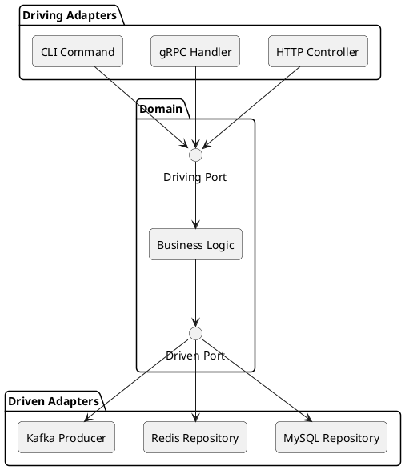
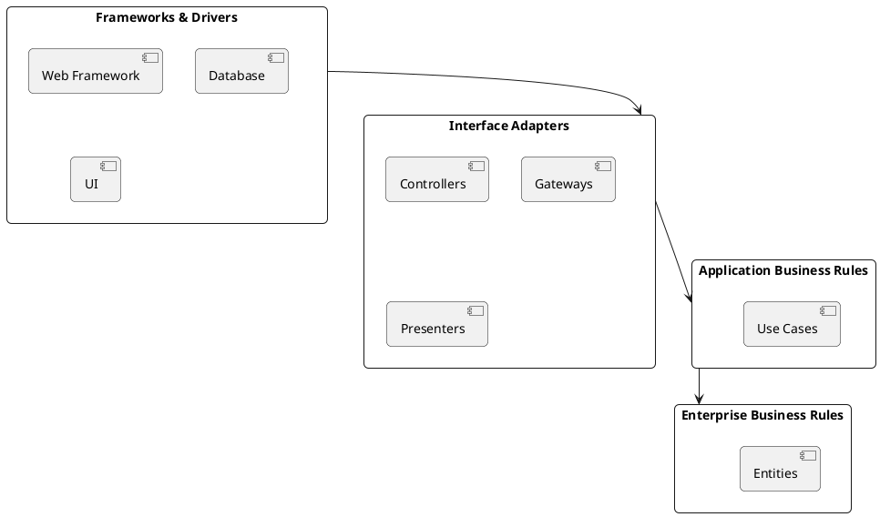
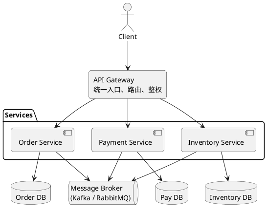
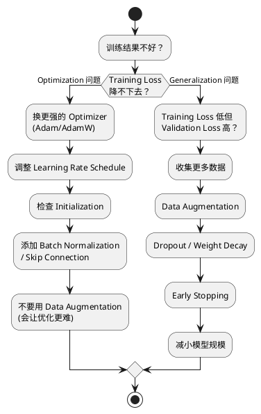

# Kroki.io 渲染测试

测试 D2、PlantUML、GraphViz 通过 kroki.io 的渲染效果。

## D2 架构图

### 六边形架构

```d2
direction: right

Driving Adapters: {
  HTTP Controller
  gRPC Handler
  CLI Command
}

Domain: {
  Driving Port: {
    shape: interface
  }
  Business Logic
  Driven Port: {
    shape: interface
  }
  Driving Port -> Business Logic -> Driven Port
}

Driven Adapters: {
  MySQL Repository
  Redis Repository
  Kafka Producer
}

Driving Adapters.HTTP Controller -> Domain.Driving Port
Driving Adapters.gRPC Handler -> Domain.Driving Port
Driving Adapters.CLI Command -> Domain.Driving Port

Domain.Driven Port -> Driven Adapters.MySQL Repository
Domain.Driven Port -> Driven Adapters.Redis Repository
Domain.Driven Port -> Driven Adapters.Kafka Producer
```

### RAG 系统架构

```d2
direction: right

Indexing: 离线索引阶段 {
  Documents: 原始文档
  Loader: Document Loader
  Chunker: 分块器
  Embedder: 嵌入器
  VectorStore: {
    shape: cylinder
    label: Vector Store
  }
  
  Documents -> Loader -> Chunker -> Embedder -> VectorStore
}

Querying: 在线查询阶段 {
  Query: 用户查询
  Transform: Query Transform
  Retriever: 检索器
  Reranker: 重排序
  Generator: 生成器
  Response: 响应
  
  Query -> Transform -> Retriever -> Reranker -> Generator -> Response
}

Indexing.VectorStore -> Querying.Retriever
```

### Clean Architecture 同心圆

```d2
direction: down

Frameworks: {
  label: "Frameworks & Drivers"
  Web Framework
  Database
  UI
}

Adapters: {
  label: "Interface Adapters"
  Controllers
  Gateways
  Presenters
}

UseCases: {
  label: "Application Business Rules"
  Use Cases
}

Entities: {
  label: "Enterprise Business Rules"
  Entities
}

Frameworks -> Adapters -> UseCases -> Entities
```

## PlantUML 时序图



## GraphViz 依赖图



## D2 流程图

```d2
direction: down

Start: 开始
Decision: {
  shape: diamond
  label: 是否有数据?
}
Process: 处理数据
Empty: 返回空结果
Format: 格式化输出
End: 结束

Start -> Decision
Decision -> Process: 是
Decision -> Empty: 否
Process -> Format -> End
Empty -> End
```

## D2 类图风格

```d2
Order: {
  shape: class
  +name: String
  +status: OrderStatus
  +totalAmount: BigDecimal
  
  +confirm()
  +cancel()
}

OrderItem: {
  shape: class
  +productId: String
  +quantity: Int
  +price: BigDecimal
}

ShippingAddress: {
  shape: class
  +street: String
  +city: String
  +country: String
}

Order -> OrderItem: contains
Order -> ShippingAddress: ships to
```

## 对比总结

| 特性 | D2 | PlantUML | GraphViz |
|------|-----|----------|----------|
| 视觉风格 | 现代、精致 | 传统 UML | 简洁、学术 |
| 布局控制 | 强 | 中等 | 自动布局 |
| 适合场景 | 架构图、系统图 | 时序图、类图 | 依赖图、流程图 |
| 主题支持 | 丰富 | 有限 | 有限 |

---

## PlantUML 架构图对比

### PlantUML 六边形架构



### PlantUML Clean Architecture



### PlantUML RAG 系统架构

```plantuml
@startuml
skinparam shadowing false
skinparam roundCorner 10

package "离线索引阶段 (Indexing)" {
  [原始文档] --> [Document\nLoader] --> [Chunker\n分块器] --> [Embedder\n嵌入器] --> database "Vector Store\n向量数据库" as VS
}

package "在线查询阶段 (Querying)" {
  [用户查询] --> [Query Transform\n查询转换] --> [Retriever\n检索器] --> [Reranker\n重排序] --> [Generator\n生成器] --> [响应]
}

VS --> [Retriever\n检索器]
@enduml
```

### PlantUML 微服务架构



### PlantUML 流程图（训练诊断）


