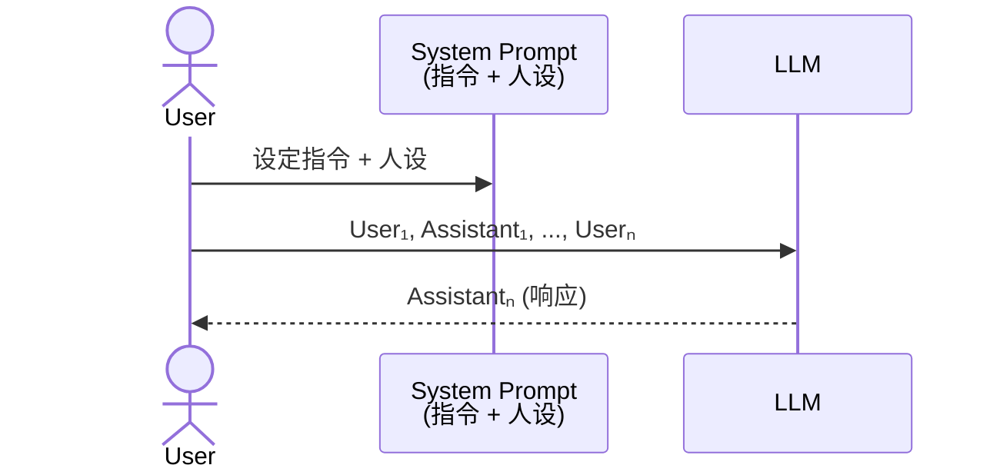
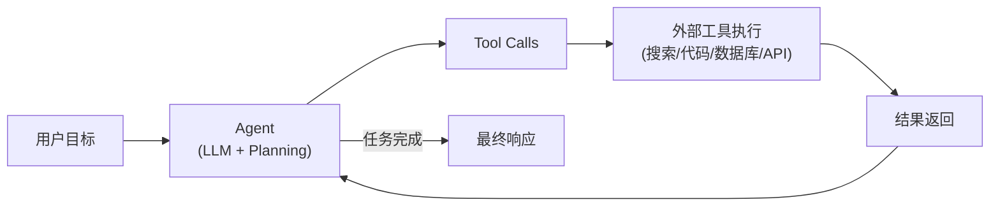
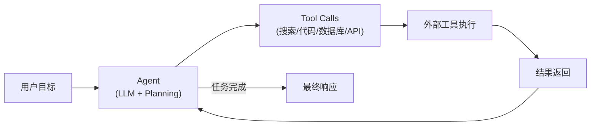
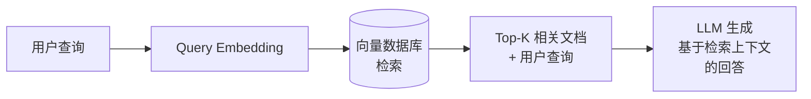
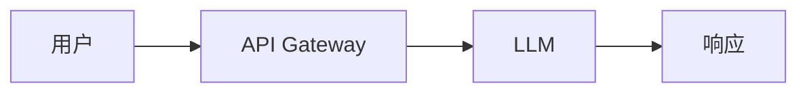
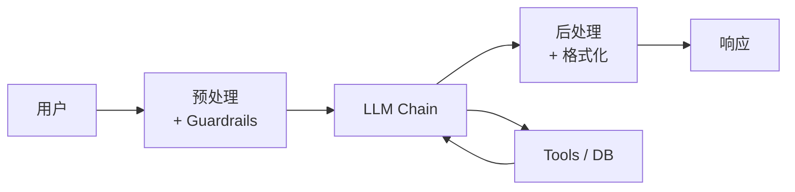
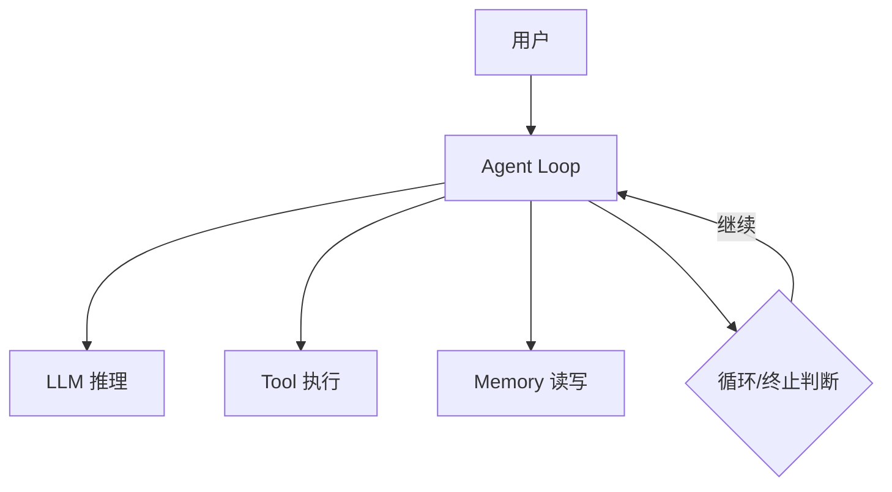
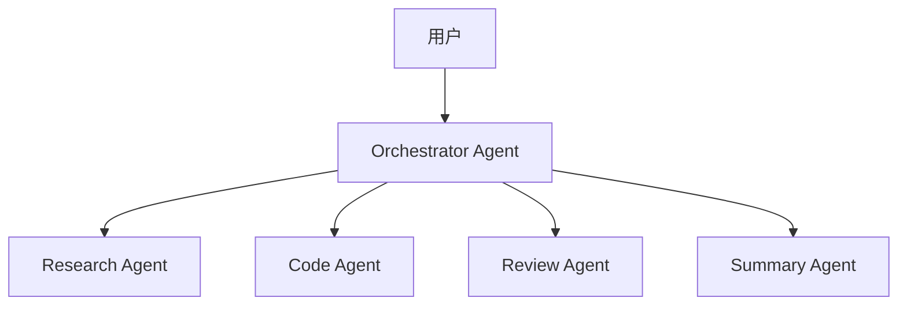

# LLM Application Architecture

## 定义

LLM Application Architecture（大语言模型应用架构）指围绕[[language-model]]构建的完整应用系统的设计模式与工程实践。它不仅包括 LLM 本身的调用方式，还涵盖上下文管理、工具集成、数据检索、编排框架和部署策略等端到端的技术栈。

## 应用模式 (Application Patterns)

### Chat（对话模式）

最常见的 LLM 交互模式，基于多轮对话历史进行上下文感知的响应。

- **接口**：ChatCompletion API（messages 数组，包含 system/user/assistant 角色）
- **上下文管理**：对话历史截断、摘要压缩、滑动窗口
- **典型应用**：客服机器人、编程助手、知识问答

> Chat 模式通过 System Prompt 设定人设和指令，后续多轮对话（User/Assistant 交替）作为上下文输入 LLM，生成感知对话历史的响应。

### Completion（补全模式）

给定 prompt 前缀，LLM 续写生成完整内容。

- **接口**：Completion API（单一 prompt 字符串）
- **用途**：文本生成、代码补全、创意写作、结构化数据提取
- **关键参数**：temperature（创造性）、max_tokens（长度限制）、stop sequences

### Agents（智能体模式）

LLM 作为推理引擎，通过工具调用 (tool use) 与外部环境交互，自主规划和执行复杂任务。参见 [[ai-agent]]。

> Agent 模式的工作流：从用户目标出发，LLM 推理产生工具调用指令，外部工具执行后返回结果，循环直到任务完成。

> Agent 模式的核心循环：LLM 推理 → 工具调用 → 获取结果 → 判断是否完成。通过 Planning、Memory、Tools、Reflection 四个组件实现自主任务执行。

Agent 模式的核心组件：
- **Planning**：任务分解与步骤规划（ReAct、Plan-and-Execute）
- **Memory**：短期记忆（对话历史）+ 长期记忆（[[vector-database-ai]]）
- **Tools**：外部能力扩展（搜索、代码执行、API 调用）
- **Reflection**：自我评估与纠错

### RAG（检索增强生成）

结合外部知识库检索与 LLM 生成能力，解决 LLM 知识截止和幻觉问题。详见 [[rag]] 和 [[rag-architecture]]。

> RAG 流程：用户查询经 Embedding 转换为向量，在向量数据库中检索 Top-K 相关文档，将检索结果与查询一起送入 LLM 生成基于外部知识的回答。

## 编排框架 (Orchestration Frameworks)

### LangChain

最流行的 LLM 应用开发框架，提供模块化的组件和链式调用模式。

- **核心抽象**：Runnable 接口、LCEL (LangChain Expression Language)
- **组件**：Model I/O、Retrievers、Chains、Agents、Memory
- **LangGraph**：基于状态图的 Agent 编排，支持循环、分支、人机协作
- **LangSmith**：可观测性平台（tracing、evaluation、monitoring）

参见 [[langchain-mastery-2025]] 课程笔记。

### LlamaIndex

专注于数据连接和[[rag]]的框架，擅长将私有数据与 LLM 连接。

- **核心能力**：Data Connectors（160+ 数据源）、Index 构建、Query Engine
- **索引类型**：Vector Store Index、Summary Index、Knowledge Graph Index
- **Agent 框架**：基于工具的路由和查询规划
- **与 LangChain 的区别**：LlamaIndex 更聚焦数据管道和检索质量，LangChain 更通用

### 其他框架

- **Semantic Kernel (Microsoft)**：企业级 LLM 编排，深度集成 Azure
- **AutoGen (Microsoft)**：多 Agent 对话框架
- **CrewAI**：基于角色的多 Agent 协作
- **Haystack**：模块化 NLP 管道，搜索和问答

## 架构模式 (Architectural Patterns)

### 单层架构 (Direct LLM Call)

> 单层架构是最简单的 LLM 部署模式，用户请求经 API Gateway 直接调用 LLM 返回响应，适用于无状态单轮任务。

- 适用：简单问答、单轮任务
- 优点：低延迟、简单
- 缺点：无上下文、无外部知识

### 管道架构 (Pipeline)

> 管道架构在 LLM 调用前后加入预处理和后处理环节，适用于需要输入验证、格式化输出的场景（如客服系统、内容审核）。
- 适用：需要输入验证、格式化输出的场景
- 典型：客服系统、内容审核

### Agent 架构 (Autonomous)

> Agent 架构的核心是一个循环：LLM 推理 → 工具执行 → 记忆读写 → 判断是否终止，支持复杂多步骤任务的自主完成。

- 适用：复杂多步骤任务
- 挑战：可靠性、成本控制、延迟

### 多 Agent 架构 (Multi-Agent)

> 多 Agent 架构通过 Orchestrator 协调多个专业 Agent 并行工作，适用于需要多专业协作的复杂任务。挑战在于通信开销和协调一致性。
- 适用：需要多专业协作的复杂任务
- 挑战：通信开销、协调一致性

## 部署模式 (Deployment Patterns)

### 托管 API (Managed API)

- 使用 OpenAI / Anthropic / Google 等商业 API
- 优点：零运维、模型持续更新
- 缺点：数据隐私风险、延迟不可控、成本高

### 自托管 (Self-hosted)

- 部署开源模型（Llama、Mistral、Qwen）到自有 GPU
- 工具：vLLM（高吞吐推理）、TGI (Text Generation Inference)、Ollama（本地开发）
- 优点：数据主权、低延迟、成本可预测
- 缺点：GPU 资源需求、运维复杂

### 混合部署 (Hybrid)

- 简单任务用本地小模型，复杂任务路由到云端大模型
- Router 模型根据查询复杂度分流
- 平衡成本与质量

### 边缘部署 (Edge Deployment)

- 在手机/PC 上运行量化后的小模型（GGUF/AWQ 格式）
- 工具：llama.cpp、MLC-LLM、ONNX Runtime
- 适用：离线场景、隐私敏感应用

## 关键工程考量

| 维度 | 挑战 | 解决方案 |
|------|------|----------|
| **延迟** | LLM 推理慢 | Streaming、缓存、模型蒸馏 |
| **成本** | Token 计费 | Prompt 压缩、缓存、小模型路由 |
| **可靠性** | 幻觉、格式错误 | Guardrails、重试、结构化输出 |
| **可观测性** | 黑箱调试难 | Tracing（LangSmith/Phoenix）、日志 |
| **安全** | Prompt 注入 | 输入过滤、权限隔离、[[ai-agent|Agent 沙箱]] |

## 相关概念

- [[ai-agent]] — LLM 应用的高级形态：自主智能体
- [[rag]] — 检索增强生成的核心概念
- [[rag-architecture]] — RAG 系统的详细架构设计
- [[langchain-mastery-2025]] — LangChain 框架深入学习
- [[vector-database-ai]] — 向量数据库，RAG 和 Agent 记忆的基础设施
- [[language-model]] — LLM 应用的核心引擎
- [[neural-network]] — LLM 的底层技术基础
