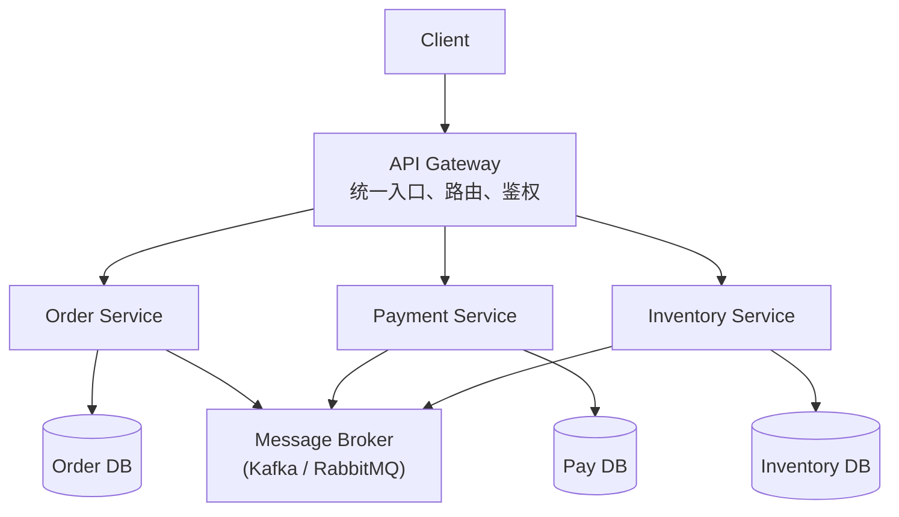

# 微服务架构（Microservice Architecture）

## 定义

微服务架构（Microservice Architecture）由 Martin Fowler 和 James Lewis 在2014年正式定义，是一种**将单一应用拆分为一组小型、独立部署的服务**的架构风格。每个服务围绕特定业务能力构建，运行在自己的进程中，通过轻量级机制（通常是 HTTP/REST 或消息队列）通信。

> "a suite of small services, each running in its own process and communicating with lightweight mechanisms" — Martin Fowler

## 核心原则

### 1. 单一职责（Single Responsibility）

每个微服务只负责一个明确的业务能力，如：
- Order Service — 订单管理
- Payment Service — 支付处理
- Inventory Service — 库存管理
- Notification Service — 消息通知

### 2. 独立部署（Independent Deployability）

- 每个服务可以独立构建、测试、部署
- 一个服务的更新不影响其他服务
- 支持不同服务使用不同的发布节奏

### 3. 去中心化（Decentralization）

- **去中心化治理**：每个团队自主选择技术栈（多语言/多数据库）
- **去中心化数据管理**：每个服务拥有自己的数据库（Database per Service）
- 不共享数据库表，通过 API 或事件通信

### 4. 故障隔离（Fault Isolation）

- 一个服务宕机不应导致整个系统崩溃
- 通过熔断（Circuit Breaker）、超时、重试等模式增强韧性
- 支持优雅降级

### 5. 围绕业务能力组织（Organize around Business Capabilities）

- 团队按业务域划分（而非技术层）
- 每个团队端到端负责一个或多个服务
- Conway's Law：系统架构反映组织结构

## 典型架构

## 关键挑战与应对

| 挑战 | 说明 | 应对方案 |
|------|------|----------|
| 分布式事务 | 跨服务数据一致性 | Saga 模式、事件溯源 |
| 服务发现 | 服务实例动态变化 | Consul、Eureka、K8s Service |
| 负载均衡 | 请求分发 | K8s Ingress、Nginx、云LB |
| 链路追踪 | 跨服务调用排查 | Jaeger、Zipkin、SkyWalking |
| 配置管理 | 多服务配置 | Spring Cloud Config、Nacos |
| 部署复杂度 | 大量服务运维 | Docker + K8s 编排 |
| 数据一致性 | 最终一致性 | Eventual Consistency + 补偿机制 |

## 与其他架构模式的比较

| 对比维度 | 微服务架构 | 单体架构（Monolith） | [[hexagonal-architecture]] | [[clean-architecture]] |
|----------|-----------|---------------------|---------------------------|----------------------|
| 架构层次 | 系统级（服务间） | 系统级 | 应用级（服务内） | 应用级（服务内） |
| 核心关注 | 服务拆分与治理 | 模块化组织 | 内外解耦 | 分层依赖 |
| 部署单元 | 多个独立服务 | 单个部署包 | N/A | N/A |
| 团队组织 | 多团队自治 | 单团队协作 | N/A | N/A |
| 复杂度来源 | 分布式系统 | 代码耦合 | 适配层管理 | 层边界管理 |

> **关键洞察**：微服务架构解决的是**系统级**的拆分和治理问题，而 [[hexagonal-architecture|六边形架构]]、[[clean-architecture|Clean Architecture]] 解决的是**单个服务内部**的代码组织问题。两者是不同层次的关注点，可以组合使用。

## 适用场景

**适合使用微服务架构的场景：**

- 大型团队（>20人）需要并行开发
- 系统需要独立扩缩容（某些模块流量大）
- 技术栈需要多样化（不同服务用不同语言/数据库）
- 需要频繁独立部署的业务模块
- 你在华为云做的 SMC/OSC/IEF 就是典型场景

**不适合使用的场景：**

- 小团队（<5人），运维成本远大于收益
- 初创项目/MVP阶段（先验证业务再拆分）
- 强一致性要求的系统（分布式事务代价高）
- 团队缺乏 DevOps/K8s 运维能力

## 与六边形架构的关系

微服务架构与 [[hexagonal-architecture|六边形架构]] 的关系是**宏观与微观的配合**：

| 微服务架构（宏观） | 六边形架构（微观） |
|-------------------|-------------------|
| 服务间通信（HTTP/gRPC/MQ） | 入站端口 + 入站适配器 |
| 数据库/缓存/消息中间件 | 出站端口 + 出站适配器 |
| 每个微服务 | 一个独立的六边形 |
| 服务边界 | 对应 DDD Bounded Context |

- 每个微服务**内部**可以用六边形架构组织代码
- 微服务间的 API 调用 = 六边形的**入站适配器**接收请求
- 微服务访问外部数据库/MQ = 六边形的**出站适配器**发送请求
- 六边形架构帮助每个微服务保持**内部整洁**，微服务架构帮助**系统级解耦**

## 备考提示

软考可能考的角度：
- 微服务架构的特征和优缺点
- 与单体架构的对比
- 微服务间通信方式（同步 vs 异步）
- 分布式事务解决方案（Saga、TCC、本地消息表）
- 服务注册与发现机制
- 容器化与编排（Docker + K8s）
- 论文素材：你在华为云微服务开发的实际经验

## 相关概念

- [[hexagonal-architecture]] — 每个微服务内部推荐采用六边形架构组织代码
- [[clean-architecture]] — 微服务内部的分层方案，与六边形架构互补
- [[onion-architecture]] — 微服务内部的领域中心架构方案
- [[ddd-tactical-patterns]] — DDD 的 Bounded Context 指导微服务拆分边界，战术模式指导内部建模
- [[ruankao-11month-strategy]] — 软考备考策略，微服务是架构设计的必考内容
