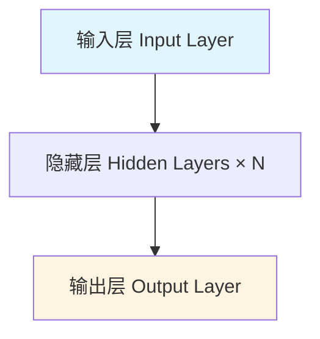

# 神经网络 (Neural Network)

## 定义

由多层互连的神经元（节点）组成的计算模型，通过调整连接权重学习数据中的模式。它是现代深度学习的基石，从图像识别到自然语言处理，几乎所有 AI 应用都建立在神经网络之上。

## 核心结构



> 神经网络的基本三层结构：输入层接收数据，隐藏层逐层提取特征，输出层产生预测结果。

每一层由多个**神经元 (neuron)** 组成，层与层之间通过**权重 (weight)** 和**偏置 (bias)** 连接。数据从输入层流入，经过隐藏层的逐层变换（前向传播 forward propagation），最终在输出层产生预测结果。

## 关键概念

- **神经元 (Neuron)**：接收输入，做线性变换 $z = Wx + b$，再通过[[activation-functions]]产生输出 $a = \sigma(z)$
- **层 (Layer)**：一组并行运算的神经元，包括输入层、隐藏层、输出层
- **权重 (Weight)**：连接两个神经元的参数，训练过程中通过[[gradient-descent]]不断调整
- **偏置 (Bias)**：每个神经元的额外参数，控制激活阈值
- **前向传播 (Forward Propagation)**：数据从输入到输出的逐层计算过程

## 跨课程视角

> 以下课程深入讲解了神经网络，点击课程名查看完整笔记。

### [[karpathy-nn-zero-to-hero|Karpathy NN Zero to Hero]]

全部 10 讲都围绕神经网络展开，从单个神经元（micrograd）到 bi-gram 语言模型，再到 MLP、WaveNet、CNN，最终到完整的 GPT-2。这是"从零理解神经网络"的最完整路径——每一步都手写实现，不依赖任何框架的黑箱。^[raw/transcripts/karpathy-nn-zero-to-hero/]

### [[andrew-ng-ml-specialization|Andrew Ng ML Specialization]] (videos 30-39)

从最简单的单个神经元模型开始，逐步构建多层网络。讲解前向传播的计算过程、向量化实现（vectorized implementation）的重要性、以及随机初始化（random initialization）为何必要——如果所有权重初始化为零，[[backpropagation]]将无法打破对称性。^[raw/transcripts/andrew-ng-ml-spec/30-Neural-Networks-Intro.md] ^[raw/transcripts/andrew-ng-ml-spec/31-Neural-Network-Model.md]

### [[hylee-genai-ml-2025|李宏毅 GenAI 2025]] (第5-6讲)

深度学习基础，侧重训练技巧和调参实践。涵盖 batch normalization、dropout、学习率调度等实用技术，帮助理解为什么训练神经网络是一门"手艺"。^[raw/transcripts/hylee-genai-2025/05-Basic-ML-DL.md]

### [[hylee-ml-2025|李宏毅 ML 2025]] (第3-4讲)

深入模型内部机制，讨论[[transformer]]及其替代架构（如 Mamba/SSM）。探讨为什么标准的全连接网络在序列任务上表现不佳，以及注意力机制如何解决这个问题。^[raw/transcripts/hylee-ml-2025/03-model_inside.md]

## 架构演化

```mermaid
graph TD
    A[感知机 Perceptron 1958] --> B[多层感知机 MLP 1980s]
    B --> C[卷积神经网络 CNN 1998 LeNet]
    C --> D[循环神经网络 RNN/LSTM 1997-2014]
    D --> E[[[transformer]] 2017 Attention Is All You Need]
    E --> F[大语言模型 LLM 2018+ GPT/BERT]
    
    style E fill:#e8f4ff
    style F fill:#fff4e1
```

> 神经网络架构的演进历程：从简单的感知机到现代的大语言模型，每个阶段都解决了特定的问题。

## 万能逼近定理 (Universal Approximation Theorem)

理论上，一个具有足够多神经元的单隐藏层前馈网络可以逼近任意连续函数。但这个定理只说明"存在"这样的网络，不保证[[gradient-descent]]能找到它——实际上，深层网络（多隐藏层）比宽网络（单层但很多神经元）更高效。

## 训练流程概览

1. **前向传播**：输入数据，逐层计算得到预测输出
2. **计算损失**：用[[loss-function]]衡量预测与真实值的差距
3. **反向传播**：通过[[backpropagation]]计算每个参数的梯度
4. **参数更新**：用[[gradient-descent]]更新权重和偏置
5. **重复**：直到损失收敛或达到预定轮数

## 相关概念

- [[backpropagation]] — 训练神经网络的核心算法
- [[gradient-descent]] — 参数更新的优化方法
- [[activation-functions]] — 赋予网络非线性表达能力
- [[transformer]] — 现代 LLM 使用的神经网络架构
- [[overfitting-regularization]] — 防止网络过拟合的技术
