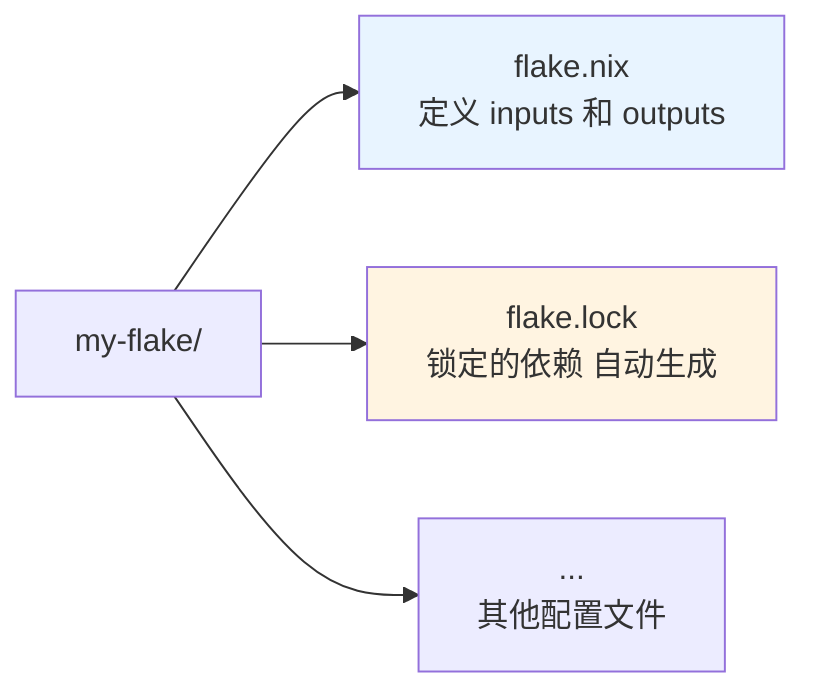

## 定义

**Flakes** 是 Nix 的现代依赖管理和配置分发机制。它将配置、依赖、构建输出统一到一个声明式结构中，并通过 `flake.lock` 锁定依赖版本，实现**完全可复现**的构建。

Flakes 自 Nix 2.4 起作为实验特性引入，现已成为社区标准实践。

---

## 核心概念

### 1. Flake 结构

一个 flake 是一个目录，包含：
- `flake.nix` — 入口文件，定义 inputs 和 outputs
- `flake.lock` — 锁定的依赖版本（自动生成）



> Flake 的基本目录结构：入口文件定义依赖和输出，lock 文件确保可复现性。
### 2. Inputs（输入）

Inputs 是 flake 的依赖，通常是其他 flake（如 nixpkgs、home-manager）。

```nix
{
  inputs = {
    # 从 GitHub 引入
    nixpkgs.url = "github:nixos/nixpkgs/nixos-unstable";
    
    # 指定分支/标签/提交
    nixpkgs-stable.url = "github:nixos/nixpkgs/nixos-23.11";
    
    # Home Manager
    home-manager = {
      url = "github:nix-community/home-manager";
      inputs.nixpkgs.follows = "nixpkgs";  # 复用主 nixpkgs
    };
    
    # 本地路径
    local-flake.url = "path:/path/to/flake";
    
    # Git 仓库
    my-repo.url = "git+https://github.com/user/repo";
    
    # Tarball
    some-tool.url = "https://example.com/tool.tar.gz";
  };
}
```

**常用 Inputs**：
```nix
{
  inputs = {
    # NixOS 官方包集合
    nixpkgs.url = "github:nixos/nixpkgs/nixos-unstable";
    
    # Home Manager（用户级配置）
    home-manager = {
      url = "github:nix-community/home-manager";
      inputs.nixpkgs.follows = "nixpkgs";
    };
    
    # Niri Wayland 合成器
    niri = {
      url = "github:sodiboo/niri-flake";
      inputs.nixpkgs.follows = "nixpkgs";
    };
    
    # Catppuccin 主题
    catppuccin.url = "github:catppuccin/nix";
    
    # Secrets 管理
    sops-nix.url = "github:Mic92/sops-nix";
    agenix.url = "github:ryantm/agenix";
    
    # 部署工具
    deploy-rs.url = "github:serokell/deploy-rs";
  };
}
```

### 3. Outputs（输出）

Outputs 是 flake 提供的功能，如系统配置、开发环境、包等。

```nix
{
  outputs = { self, nixpkgs, home-manager, ... }:
    let
      system = "x86_64-linux";
      username = "viryoke";
    in
    {
      # NixOS 系统配置
      nixosConfigurations.desktop = nixpkgs.lib.nixosSystem {
        inherit system;
        modules = [
          ./hosts/desktop
          home-manager.nixosModules.home-manager
          {
            home-manager.users.${username} = import ./home;
          }
        ];
      };
      
      # 开发环境
      devShells.${system}.default = nixpkgs.legacyPackages.${system}.mkShell {
        buildInputs = [
          nixpkgs.legacyPackages.${system}.python3
          nixpkgs.legacyPackages.${system}.nodejs
        ];
      };
      
      # 自定义包
      packages.${system}.myTool = nixpkgs.legacyPackages.${system}.callPackage ./my-tool.nix {};
    };
}
```

**常见 Output 类型**：

| Output | 用途 | 示例 |
|--------|------|------|
| `nixosConfigurations.<name>` | NixOS 系统配置 | `nixosConfigurations.desktop` |
| `homeConfigurations.<name>` | Home Manager 配置 | `homeConfigurations.viryoke` |
| `devShells.<system>.<name>` | 开发环境 | `devShells.x86_64-linux.default` |
| `packages.<system>.<name>` | 自定义包 | `packages.x86_64-linux.myTool` |
| `overlays.<name>` | Nixpkgs overlays | `overlays.default` |
| `nixosModules.<name>` | NixOS 模块 | `nixosModules.myService` |

---

## Flake.lock 文件

### 作用

`flake.lock` 记录了所有 inputs 的**精确版本**（commit hash、lastModified 等），确保：
- 团队成员使用相同版本
- CI/CD 构建可复现
- 回滚到历史版本

### 示例

```json
{
  "nodes": {
    "nixpkgs": {
      "locked": {
        "lastModified": 1700000000,
        "narHash": "sha256-abc...",
        "owner": "nixos",
        "repo": "nixpkgs",
        "rev": "abcd1234...",
        "type": "github"
      },
      "original": {
        "owner": "nixos",
        "ref": "nixos-unstable",
        "repo": "nixpkgs",
        "type": "github"
      }
    },
    "root": {
      "inputs": {
        "nixpkgs": "nixpkgs"
      }
    }
  },
  "root": "root",
  "version": 7
}
```

### 管理 lock 文件

```bash
# 更新所有 inputs
nix flake update

# 更新特定 input
nix flake lock --update-input nixpkgs

# 查看 lock 信息
nix flake metadata

# 检查是否有更新
nix flake check
```

---

## 常用命令

### 系统管理

```bash
# 应用配置（传统 switch）
sudo nixos-rebuild switch --flake .#hostname

# 测试配置（不持久化）
sudo nixos-rebuild test --flake .#hostname

# 构建但不应用
sudo nixos-rebuild build --flake .#hostname

# 回滚
sudo nixos-rebuild switch --rollback

# 查看当前系统配置
nixos-rebuild list-generations
```

### Flake 操作

```bash
# 初始化新 flake
nix flake init
nix flake init -t github:nixos/templates#full

# 查看 flake 信息
nix flake show
nix flake metadata

# 更新依赖
nix flake update
nix flake update nixpkgs  # 只更新 nixpkgs

# 检查 flake
nix flake check

# 进入开发环境
nix develop

# 构建输出
nix build .#default
nix build .#packages.x86_64-linux.myTool

# 运行应用
nix run .#default

# 搜索包
nix search nixpkgs vim
```

### 垃圾回收

```bash
# 删除未引用的旧版本
sudo nix-collect-garbage -d

# 查看 store 大小
du -sh /nix/store

# 查看引用关系
nix-store --gc --print-roots

# 删除特定代
sudo nix-env --delete-generations 10 11 12 --profile /nix/var/nix/profiles/system
```

---

## 多主机配置

### 目录结构

```
nix-config/
├── flake.nix
├── hosts/
│   ├── desktop/
│   │   ├── default.nix
│   │   └── hardware-configuration.nix
│   ├── laptop/
│   │   ├── default.nix
│   │   └── hardware-configuration.nix
│   └── server/
│       ├── default.nix
│       └── hardware-configuration.nix
├── home/
│   ├── default.nix
│   └── ...
└── modules/
    ├── common.nix
    └── ...
```

### flake.nix 示例

```nix
{
  inputs = {
    nixpkgs.url = "github:nixos/nixpkgs/nixos-unstable";
    home-manager = {
      url = "github:nix-community/home-manager";
      inputs.nixpkgs.follows = "nixpkgs";
    };
  };

  outputs = { self, nixpkgs, home-manager, ... }:
    let
      # 通用配置函数
      mkSystem = hostname: system: extraModules:
        nixpkgs.lib.nixosSystem {
          inherit system;
          modules = [
            ./hosts/${hostname}
            ./modules/common.nix
            home-manager.nixosModules.home-manager
            {
              home-manager.users.viryoke = import ./home;
            }
          ] ++ extraModules;
        };
    in
    {
      nixosConfigurations = {
        desktop = mkSystem "desktop" "x86_64-linux" [];
        laptop = mkSystem "laptop" "x86_64-linux" [];
        server = mkSystem "server" "x86_64-linux" [];
      };
    };
}
```

---

## 开发环境（devShells）

### 基本用法

```nix
{
  outputs = { self, nixpkgs, ... }:
    let
      system = "x86_64-linux";
      pkgs = nixpkgs.legacyPackages.${system};
    in
    {
      devShells.${system}.default = pkgs.mkShell {
        buildInputs = [
          pkgs.python3
          pkgs.nodejs
          pkgs.go
        ];
        
        shellHook = ''
          echo "Welcome to dev shell!"
          export PYTHONPATH="$PWD/src:$PYTHONPATH"
        '';
      };
    };
}
```

### 使用方式

```bash
# 进入开发环境
nix develop

# 或指定 flake
nix develop .#default
nix develop github:user/repo

# 运行命令（不进入 shell）
nix develop --command python script.py
```

---

## 最佳实践

### 1. 使用 follows 共享 nixpkgs

```nix
{
  inputs = {
    nixpkgs.url = "github:nixos/nixpkgs/nixos-unstable";
    
    home-manager = {
      url = "github:nix-community/home-manager";
      inputs.nixpkgs.follows = "nixpkgs";  # 复用主 nixpkgs
    };
    
    niri = {
      url = "github:sodiboo/niri-flake";
      inputs.nixpkgs.follows = "nixpkgs";
    };
  };
}
```

**好处**：
- 减少下载量（只下载一份 nixpkgs）
- 避免版本冲突
- 加快构建速度

### 2. 分离系统配置和用户配置

```nix
{
  outputs = { self, nixpkgs, home-manager, ... }:
    {
      # 系统级配置
      nixosConfigurations.desktop = nixpkgs.lib.nixosSystem {
        system = "x86_64-linux";
        modules = [
          ./hosts/desktop
          home-manager.nixosModules.home-manager
          {
            # 用户级配置
            home-manager.users.viryoke = import ./home;
          }
        ];
      };
    };
}
```

### 3. 使用 overlays 定制包

```nix
# overlays/default.nix
final: prev: {
  # 修改现有包
  my-vim = prev.vim.overrideAttrs (old: {
    buildInputs = old.buildInputs ++ [ prev.python3 ];
  });
  
  # 添加新包
  my-tool = prev.callPackage ../packages/my-tool {};
}

# 在 flake.nix 中使用
{
  outputs = { self, nixpkgs, ... }:
    {
      nixosConfigurations.desktop = nixpkgs.lib.nixosSystem {
        modules = [
          ({ pkgs, ... }: {
            nixpkgs.overlays = [ (import ./overlays) ];
          })
        ];
      };
    };
}
```

### 4. 模块化配置

```nix
# modules/common.nix
{ config, pkgs, lib, ... }:
{
  # 所有主机共享的配置
  nix.settings = {
    experimental-features = [ "nix-command" "flakes" ];
    auto-optimise-store = true;
  };
  
  environment.systemPackages = [
    pkgs.vim
    pkgs.git
    pkgs.curl
  ];
}

# hosts/desktop/default.nix
{ config, pkgs, ... }:
{
  imports = [
    ../../modules/common.nix
    ./hardware-configuration.nix
  ];
  
  # 主机特定配置
  networking.hostName = "desktop";
}
```

---

## 常见问题

### 1. Flake 找不到

```bash
# 错误：flake 未初始化
nix flake show
# error: path '/path/to/flake' is not a flake

# 解决：初始化 flake
nix flake init
```

### 2. 依赖冲突

```nix
# 问题：多个 inputs 使用不同版本的 nixpkgs
inputs = {
  nixpkgs.url = "github:nixos/nixpkgs/nixos-unstable";
  some-flake.url = "github:user/some-flake";
  # some-flake 内部使用旧版 nixpkgs
}

# 解决：强制 follows
inputs = {
  nixpkgs.url = "github:nixos/nixpkgs/nixos-unstable";
  some-flake = {
    url = "github:user/some-flake";
    inputs.nixpkgs.follows = "nixpkgs";
  };
}
```

### 3. 构建失败，缺少哈希

```nix
# 错误：hash mismatch
error: hash mismatch in fixed-output derivation

# 解决：更新哈希
# 1. 删除旧哈希
src = fetchurl {
  url = "https://example.com/file.tar.gz";
  hash = "";  # 清空
};

# 2. 重新构建，Nix 会打印正确哈希
# 3. 复制哈希到配置中
src = fetchurl {
  url = "https://example.com/file.tar.gz";
  hash = "sha256-abc123...";
};
```

---

## 相关概念

- [[nixos-overview]] — NixOS 核心理念与架构
- [[nix-language]] — Nix 表达式语言
- [[nixos-home-manager]] — Home Manager 用户配置
- [[nixos-config-review]] — 我的 nix-config 审查

---

## 参考资源

- [Nix Flakes Manual](https://nixos.org/manual/nix/stable/command-ref/new-cli/nix3-flake.html)
- [Flakes Tutorial](https://nixos.wiki/wiki/Flakes)
- [Zero to Nix - Flakes](https://zero-to-nix.com/concepts/flakes)
- [Nix Templates](https://github.com/nixos/templates)
