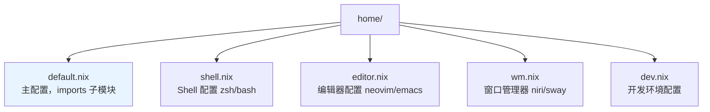
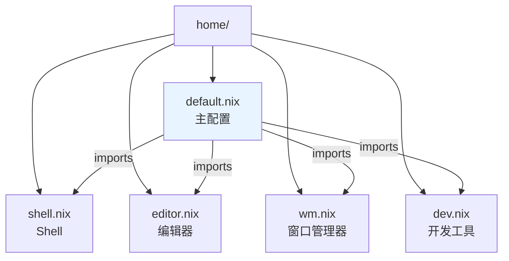

## 定义

**Home Manager** 是一个用 Nix 管理用户级配置（dotfiles）的工具。它将 `~/.bashrc`、`~/.vimrc`、`~/.config/` 等用户配置声明式化，与 NixOS 系统级配置互补。

核心理念：
- **系统级**用 NixOS modules（`/etc/`、`systemd`、内核模块）
- **用户级**用 Home Manager（`~/.config/`、`~/.*rc`、用户包）

---

## 为什么需要 Home Manager？

### NixOS 系统配置的局限

NixOS 的 `configuration.nix` 只能管理系统级配置：
```nix
# 可以：系统级
environment.systemPackages = [ pkgs.vim ];
services.nginx.enable = true;

# 不可以：用户级
# ~/.bashrc、~/.vimrc、~/.config/nvim 等
```

### Home Manager 的补充

```nix
# Home Manager 管理用户级
programs.zsh = {
  enable = true;
  shellAliases = { ll = "ls -la"; };
};

programs.git = {
  enable = true;
  userName = "viryoke";
  userEmail = "viryoke@gmail.com";
};
```

---

## 两种使用方式

### 方式 1：作为 NixOS 模块（推荐）

```nix
# flake.nix
{
  inputs = {
    nixpkgs.url = "github:nixos/nixpkgs/nixos-unstable";
    home-manager = {
      url = "github:nix-community/home-manager";
      inputs.nixpkgs.follows = "nixpkgs";
    };
  };

  outputs = { self, nixpkgs, home-manager, ... }:
    {
      nixosConfigurations.desktop = nixpkgs.lib.nixosSystem {
        system = "x86_64-linux";
        modules = [
          ./hosts/desktop
          home-manager.nixosModules.home-manager
          {
            home-manager = {
              useGlobalPkgs = true;
              useUserPackages = true;
              users.viryoke = import ./home;
            };
          }
        ];
      };
    };
}
```

### 方式 2：独立使用（非 NixOS）

```nix
# flake.nix
{
  outputs = { self, nixpkgs, home-manager, ... }:
    {
      homeConfigurations.viryoke = home-manager.lib.homeManagerConfiguration {
        pkgs = nixpkgs.legacyPackages.x86_64-linux;
        modules = [ ./home.nix ];
      };
    };
}
```

```bash
# 应用配置
home-manager switch --flake .#viryoke
```

---

## 配置结构

### 典型目录结构



> Home Manager 的典型模块化结构：主配置通过 imports 引入各子模块，按功能分离管理。

### 主配置示例

```nix
# home/default.nix
{ pkgs, username, ... }:
{
  imports = [
    ./shell.nix
    ./editor.nix
    ./wm.nix
  ];

  home = {
    username = username;
    homeDirectory = "/home/${username}";
    stateVersion = "25.05";
    
    packages = with pkgs; [
      ripgrep
      fd
      eza
      zoxide
      jq
      tree
      htop
    ];
  };

  # 会话变量
  home.sessionVariables = {
    EDITOR = "nvim";
    BROWSER = "google-chrome";
    TERMINAL = "ghostty";
  };

  programs.home-manager.enable = true;
}
```

---

## 常用模块

### 1. Shell 配置

```nix
# home/shell.nix
{ pkgs, ... }:
{
  programs.zsh = {
    enable = true;
    enableCompletion = true;
    autosuggestion.enable = true;
    syntaxHighlighting.enable = true;
    
    history = {
      size = 10000;
      save = 10000;
    };
    
    shellAliases = {
      ll = "ls -la";
      la = "ls -a";
      ".." = "cd ..";
      "..." = "cd ../..";
      cat = "bat";
      find = "fd";
      grep = "rg";
    };
    
    oh-my-zsh = {
      enable = true;
      plugins = [ "git" "docker" "python" ];
    };
  };

  programs.starship = {
    enable = true;
    settings = {
      character = {
        success_symbol = "[❯](green)";
        error_symbol = "[❯](red)";
      };
    };
  };
}
```

### 2. Git 配置

```nix
programs.git = {
  enable = true;
  userName = "viryoke";
  userEmail = "viryoke@gmail.com";
  
  extraConfig = {
    init.defaultBranch = "main";
    pull.rebase = true;
    core.editor = "nvim";
  };
  
  aliases = {
    st = "status";
    co = "checkout";
    br = "branch";
    ci = "commit";
    lg = "log --oneline --graph --decorate";
  };
  
  ignores = [
    ".DS_Store"
    "*.swp"
    "*.swo"
    ".env"
    "node_modules/"
  ];
};
```

### 3. 终端配置

```nix
programs.ghostty = {
  enable = true;
  settings = {
    theme = "catppuccin-mocha";
    font-family = "JetBrainsMono Nerd Font";
    font-size = 14;
    window-padding-x = 8;
    window-padding-y = 4;
    background-opacity = 0.95;
  };
};
```

### 4. 编辑器配置

```nix
programs.neovim = {
  enable = true;
  defaultEditor = true;
  viAlias = true;
  vimAlias = true;
  
  extraPackages = with pkgs; [
    # LSP servers
    lua-language-server
    pyright
    typescript-language-server
    
    # Formatters
    stylua
    black
    ruff
    
    # Tools
    ripgrep
    fd
    fzf
    lazygit
  ];
  
  plugins = with pkgs.vimPlugins; [
    # 插件列表
  ];
  
  extraConfig = ''
    set number
    set relativenumber
    set expandtab
    set tabstop=2
    set shiftwidth=2
  '';
};
```

### 5. 文件管理

```nix
# 管理点文件
home.file = {
  ".bashrc".text = ''
    alias ll='ls -la'
    export PATH="$HOME/.local/bin:$PATH"
  '';
  
  ".config/myapp/config.toml".source = ./config.toml;
  
  ".config/myapp/config.yaml".text = ''
    key: value
    nested:
      option: true
  '';
};

# 或使用 xdg 标准
xdg.configFile = {
  "myapp/config.toml".source = ./config.toml;
};

xdg.dataFile = {
  "myapp/data.json".source = ./data.json;
};
```

---

## 高级特性

### 1. 条件配置

```nix
{ config, pkgs, lib, ... }:
{
  # 只在特定系统上启用
  programs.zsh = lib.mkIf pkgs.stdenv.isLinux {
    enable = true;
  };
  
  # 根据用户配置
  programs.git = {
    enable = true;
    userName = if config.home.username == "work" 
      then "work-user" 
      else "personal-user";
  };
}
```

### 2. 自定义选项

```nix
{ lib, ... }:
{
  options.myConfig = {
    enable = lib.mkEnableOption "my custom config";
    
    theme = lib.mkOption {
      type = lib.types.enum [ "light" "dark" ];
      default = "dark";
      description = "Color theme";
    };
  };
  
  config = lib.mkIf config.myConfig.enable {
    # 配置内容
  };
}
```

### 3. 激活脚本

```nix
home.activation = {
  # 在配置应用后执行
  setupDirectories = lib.hm.dag.entryAfter ["writeBoundary"] ''
    mkdir -p $HOME/Projects
    mkdir -p $HOME/Documents
  '';
  
  installTools = lib.hm.dag.entryAfter ["writeBoundary"] ''
    npm install -g @anthropic-ai/claude-code 2>/dev/null || true
  '';
};
```

### 4. 服务管理

```nix
# 用户级 systemd 服务
services = {
  # 屏幕同步
  syncthing.enable = true;
  
  # 密码管理
  gpg-agent = {
    enable = true;
    defaultCacheTtl = 1800;
    maxCacheTtl = 7200;
  };
  
  # 通知守护进程
  dunst = {
    enable = true;
    settings = {
      global = {
        font = "JetBrainsMono Nerd Font 10";
        geometry = "300x5-30+20";
      };
    };
  };
};
```

---

## 常用命令

```bash
# 应用配置（作为 NixOS 模块时）
sudo nixos-rebuild switch --flake .#hostname

# 应用配置（独立使用时）
home-manager switch --flake .#username

# 查看配置状态
home-manager generations

# 回滚
home-manager rollback

# 清理旧代
home-manager expire-generations "-7 days"

# 查看差异
nixos-rebuild build --flake .#hostname
nix-diff /run/current-system result
```

---

## 最佳实践

### 1. 使用 useGlobalPkgs

```nix
home-manager = {
  useGlobalPkgs = true;      # 使用系统级 pkgs
  useUserPackages = true;    # 用户包安装到用户目录
  users.viryoke = import ./home;
};
```

**好处**：
- 避免重复下载 nixpkgs
- 保持系统和用户包版本一致
- 减少构建时间

### 2. 模块化配置



> 模块化配置的最佳实践：按功能分离为独立文件，主配置通过 imports 统一引入。

### 3. 使用 stateVersion

```nix
home = {
  username = "viryoke";
  homeDirectory = "/home/viryoke";
  stateVersion = "25.05";  # 与 NixOS 版本匹配
};
```

**作用**：
- 确保向后兼容性
- 防止破坏性变更
- 与 NixOS `system.stateVersion` 对应

### 4. 管理 Secrets

```nix
# 使用 sops-nix
sops = {
  defaultSopsFile = ./secrets.yaml;
  secrets = {
    "github_token" = {};
    "ssh_key" = {};
  };
};

# 在配置中引用
programs.git.extraConfig = {
  credential.helper = "store";
  url."https://${config.sops.secrets.github_token}@github.com".insteadOf = "https://github.com";
};
```

---

## 常见问题

### 1. 权限问题

```nix
# 错误：Home Manager 无法修改系统文件
home.file."/etc/myconfig".text = "...";

# 正确：只管理用户目录
home.file.".config/myapp/config".text = "...";
```

### 2. 冲突：文件已存在

```bash
# 错误：文件已存在
error: Existing file /home/user/.bashrc would be clobbered

# 解决：备份或删除
mv ~/.bashrc ~/.bashrc.bak
# 或
rm ~/.bashrc
```

### 3. Home Manager 和 NixOS 配置冲突

```nix
# 问题：两处都配置了 zsh
# NixOS: programs.zsh.enable = true;
# Home Manager: programs.zsh.enable = true;

# 解决：NixOS 只启用 shell，Home Manager 管理配置
# hosts/desktop/default.nix
programs.zsh.enable = true;  # 只启用

# home/default.nix
programs.zsh = {
  enable = true;
  # 详细配置
};
```

---

## 相关概念

- [[nixos-overview]] — NixOS 核心理念与架构
- [[nixos-flakes]] — Flakes 机制详解
- [[nix-language]] — Nix 表达式语言
- [[nixos-config-review]] — 我的 nix-config 审查

---

## 参考资源

- [Home Manager Manual](https://nix-community.github.io/home-manager/)
- [Home Manager Options](https://nix-community.github.io/home-manager/options.xhtml)
- [Home Manager GitHub](https://github.com/nix-community/home-manager)
