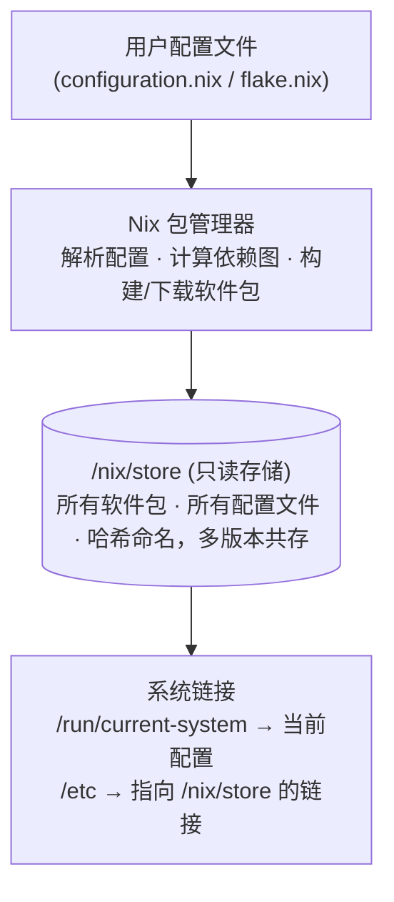

## 定义

NixOS 是一个基于 Nix 包管理器的 Linux 发行版，核心特征是**声明式配置**和**不可变基础设施**。整个系统状态由一个配置文件（`configuration.nix` 或 flake）定义，任何变更都通过重建系统实现，而非手动修改文件。

---

## 核心理念

### 1. 声明式配置（Declarative Configuration）

**传统 Linux**：手动执行命令修改系统状态
```bash
# 传统方式：命令式
sudo apt install vim
sudo systemctl enable nginx
echo "alias ll='ls -la'" >> ~/.bashrc
```

**NixOS**：在配置文件中声明期望状态
```nix
# NixOS 方式：声明式
{
  environment.systemPackages = [ pkgs.vim ];
  services.nginx.enable = true;
  programs.bash.shellAliases = { ll = "ls -la"; };
}
```

**优势**：
- 配置即文档：系统状态完全可读
- 可复现：同一配置在任何机器上产生相同结果
- 版本控制：配置变更可追踪、可回滚

### 2. 不可变性（Immutability）

NixOS 的 `/nix/store` 是只读的，所有软件包和配置都存储为哈希命名的路径：
```
/nix/store/abcd1234-vim-9.0
/nix/store/efgh5678-nginx-config
```

**关键特性**：
- 多个版本共存：不同配置可引用不同版本的同一软件
- 原子升级：切换配置是原子操作，要么成功要么回滚
- 垃圾回收：未引用的旧版本可安全删除

### 3. 可复现性（Reproducibility）

Nix 使用**纯函数式构建**：
- 相同输入 → 相同输出（确定性）
- 依赖显式声明（无隐式依赖）
- 构建隔离（无环境污染）

---

## 系统架构

### 核心组件



> NixOS 的核心数据流：用户编写声明式配置文件，Nix 包管理器解析依赖并构建/下载软件包到只读的 /nix/store，最后通过系统链接将当前配置激活为运行中的系统状态。

### 配置层级

```
系统级配置 (NixOS modules)
├── /etc/nixos/configuration.nix  # 传统方式
└── flake.nix                     # Flakes 方式（推荐）
    └── nixosConfigurations.<hostname>

用户级配置 (Home Manager)
└── home-manager.users.<username>
    ├── 点文件管理（.bashrc, .vimrc）
    ├── 用户软件包
    └── 服务配置
```

---

## 与传统 Linux 的对比

| 方面 | 传统 Linux | NixOS |
|------|-----------|-------|
| 包管理 | `apt install vim` | `environment.systemPackages = [ pkgs.vim ]` |
| 配置修改 | 编辑 `/etc/nginx.conf` | 编辑 `configuration.nix`，rebuild |
| 系统状态 | 分散在多个文件，难以追踪 | 单一配置，版本控制 |
| 回滚 | 手动备份/恢复 | `nixos-rebuild switch --rollback` |
| 多机同步 | 手动复制脚本 | 共享配置，`nixos-rebuild` |
| 依赖冲突 | 常见问题（DLL Hell） | 不存在（哈希隔离） |

---

## NixOS 的优缺点

### 优势

1. **可复现性**：配置即代码，环境可精确复制
2. **原子升级与回滚**：系统变更安全，随时回退
3. **声明式管理**：配置即文档，易于理解和维护
4. **多版本共存**：不同项目可使用不同版本的同一软件
5. **开发环境隔离**：`nix-shell` / `nix develop` 提供临时环境

### 劣势

1. **学习曲线陡峭**：Nix 语言、模块系统、Flakes 都需要学习
2. **文档分散**：官方文档不够集中，社区知识碎片化
3. **构建时间**：首次构建或自定义包需要编译时间
4. **磁盘占用**：多版本共存导致 `/nix/store` 膨胀（需定期 GC）
5. **二进制缓存依赖**：无缓存时编译耗时

---

## 核心命令

### 系统管理

```bash
# 应用配置变更（传统方式）
sudo nixos-rebuild switch

# 应用配置变更（Flakes 方式）
sudo nixos-rebuild switch --flake .#hostname

# 测试配置（不持久化，重启后回滚）
sudo nixos-rebuild test --flake .#hostname

# 回滚到上一版本
sudo nixos-rebuild switch --rollback

# 查看所有系统代（generations）
nix-env --list-generations --profile /nix/var/nix/profiles/system

# 垃圾回收（删除未引用的旧版本）
sudo nix-collect-garbage -d

# 查看磁盘占用
nix-store --gc --print-roots
du -sh /nix/store
```

### 包管理

```bash
# 搜索包
nix search nixpkgs vim
nix search nixpkgs python

# 安装包（临时，不修改配置）
nix-env -iA nixpkgs.vim

# 卸载包
nix-env -e vim

# 查看已安装包
nix-env -q

# 进入临时环境（不安装）
nix-shell -p python3 nodejs
```

### Flakes 命令

```bash
# 初始化 flake
nix flake init

# 更新 flake inputs
nix flake update

# 查看 flake 信息
nix flake show

# 构建 flake 输出
nix build .#default
```

---

## 配置文件结构

### 传统方式（/etc/nixos/）

```
/etc/nixos/
├── configuration.nix    # 主配置
└── hardware-configuration.nix  # 硬件检测（自动生成）
```

### Flakes 方式（推荐）

```
~/nix-config/
├── flake.nix            # 入口，定义 inputs 和 outputs
├── flake.lock           # 锁定的依赖版本
├── hosts/
│   └── desktop/
│       ├── default.nix  # 主机特定配置
│       └── hardware-configuration.nix
└── home/
    ├── default.nix      # Home Manager 配置
    └── ...
```

---

## 学习路径

### 阶段 1：基础（1-2 周）
- [ ] 理解声明式配置理念
- [ ] 掌握 Nix 语言基础（[[nix-language]]）
- [ ] 能用 `configuration.nix` 配置基本系统
- [ ] 理解 `/nix/store` 和垃圾回收

### 阶段 2：Flakes（1 周）
- [ ] 理解 Flakes 的 inputs/outputs
- [ ] 能将传统配置迁移到 Flakes
- [ ] 掌握多主机配置管理

### 阶段 3：进阶（持续）
- [ ] Home Manager 用户级配置（[[nixos-home-manager]]）
- [ ] 模块系统深入（options, types, mkOption）
- [ ] Overlays 和包定制
- [ ] Secrets 管理（sops-nix, agenix）

---

## 相关概念

- [[nix-language]] — Nix 表达式语言
- [[nixos-flakes]] — Flakes 机制详解
- [[nixos-home-manager]] — Home Manager 用户配置
- [[nixos-wayland-niri]] — Wayland 与 Niri 合成器
- [[nixos-nvidia]] — NVIDIA GPU 配置
- [[nixos-config-review]] — 我的 nix-config 审查

---

## 参考资源

- [NixOS 官方手册](https://nixos.org/manual/nixos/stable/)
- [Nix Pills](https://nixos.org/guides/nix-pills/) — Nix 语言入门
- [NixOS Wiki](https://nixos.wiki/)
- [Zero to Nix](https://zero-to-nix.com/) — 现代 Nix 教程
- [Misterio77/nix-starter-configs](https://github.com/Misterio77/nix-starter-configs) — 极简模板

## 个人笔记
- Nix运维工具:NixOps、colmena