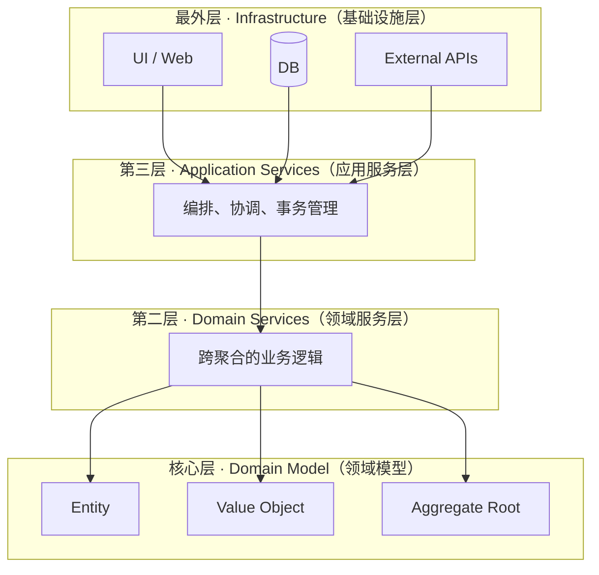

# 洋葱架构（Onion Architecture）

## 定义

洋葱架构（Onion Architecture）由 Jeffrey Palermo 于2008年提出，以**洋葱的同心层**为隐喻，将领域模型（Domain Model）置于最核心位置，外层依次包裹领域服务、应用服务、基础设施。核心原则与 [[hexagonal-architecture|六边形架构]] 和 [[clean-architecture|整洁架构]] 一致：**依赖方向从外到内，内层不知道外层的存在。**

> "The foundational concept is that the domain model is the heart of the software. Everything else is replaceable." — Jeffrey Palermo

## 核心原则

### 1. 同心圆分层



### 2. 各层职责

| 层级 | 名称 | 内容 | 可替换性 |
|------|------|------|----------|
| 最内层 | Domain Model | Entity、Value Object、Aggregate | 不可替换（业务核心） |
| 第二层 | Domain Services | 跨 Entity 的业务操作 | 低 |
| 第三层 | Application Services | Use Case 编排、事务管理 | 中 |
| 最外层 | Infrastructure | UI、数据库、外部API、框架 | 高（可整体替换） |

### 3. 依赖规则

- **外层依赖内层**，内层绝对不依赖外层
- Domain Model 层不引用任何框架、数据库、UI
- Infrastructure 层实现内层定义的接口（依赖倒置）
- 数据从外层传入时，必须转换为内层定义的类型

### 4. 依赖倒置是关键机制

```java
// 内层（Domain）定义接口
interface OrderRepository {
    void save(Order order);
    Optional<Order> findById(String id);
}

// 外层（Infrastructure）实现接口
class JpaOrderRepository implements OrderRepository {
    @PersistenceContext
    private EntityManager em;
    
    @Override
    public void save(Order order) {
        em.persist(order);
    }
    // ...
}
```

### 5. 洋葱架构的"可剥性"

与真正的洋葱一样：
- **外层可以被"剥掉"而不影响内层**
- 替换数据库？只换 Infrastructure 层的 Repository 实现
- 替换 UI？只换 Infrastructure 层的 Controller/View
- 替换框架？只换 Infrastructure 层的配置和适配器
- **核心域始终不变**

## 与其他架构模式的比较

| 对比维度 | Onion Architecture | [[hexagonal-architecture]] | [[clean-architecture]] | 传统三层架构 |
|----------|-------------------|---------------------------|----------------------|-------------|
| 提出者 | Jeffrey Palermo (2008) | Alistair Cockburn (2005) | Robert Martin (2012) | — |
| 核心隐喻 | 洋葱同心层 | 六边形端口 | 同心圆+Use Case | 水平分层 |
| 最内层 | Domain Model | Domain | Entity | 数据访问层 |
| 分层数量 | 4层 | 3概念 | 4层 | 3层 |
| 侧重点 | 领域模型独立性 | 适配器可替换性 | Use Case 编排 | 技术职责分离 |
| 依赖方向 | 向内 | 向内 | 向内 | 向下（Controller→DAO） |
| DDD亲和度 | 高（天然支持） | 高 | 中 | 低 |

> **关键洞察**：Onion Architecture 和 [[hexagonal-architecture|六边形架构]] 本质相同，区别在于隐喻角度——洋葱强调"**领域模型在中心**"，六边形强调"**端口和适配器可替换**"。两者都基于同一核心：**依赖向内 + 依赖倒置**。

## 适用场景

**适合使用 Onion Architecture 的场景：**

- 领域逻辑是系统核心竞争力的项目
- 团队使用 DDD 进行领域建模（天然搭配 [[ddd-tactical-patterns|DDD战术模式]]）
- 需要长期维护、技术栈可能演进的系统
- 要求核心域可独立测试（不依赖任何框架）
- .NET/C# 生态中广泛采用（Palermo 的背景）

**不适合使用的场景：**

- 简单 CRUD 应用（过度设计）
- 纯数据处理管道（没有复杂领域模型）
- 团队对依赖倒置、接口隔离等 SOLID 原则不熟悉
- 快速原型或 MVP 阶段

## 与六边形架构的关系

Onion Architecture 与 [[hexagonal-architecture|六边形架构]] 的关系：

**本质相同，表达方式不同：**

| 洋葱架构概念 | 对应六边形架构概念 |
|-------------|------------------|
| Domain Model + Domain Services | 核心域（Domain） |
| Application Services | 入站端口 + Use Case 编排 |
| Infrastructure（入站侧） | 入站适配器（Controller/Handler） |
| Infrastructure（出站侧） | 出站适配器（Repository实现） |
| 内层定义的接口 | 端口（Port） |
| 外层实现的接口 | 适配器（Adapter） |

**选择建议：**
- 如果你的团队更关注**领域建模**（DDD），用洋葱架构的隐喻更自然
- 如果你的团队更关注**技术可替换性**（换DB/换MQ），用六边形的隐喻更直观
- 实际项目中，两者可以混用，核心原则一致

## 备考提示

软考可能考的角度：
- 洋葱架构的分层结构和依赖方向
- 与 MVC、三层架构的区别
- 依赖倒置原则在架构中的体现
- 领域模型独立性的意义
- 与 [[clean-architecture|Clean Architecture]] 的异同
- 论文素材：如何在项目中实践依赖解耦

## 相关概念

- [[hexagonal-architecture]] — 六边形架构，与洋葱架构本质相同，不同隐喻
- [[clean-architecture]] — 整洁架构，Robert Martin 的版本，强调 Use Case
- [[ddd-tactical-patterns]] — DDD 战术模式是洋葱架构核心层的建模工具
- [[microservice-architecture]] — 每个微服务内部可采用洋葱架构组织代码
- [[ruankao-11month-strategy]] — 软考备考策略，架构分层是高频考点
