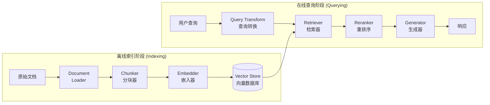
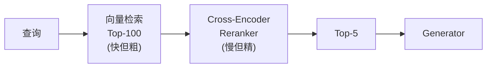
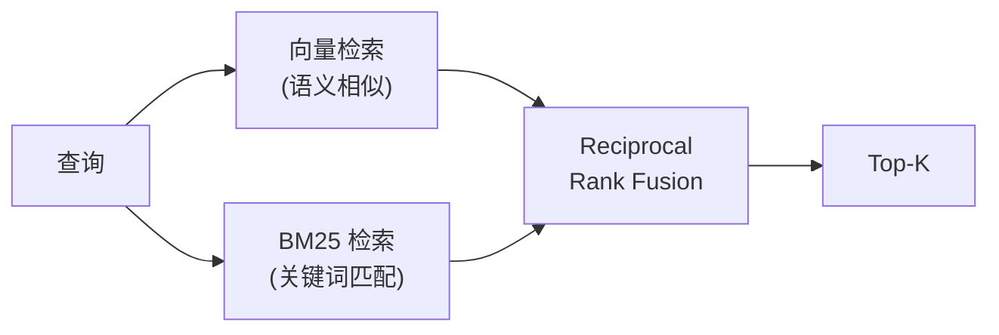
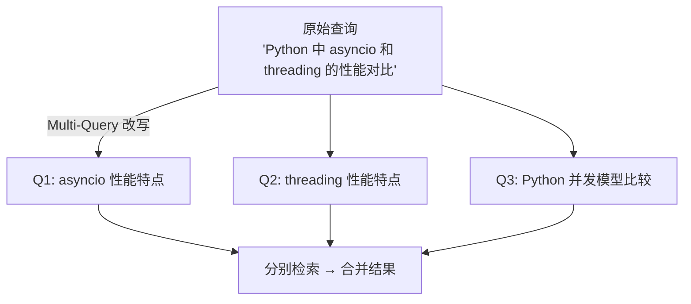
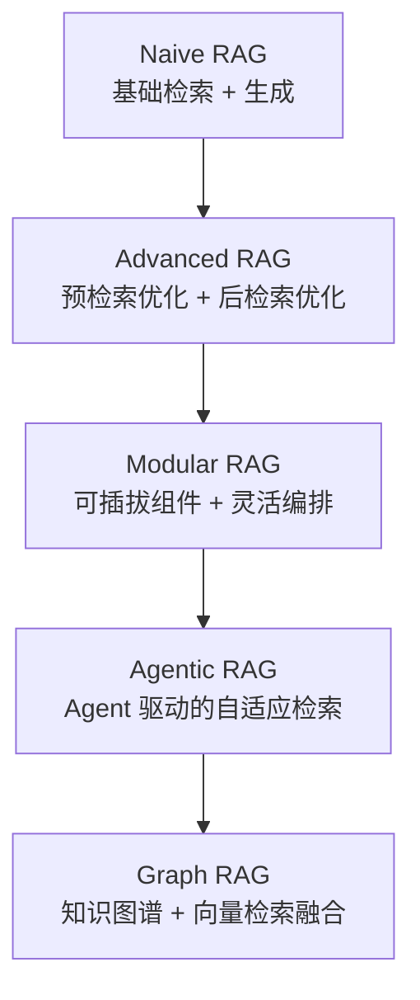

# RAG Architecture

## 定义

RAG Architecture（检索增强生成架构）是 [[rag]] 系统的工程实现蓝图，定义了从原始数据到最终生成响应的完整数据流。一个生产级 RAG 系统由多个可独立优化的组件组成：数据摄入 (ingestion)、索引构建 (indexing)、检索 (retrieval) 和生成 (generation)。

## 系统架构总览



> 上图展示 RAG 系统的两阶段架构：离线索引阶段将文档切块并嵌入到向量数据库，在线查询阶段将用户查询转换为向量检索并生成回答。

## 核心组件 (Core Components)

### Document Loader（文档加载器）

负责从各种数据源提取原始内容和元数据 (metadata)。

- **结构化数据**：CSV、JSON、数据库（SQL/NoSQL）
- **非结构化数据**：PDF、Word、HTML、Markdown
- **API 数据**：Notion、Confluence、Google Drive、GitHub
- **关键考量**：
  - 保留文档结构（标题层级、表格、列表）
  - 提取元数据（来源、日期、作者、页码）
  - 处理多模态内容（图片 OCR、表格解析）

### Chunker（分块器）

将长文档切分为适合检索和嵌入的语义单元。分块策略直接影响检索质量。

| 策略 | 方法 | 优缺点 |
|------|------|--------|
| **Fixed-size** | 按固定 token 数切分 | 简单但可能切断语义 |
| **Recursive** | 按分隔符层级切分（段落→句子→字符） | 保持结构，LangChain 默认 |
| **Semantic** | 按语义相似度切分 | 质量最高但计算成本高 |
| **Document-aware** | 按 Markdown 标题 / HTML 标签切分 | 保留文档逻辑结构 |

关键参数：
- **Chunk Size**：通常 256-1024 tokens，取决于嵌入模型的上下文窗口
- **Overlap**：块间重叠 10-20%，防止信息在边界丢失
- **Parent-Child**：小块用于检索（精度高），返回大块上下文（信息完整）

### Embedder（嵌入器）

将文本转换为高维向量表示，使语义相似的文本在向量空间中距离更近。

- **模型选择**：
  - 开源：BGE、E5、GTE、Jina Embeddings
  - 商业：OpenAI text-embedding-3、Cohere Embed
- **维度**：通常 384-3072 维，维度越高表达能力越强但存储/计算成本越高
- **关键考量**：
  - 查询和文档应使用相同模型（或兼容模型）
  - 某些模型需要为 query 和 document 使用不同前缀
  - 多语言场景需要选择支持目标语言的模型

### Retriever（检索器）

根据查询向量从[[vector-database-ai|向量数据库]]中检索最相关的文档块。

- **向量检索**：基于 ANN (Approximate Nearest Neighbor) 算法
  - HNSW (Hierarchical Navigable Small World)
  - IVF (Inverted File Index)
  - ScaNN (Google)
- **检索策略**：
  - **Top-K**：返回相似度最高的 K 个结果
  - **MMR (Maximal Marginal Relevance)**：平衡相关性和多样性
  - **Threshold**：仅返回超过相似度阈值的结果
- **元数据过滤**：在向量检索前先按元数据（日期、来源、类别）缩小范围

### Generator（生成器）

将检索到的上下文和用户查询组合成 prompt，调用 [[language-model]] 生成最终回答。

```text
┌─────────────────────────────────────┐
│ System: 基于以下上下文回答用户问题。  │
│ 如果上下文中没有相关信息，请说明。    │
│                                     │
│ Context:                            │
│ [检索到的文档块 1]                    │
│ [检索到的文档块 2]                    │
│ [检索到的文档块 3]                    │
│                                     │
│ User: {用户查询}                     │
└─────────────────────────────────────┘
```

生成器设计要点：
- **Source Attribution**：在回答中标注信息来源（引用标记）
- **Hallucination Prevention**：通过 prompt 指令要求模型仅基于上下文回答
- **Streaming**：流式输出提升用户体验

## 高级 RAG 技术 (Advanced RAG Techniques)

### Reranking（重排序）

在初始检索后，使用更精细的模型对候选文档重新排序。



> 两阶段检索策略：第一阶段用 Bi-Encoder 快速召回候选集，第二阶段用 Cross-Encoder 精排，显著提升检索精度。

- **Cross-Encoder**：将查询和文档拼接后联合编码，精度远高于 Bi-Encoder
- **LLM-based Reranker**：用 [[language-model]] 判断文档相关性（如 RankGPT）
- **常用模型**：Cohere Rerank、BGE-Reranker、Jina Reranker
- 显著提升检索精度，是生产 RAG 系统的标配组件

### Hybrid Search（混合搜索）

结合语义搜索（向量检索）和关键词搜索（BM25/TF-IDF），兼顾精确匹配和语义理解。



> 混合搜索将语义理解和精确匹配两种检索方式融合，通过 RRF 算法合并排序结果，特别适合包含专有名词、代码、ID 等需要精确匹配的查询场景。

- **RRF (Reciprocal Rank Fusion)**：合并多个检索结果的排序
- **加权融合**：$\text{score} = \alpha \cdot \text{semantic} + (1-\alpha) \cdot \text{keyword}$
- **优势场景**：包含专有名词、代码、ID 等需要精确匹配的查询

### Query Transformation（查询转换）

在检索前对用户查询进行改写或扩展，提升检索召回率。

- **HyDE (Hypothetical Document Embeddings)**：让 LLM 先生成一个假设性答案文档，用该文档的嵌入去检索（比直接用查询嵌入效果更好）
- **Multi-Query**：将用户查询改写为多个不同角度的查询，分别检索后合并去重
- **Step-back Prompting**：将具体问题抽象化为更通用的查询
- **Query Decomposition**：将复杂问题分解为多个子问题，逐步检索和回答



### Contextual Compression（上下文压缩）

检索到的文档块可能包含大量无关信息，在送入 LLM 前进行压缩。

- **摘要压缩**：用 LLM 提取文档块中与查询相关的部分
- **句子过滤**：只保留与查询最相关的句子
- **优势**：减少 token 消耗、降低噪声、提高生成质量

### Agentic RAG

将 [[ai-agent]] 的能力引入 RAG，使系统能够自主决策检索策略。

- **自适应检索**：Agent 判断是否需要检索（简单问题直接回答）
- **迭代检索**：初次检索结果不足时，自动改写查询重新检索
- **多源检索**：Agent 根据查询类型选择不同的数据源
- **自我验证**：Agent 检查生成回答是否被检索文档支持

## 评估 (Evaluation)

RAG 系统的评估需要分别衡量检索质量和生成质量。

### 检索评估

| 指标 | 含义 |
|------|------|
| **Recall@K** | Top-K 结果中包含正确答案的比例 |
| **MRR** | 第一个正确结果的排名倒数的均值 |
| **NDCG** | 考虑排名位置的相关性得分 |
| **Hit Rate** | 至少检索到一个相关文档的查询比例 |

### 生成评估

| 指标 | 含义 | 评估方式 |
|------|------|----------|
| **Faithfulness** | 回答是否忠实于检索上下文 | LLM-as-Judge |
| **Relevance** | 回答是否切题 | LLM-as-Judge |
| **Completeness** | 回答是否完整覆盖问题 | LLM-as-Judge |
| **Hallucination Rate** | 回答中包含上下文未支持信息的比例 | 自动检测 |

### 评估框架

- **RAGAS**：专为 RAG 设计的评估框架，提供 faithfulness、answer relevancy、context precision 等指标
- **TruLens**：支持自定义评估函数和反馈链
- **LangSmith**：集成在 LangChain 生态中的评估和监控平台

## 生产部署考量

| 维度 | 建议 |
|------|------|
| **索引更新** | 增量更新 vs 全量重建；使用文档版本管理 |
| **缓存** | 缓存高频查询的检索结果和 LLM 响应 |
| **监控** | 跟踪检索命中率、生成质量、用户反馈 |
| **成本控制** | 嵌入 API 成本、LLM token 成本、向量存储成本 |
| **安全** | 文档级权限控制、PII 脱敏、注入防护 |

## RAG 架构演化



> RAG 架构从简单的基础检索+生成，逐步演进到具备自优化、自纠错能力的 Agent 驱动模式，最终融合知识图谱实现结构化推理。

## 相关概念

- [[rag]] — RAG 的核心概念和原理
- [[vector-database-ai]] — 向量数据库，RAG 检索层的核心基础设施
- [[ai-agent]] — Agentic RAG 将 Agent 能力与 RAG 结合
- [[language-model]] — RAG 生成层的核心引擎
- [[llm-application-architecture]] — RAG 是 LLM 应用架构的重要模式之一
- [[neural-network]] — 嵌入模型和语言模型的底层基础
