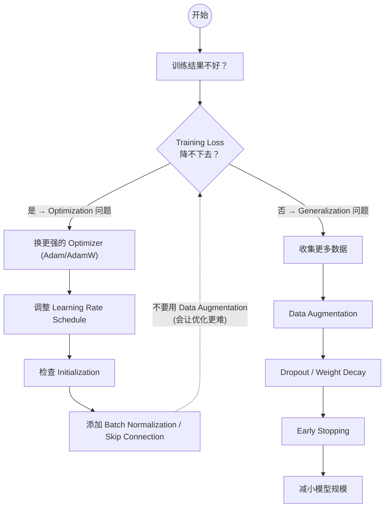

# 训练技巧 (Training Tips)

## 定义

深度学习模型训练过程中的一系列工程实践与优化策略。训练[[neural-network]]不仅仅是写出模型架构然后调用 `loss.backward()`——从学习率调度到批归一化，从初始化策略到梯度裁剪，每一个环节都直接影响模型能否收敛、收敛多快、以及最终泛化能力如何。

李宏毅老师将训练技巧按其所影响的机器学习三步骤分类：

| 步骤 | 含义 | 典型技巧 |
|------|------|----------|
| 步骤 1：定义 Loss | 损失函数的选择与数据 | [[loss-function]] 选择（MSE vs Cross-Entropy）、Data Augmentation |
| 步骤 2：模型架构 | 函数搜索范围的划定 | Batch Normalization、Layer Normalization、Skip Connection、[[activation-functions]] |
| 步骤 3：优化 | 搜索最优函数的方法 | [[gradient-descent]] 变体（Adagrad、RMSprop、Adam）、Learning Rate Scheduling、Gradient Clipping |

每个技巧带来的好处可分为两个方向：**更好的 Optimization**（training loss 更低）和**更好的 Generalization**（validation loss 更接近 training loss，避免[[overfitting-regularization|过拟合]]）。

> **关键洞察**：当 deep network 的 training loss 降得不如 linear model 低时，问题出在 Optimization，而非 Overfitting。此时应选择强化优化的技巧，而非正则化。^[raw/transcripts/hylee-genai-2025/hylee-2025-06-訓練神經網路的各種訣竅-mPWvAN4hzzY.md]

## 关键技巧

### 优化器 (Optimizers)

Vanilla [[gradient-descent]]只用当前梯度决定方向，但 loss surface 在不同方向上的梯度大小可能差异巨大，导致单一学习率无法兼顾所有参数。Optimizer 系列通过历史信息来为每个参数自适应调整学习率：

- **Adagrad**：记录所有历史梯度的平方和 $\sigma = \sqrt{\sum g_t^2}$，用它除学习率。梯度大的方向自动获得小学习率，梯度小的方向获得大学习率。缺点是 $\sigma$ 会单调递增，导致后期学习率过小。
- **RMSprop**：Adagrad 的改进版，用指数移动平均代替累加：$\sigma_t = \alpha \sigma_{t-1} + (1-\alpha) g_t^2$。让近期梯度有更大影响力，学习率能即时响应地形变化。
- **Momentum**：模拟物理世界的动量，将历史梯度加权累加为 $m_t = \beta m_{t-1} + (1-\beta) g_t$，用 $m_t$ 而非 $g_t$ 更新参数。帮助越过 saddle point 和浅 local minima。
- **Adam**：Momentum + RMSprop 的结合体，同时维护动量项 $m_t$ 和自适应学习率项 $v_t$，并做 bias correction。现代深度学习训练的默认选择。
- **AdamW**：Adam + 解耦权重衰减（decoupled weight decay），大模型训练（如 LLM pretrain）的标配。^[raw/transcripts/hylee-genai-2025/hylee-2025-06-訓練神經網路的各種訣竅-mPWvAN4hzzY.md]

### 学习率调度 (Learning Rate Scheduling)

学习率是训练中最敏感的超参数之一：

- **Warmup**：训练初期从小学习率开始，逐步增大，避免初期不稳定
- **Cosine Decay**：按余弦曲线从最大值衰减到最小值
- **Linear Decay**：线性递减学习率
- **Reduce on Plateau**：当 validation loss 停滞时自动降低学习率

现代 LLM 训练通常采用 warmup + cosine decay 的组合策略。^[raw/transcripts/hylee-ml-2025/hylee-ml-2025-05-预训练与对齐-Ozos6M1JtIE.md]

### 批归一化与层归一化 (Batch / Layer Normalization)

Normalization 系列技术将每一层的输出限制在某个范围内，使各维度的数值 scale 大致相同：

- **Batch Normalization (BatchNorm)**：在一个 mini-batch 内对每个特征维度做归一化（均值 0、方差 1），引入可学习的 $\gamma, \beta$ 参数恢复表达能力。主要帮助 Optimization（更容易调学习率），附带一些 Generalization 效果。
- **Layer Normalization (LayerNorm)**：对单个样本的所有特征做归一化，不依赖 batch 维度。是 [[transformer]] 架构的标准组件。
- **Data Normalization**：在数据进入网络前做标准化处理。

Normalization 本质上改变了函数搜索的范围（步骤 2），主要带来 Optimization 的好处——因为各维度数值范围一致，学习率更容易调整。同时，由于添加了额外约束，函数范围变小，对 Generalization 也有一定帮助。^[raw/transcripts/hylee-genai-2025/hylee-2025-06-訓練神經網路的各種訣竅-mPWvAN4hzzY.md]

### Dropout

训练时随机将一部分神经元的输出置零（如 dropout rate = 0.5 即丢弃 50%），迫使网络不依赖特定神经元组合，学习更鲁棒的特征。推理时关闭 dropout，所有神经元参与计算。

Dropout 主要服务于 **Generalization**，是防止[[overfitting-regularization|过拟合]]的经典方法之一。^[raw/transcripts/karpathy-nn-zero-to-hero/04-makemore-activations-gradients-P6sfmUTpUmc.md]

### 数据增强 (Data Augmentation)

通过变换现有数据创造"新"样本，扩充训练集的多样性：

- **图像**：水平翻转、旋转、裁剪、模糊、颜色抖动
- **语音**：变速、变调、男女声转换、添加噪声
- **文本**：回译（back translation）、同义词替换

Data Augmentation 改变的是 Loss 定义中的数据部分（步骤 1），主要带来 **Generalization** 的好处。注意：如果当前问题是 Optimization 问题（training loss 降不下去），加数据反而会让优化更困难。^[raw/transcripts/hylee-genai-2025/hylee-2025-06-訓練神經網路的各種訣竅-mPWvAN4hzzY.md]

### 混合精度训练 (Mixed Precision Training)

同时使用 FP16（半精度）和 FP32（全精度）进行计算：

- 前向传播和[[backpropagation|反向传播]]用 FP16，速度快、显存省
- 参数主副本保持 FP32，保证数值精度
- 配合 **Loss Scaling** 防止 FP16 下梯度下溢（gradient underflow）

大规模 LLM 训练中，mixed precision 可以将训练速度提升约 2 倍，显存占用减少近一半。^[raw/transcripts/hylee-ml-2025/hylee-ml-2025-05-预训练与对齐-Ozos6M1JtIE.md]

### 梯度裁剪 (Gradient Clipping)

当梯度范数超过阈值时，按比例缩小梯度：

$$g \leftarrow g \cdot \frac{\text{max\_norm}}{\|g\|} \quad \text{if } \|g\| > \text{max\_norm}$$

防止[[gradient-descent|梯度爆炸]]导致的训练不稳定，是 RNN 和大模型训练中的标准操作。典型阈值：1.0 或 0.3。^[raw/transcripts/hylee-ml-2025/hylee-ml-2025-05-预训练与对齐-Ozos6M1JtIE.md]

### 参数初始化 (Initialization)

好的初始化对训练至关重要——即使有强大的 optimizer，不同的初始化也会导向不同的 local minimum，而不同 minimum 的泛化特性差异巨大：

- **Kaiming/He Initialization**：根据输入维度调整随机初始化的 scale，$\text{scale} = \sqrt{2 / n_{\text{in}}}$，专为 ReLU 类[[activation-functions|激活函数]]设计
- **Xavier/Glorot Initialization**：$\text{scale} = \sqrt{2 / (n_{\text{in}} + n_{\text{out}})}$，适用于 Tanh/Sigmoid
- **Pre-training 作为初始化**：先在大规模无标注数据上预训练，再在目标任务上微调。Pre-training 同时帮助 Optimization 和 Generalization——平坦盆地的 minimum 比峡谷中的 minimum 泛化更好。^[raw/transcripts/hylee-genai-2025/hylee-2025-06-訓練神經網路的各種訣竅-mPWvAN4hzzY.md]

### Skip Connection (残差连接)

将层的输入直接加到输出上：$a' = Wa + a$。好处：

- 让低层参数的变化能"直通"到最终输出（高速公路效应）
- 显著平坦化 loss surface，使优化更容易
- 是 ResNet 和现代 [[transformer]] 架构的核心组件

Skip connection 改变了网络架构（步骤 2），主要带来 **Optimization** 的好处。^[raw/transcripts/hylee-genai-2025/hylee-2025-06-訓練神經網路的各種訣竅-mPWvAN4hzzY.md]

### 损失函数选择

分类任务不能直接用 Accuracy 做 Loss——Accuracy 不可微，计算出的梯度几乎总为 0，无法做[[gradient-descent|梯度下降]]。正确做法是用 **Cross-Entropy Loss**（配合 Softmax），它可微且能反映预测概率分布与真实分布的差异。参见[[loss-function]]。^[raw/transcripts/hylee-genai-2025/hylee-2025-06-訓練神經網路的各種訣竅-mPWvAN4hzzY.md]

## 跨课程视角

> 以下课程深入讲解了训练技巧，点击课程名查看完整笔记。

### [[hylee-genai-ml-2025|李宏毅 GenAI 2025]] (第6讲)

本讲的核心来源。系统性地按"三步骤"框架介绍训练技巧：从 Optimizer（Adagrad → RMSprop → Momentum → Adam）到 Initialization（Kaiming init、pre-training 作为 pretext task）、到架构设计（CNN receptive field、skip connection）、再到 Normalization 和 Loss 定义（Cross-Entropy vs Accuracy）。特别强调每个技巧到底是帮助 Optimization 还是 Generalization，避免"看到效果差就说 overfitting"的常见误区。^[raw/transcripts/hylee-genai-2025/hylee-2025-06-訓練神經網路的各種訣竅-mPWvAN4hzzY.md]

### [[hylee-ml-2025|李宏毅 ML 2025]] (第5讲 预训练与对齐)

聚焦 LLM 训练的三阶段范式：Pre-training → SFT (Supervised Fine-Tuning) → RLHF。强调 Pre-training 阶段使用的数据量远超 Alignment 阶段（LLaMA-2 的 SFT 仅用 ~27,540 条数据），但 Alignment 数据的质量至关重要——"画龙点睛"。讨论 Knowledge Distillation（用 GPT-4 等强模型生成训练数据）作为低成本获得强大模型的方法。从宏观角度理解训练流程中各阶段的目标与技巧。^[raw/transcripts/hylee-ml-2025/hylee-ml-2025-05-预训练与对齐-Ozos6M1JtIE.md]

### [[karpathy-nn-zero-to-hero|Karpathy NN Zero to Hero]] (L4-L5)

从实践角度深入训练细节：实验对比不同[[activation-functions|激活函数]]（Tanh vs ReLU）对梯度流的影响、BatchNorm 和 Dropout 在字符级语言模型中的实际效果、手动[[backpropagation|反向传播]]（Backprop Ninja）理解梯度计算的每个细节。强调"先手写实现，再用框架"的学习路径。^[raw/transcripts/karpathy-nn-zero-to-hero/04-makemore-activations-gradients-P6sfmUTpUmc.md] ^[raw/transcripts/karpathy-nn-zero-to-hero/05-makemore-backprop-ninja-q8SA3rM6ckI.md]

## 诊断训练问题的决策树

> 训练诊断决策树：首先判断 Training Loss 是否降得下去——如果能降但验证差，是泛化问题，用正则化和数据增强；如果降不下去，是优化问题，应调整 Optimizer、学习率和初始化策略。

## 技巧分类总览

| 技巧 | 改变步骤 | 主要好处 | 备注 |
|------|----------|----------|------|
| Adam / AdamW | 3 (优化) | Optimization | 现代默认选择 |
| Learning Rate Schedule | 3 (优化) | Optimization | Warmup + Decay |
| Momentum | 3 (优化) | Optimization | 帮助越过 saddle point |
| Batch Normalization | 2 (架构) | Optimization (+Generalization) | CNN 标配 |
| Layer Normalization | 2 (架构) | Optimization | Transformer 标配 |
| Dropout | 2 (架构) | Generalization | 防过拟合 |
| Data Augmentation | 1 (Loss) | Generalization | 不适用于优化问题 |
| Weight Decay / L2 | 1 (Loss) | Generalization | 等价于正则化 |
| Kaiming Initialization | 3 (优化) | Optimization | ReLU 专用 |
| Pre-training | 3 (优化) | Optimization + Generalization | 2025 年通用大绝招 |
| Skip Connection | 2 (架构) | Optimization | 平坦化 loss surface |
| Mixed Precision | 3 (优化) | 速度/显存 | 大规模训练必备 |
| Gradient Clipping | 3 (优化) | 稳定性 | 防止梯度爆炸 |
| Cross-Entropy Loss | 1 (Loss) | Optimization | 分类任务标准选择 |

## 相关概念

- [[gradient-descent]] — 所有 Optimizer 的基础算法
- [[backpropagation]] — 计算梯度的核心机制
- [[loss-function]] — 训练要最小化的目标
- [[activation-functions]] — 影响梯度流动和网络表达能力
- [[neural-network]] — 训练技巧的应用对象
- [[overfitting-regularization]] — Generalization 类技巧的核心目标
- [[fine-tuning]] — 预训练后的微调阶段
- [[transformer]] — 现代 LLM 的架构，大量使用 LayerNorm 和 Skip Connection
