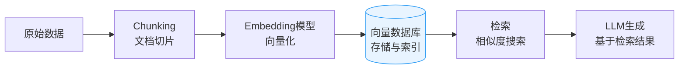

# 向量数据库在AI项目中的运用

## 概述

向量数据库（Vector Database）是专为存储、索引和检索高维向量数据而设计的数据库系统。在AI/LLM项目中，它是实现语义搜索和[[rag-architecture|RAG（检索增强生成）]]的核心基础设施。

## 核心原理

**Embedding（向量化）：** 将文本、图片、音频等非结构化数据通过模型转换为高维向量（如1536维），语义相近的内容在向量空间中距离更近。

**相似度检索：** 通过余弦相似度、欧氏距离等度量方式，快速找到与查询向量最相似的Top-K结果。

**索引算法：**
- HNSW（Hierarchical Navigable Small World）：高召回率，主流选择
- IVF（Inverted File Index）：适合大规模数据
- PQ（Product Quantization）：压缩存储，牺牲精度换空间

## 主流产品

- **Milvus / Zilliz**：开源，国产，支持分布式
- **Pinecone**：全托管SaaS，易用
- **Weaviate**：内置向量化模块
- **Chroma**：轻量级，适合原型开发
- **Qdrant**：Rust实现，高性能
- **pgvector**：PostgreSQL扩展，适合已有PG基础设施

## 在AI项目中的典型应用场景

### 1. RAG（检索增强生成）
- 将企业知识库文档向量化存入向量数据库
- 用户提问时，先检索相关文档片段，再拼接给LLM生成回答
- 解决LLM知识截止和幻觉问题

### 2. 语义搜索
- 替代传统关键词搜索，支持模糊语义匹配
- 电商商品搜索、客服知识库、代码搜索

### 3. 推荐系统
- 用户画像和物品画像向量化后做相似度匹配
- 比传统协同过滤更适合冷启动场景

### 4. 多模态检索
- 图片→向量，实现以图搜图
- 文本→向量→图片，跨模态检索

## 架构设计要点

**数据流：**

> 向量数据库的完整数据流：从原始文档切分到向量化存储，再到检索增强的 LLM 生成。

**关键决策：**
- Chunk策略：按段落/固定长度/语义切分，影响检索质量
- Embedding模型选择：OpenAI text-embedding / BGE / M3E 等
- 混合检索：向量检索 + 关键词检索（BM25）融合，提升召回率
- 重排序（Reranking）：检索后用Cross-encoder重排，提升精度

## 与传统数据库的区别

- 传统DB：精确匹配、结构化查询（SQL）
- 向量DB：近似最近邻（ANN）、高维空间相似度检索
- 二者互补而非替代：实际项目中常结合使用（向量检索 + 关系型过滤）

## 关联概念

- [[rag-architecture]] — RAG架构详解
- [[hexagonal-architecture]] — 六边形架构（解耦向量数据库依赖的设计模式）
- [[llm-application-architecture]] — LLM应用架构总览

## 备考提示

软考可能考的角度：
- 向量数据库解决了AI项目中的什么问题（非结构化数据的语义检索）
- 与关系型数据库/全文检索的区别
- 在系统架构中如何集成（API设计、数据流）
- 性能考量：索引选择、维度压缩、混合检索策略
