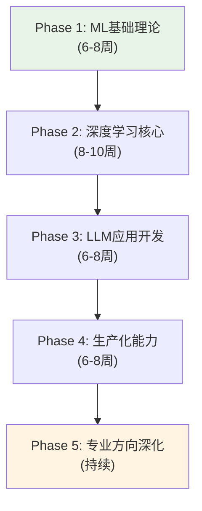

# AI工程师系统学习计划（文本优先版）

> **核心原则**：文本优先，视频为辅。所有学习以教科书、技术博客、官方文档为主线，视频仅作辅助。
> 文本可翻译、可跳读、可精读，学习密度远高于视频。

## 你的起点优势

作为12年资深工程师（Java/Go/Python/K8s/云原生），你已具备：
- ✓ 扎实的工程能力（系统设计、分布式、微服务）
- ✓ 云原生技术栈（K8s, Docker, CI/CD）
- ✓ 多语言开发经验
- ✓ 生产环境思维

需要补的：ML理论基础、深度学习、LLM应用开发

## 学习路线总览

> AI 工程师系统学习的五阶段路径：从 ML 基础理论到专业方向深化，逐步构建完整的 AI 技术栈。

---

## Phase 1: ML基础理论 (6-8周)

**目标：** 建立机器学习思维，理解核心算法

### 主线教材：d2l.ai（动手学深度学习）

🥇 **首选**：[d2l.ai 中文版](https://zh.d2l.ai/) — 交互式教材，每个概念附可运行代码（PyTorch）

| 章节 | 主题 | 学习重点 |
|------|------|----------|
| 第2章 | 预备知识 | 张量操作、线性代数回顾（快速过） |
| 第3章 | 线性神经网络 | 线性回归、softmax回归、损失函数 |
| 第4章 | 多层感知机 | 前向传播、反向传播、激活函数 |
| 第5章 | 深度学习计算 | 模型构造、参数管理、GPU计算 |

**辅助**：[[3blue1brown-linear-algebra|3Blue1Brown 线性代数]]（可视化补充，B站有中文字幕）

### 第5-8周：机器学习算法

🥇 **首选**：[[andrew-ng-ml-specialization|Andrew Ng ML Specialization]] 配套笔记 + 编程作业
- Coursera 有文字版讲义，不必须看视频
- Python + scikit-learn，有编程作业

🥈 **辅助视频**（选看）：
- [[hylee-ml-2025|李宏毅 ML 2025]] 前5讲（中文讲解，已有字幕）

**核心算法（必须手写实现）：**
- 线性回归、逻辑回归
- 决策树、随机森林
- SVM（理解核技巧思想）
- K-means、DBSCAN
- 交叉验证、特征工程

**实践项目：**
- Kaggle入门竞赛（Titanic, House Prices）
- 用scikit-learn完成完整ML pipeline

---

## Phase 2: 深度学习核心 (8-10周)

**目标：** 掌握神经网络和深度学习

### 第1-6周：深度学习基础

🥇 **首选**：[d2l.ai 中文版](https://zh.d2l.ai/) 继续

| 章节 | 主题 | 学习重点 |
|------|------|----------|
| 第6章 | 卷积神经网络 | CNN、LeNet、ResNet |
| 第7章 | 现代CNN | VGG、GoogLeNet、Batch Normalization |
| 第8章 | 循环神经网络 | RNN、LSTM、GRU |
| 第10章 | 注意力机制 | Attention、Self-Attention（重中之重） |

🥈 **补充博客**（必读）：
- [[jay-alammar-chip-huyen-blog|Jay Alammar: The Illustrated Transformer]] — 图解Transformer，全网最佳可视化
- [[karpathy-blog-articles|Karpathy: A Recipe for Training Neural Networks]] — 训练神经网络的最佳实践

📹 **辅助视频**（选看）：
- [[hylee-genai-ml-2025|李宏毅生成式AI导论]] 第2-6讲（已有字幕）

**核心任务：**
- PyTorch基础（必学，业界标准）
- 手写简单神经网络
- 用PyTorch实现CNN做图像分类

### 第7-10周：Transformer深度理解

**这是当前AI的核心，必须深入**

🥇 **首选文本**：
- [[jay-alammar-chip-huyen-blog|Jay Alammar: The Illustrated Transformer]] — 图解精读
- [Stanford CS224n 课程笔记](https://web.stanford.edu/class/cs224n/) — NLP方向理论基础
- 精读 "Attention Is All You Need" 论文

🥈 **辅助教材**：
- [d2l.ai 第10章](https://zh.d2l.ai/chapter_attention-mechanisms-and-transformers/index.html) — Transformer实现
- [[raschka-understanding-llms|Raschka: LLM学习路线图]] — 系统性LLM知识框架

📹 **辅助视频**（推荐看）：
- [[karpathy-nn-zero-to-hero|Karpathy NN Zero to Hero]] 第7讲 Let's build GPT（从零实现Transformer，实操性强）

**核心任务：**
- 跟着Karpathy视频，从零实现GPT
- 理解：Multi-head attention, Position encoding, Layer normalization

---

## Phase 3: LLM应用开发 (6-8周)

**目标：** 掌握大语言模型应用开发

### 第1-3周：Prompt Engineering + LLM原理

🥇 **首选文本**：
- [[karpathy-blog-articles|Karpathy博客]] — LLM使用实践
- [[lilian-weng-blog|Lilian Weng: Prompt Engineering]] — 系统化Prompt技术
- OpenAI官方 [Prompt Engineering Guide](https://platform.openai.com/docs/guides/prompt-engineering)

📹 **辅助视频**（选看）：
- [[karpathy-llm-talks|Karpathy LLM Talks]] — Intro to LLMs + Deep Dive

### 第4-8周：RAG与Agent开发

🥇 **首选文本**：
- [[lilian-weng-blog|Lilian Weng: LLM Powered Agent]] — Agent架构综述
- [[anthropic-building-agents|Anthropic: Building Effective Agents]] — Agent实战指南
- [LangChain 官方文档](https://python.langchain.com/docs/) — 框架文档即教程
- [HuggingFace NLP Course](https://huggingface.co/learn/nlp-course) — 纯文本+代码

🥈 **辅助教材**：
- [[eugene-yan-simon-willison|Eugene Yan: LLM Engineering Patterns]] — 工程模式

📹 **辅助视频**（选看）：
- [[langchain-mastery-2025|LangChain Mastery 2025]] — 视频版框架教程
- [[freecodecamp-langgraph|LangGraph 课程]] — 复杂Agent构建

**实践项目：**
- 构建企业知识库问答系统（RAG）
- 开发AI Agent（能调用工具、记忆上下文）

---

## Phase 4: 生产化能力 (6-8周)

**目标：** 将AI应用部署到生产环境

**这是你的核心优势，快速强化**

🥇 **首选文本**：
- [[jay-alammar-chip-huyen-blog|Chip Huyen: Designing ML Systems]] — MLOps架构书
- [Full Stack Deep Learning](https://fullstackdeeplearning.com/) — 文字+代码
- [ML Engineering Book (Andriy Burkov)](http://www.mlebook.com/) — 工程实践

🥈 **辅助**：
- [[lilian-weng-inference-optimization|Lilian Weng: LLM推理优化]] — 推理优化综述

📹 **辅助视频**（选看）：
- [[mlops-zoomcamp|MLOps Zoomcamp]] — 视频+代码，工程实践导向

### 第1-3周：模型服务化

**核心技术：**
- 模型推理服务：vLLM, TGI, Ollama
- API设计：FastAPI + 流式响应
- 负载均衡、限流、监控

### 第4-6周：MLOps基础

**核心工具：**
- 实验跟踪：MLflow, Weights & Biases
- Pipeline编排：Kubeflow Pipelines, Airflow
- 模型版本管理

### 第7-8周：性能优化

**重点技术：**
- 模型量化：GPTQ, AWQ, GGUF
- 推理加速：TensorRT, ONNX Runtime
- KV Cache优化

---

## Phase 5: 专业方向深化 (持续)

根据兴趣和市场需求，选择1-2个方向深入：

### 方向A: LLM微调专家

🥇 **首选文本**：
- [[lilian-weng-semi-supervised|Lilian Weng: 半监督学习]] — 理论基础
- Hugging Face PEFT库官方文档与教程
- [[raschka-understanding-llms|Raschka: Build a Large Language Model]] — LLM实践书

📹 **辅助视频**：
- [[freecodecamp-llm-finetuning|LLM微调课程]] — LoRA/QLoRA实战

### 方向B: AI Agent架构师

🥇 **首选文本**：
- [[lilian-weng-blog|Lilian Weng: LLM Agent综述]] — 理论框架
- [[anthropic-building-agents|Anthropic Agent实战指南]]
- LangGraph 官方文档

📹 **辅助视频**：
- [[freecodecamp-langgraph|LangGraph课程]] — 复杂Agent构建

### 方向C: 多模态AI

🥇 **首选文本**：
- [[lilian-weng-vision-language-models|Lilian Weng: 视觉语言模型]] — 综述

📹 **辅助视频**：
- [[cvpr-2022-multimodal-ml|CVPR 2022多模态ML]] — 理论基础
- [[hylee-genai-ml-2025]] 第9讲（多模态生成实践）

---

## 时间规划建议

**工作日（每天2-3小时）：**
- 早起60分钟：读教材/博客（文本为主）
- 午休30分钟：浏览技术博客/论文摘要
- 晚上1-1.5小时：动手实践（写代码，跑d2l.ai的Jupyter）

**周末（每天4-6小时）：**
- 项目实战
- 深入阅读长篇博客/论文
- Kaggle竞赛

**总时长预估：**
- Phase 1: ~120小时
- Phase 2: ~160小时
- Phase 3: ~120小时
- Phase 4: ~100小时
- Phase 5: 持续

**总计：~500小时（约7-9个月，每天2-3小时）**
比视频版节省约150小时——文本学习密度更高。

## 里程碑检查点

### 第3个月末
- [ ] 完成 d2l.ai 前10章，能独立用 scikit-learn + PyTorch 做项目
- [ ] Kaggle 入门竞赛提交成功
- [ ] 理解 [[gradient-descent|梯度下降]]、[[overfitting-regularization|过拟合]] 等核心概念

### 第6个月末
- [ ] 精读 Jay Alammar Illustrated Transformer + 原始论文
- [ ] 从零实现 [[transformer|Transformer]]（跟 Karpathy 第7讲）
- [ ] 理解 Attention 机制

### 第9个月末
- [ ] 完成2个 LLM 应用项目（RAG + Agent）
- [ ] 熟悉 LangChain/LangGraph
- [ ] 能部署 LLM 服务到 K8s

### 第12个月末
- [ ] 完成1个生产级 AI 项目
- [ ] 有 MLOps 实践经验
- [ ] 可以面试 AI Engineer 岗位

## 文本资源速查表

| 资源 | 类型 | 语言 | 链接 | 适合阶段 |
|------|------|------|------|----------|
| d2l.ai（动手学深度学习） | 交互式教材 | 中文/英文 | [zh.d2l.ai](https://zh.d2l.ai/) | Phase 1-2 |
| Stanford CS231n 笔记 | 课程笔记 | 英文 | [cs231n.github.io](https://cs231n.github.io/) | Phase 2 |
| Stanford CS224n 笔记 | 课程笔记 | 英文 | [cs224n](https://web.stanford.edu/class/cs224n/) | Phase 2-3 |
| HuggingFace NLP Course | 文本教程 | 英文 | [huggingface.co/learn](https://huggingface.co/learn/nlp-course) | Phase 3 |
| Jay Alammar 博客 | 技术博客 | 英文 | [jalammar.github.io](https://jalammar.github.io/) | Phase 2 |
| Lilian Weng 博客 | 技术博客 | 英文 | [lilianweng.github.io](https://lilianweng.github.io/) | Phase 3-4 |
| Karpathy 博客 | 技术博客 | 英文 | [karpathy.github.io](https://karpathy.github.io/) | Phase 2-3 |
| Chip Huyen ML Systems | 书籍 | 英文 | O'Reilly | Phase 4 |
| Full Stack Deep Learning | 文本教程 | 英文 | [fullstackdeeplearning.com](https://fullstackdeeplearning.com/) | Phase 4 |
| ML Engineering Book | 书籍 | 英文 | [mlebook.com](http://www.mlebook.com/) | Phase 4 |
| Raschka LLM Roadmap | 路线图 | 英文 | 已收录Wiki | Phase 2-3 |
| Anthropic Agent Guide | 实战指南 | 英文 | 已收录Wiki | Phase 3 |

## 与软考的关系

你的软考系统架构师考试（11月）与AI学习**不冲突**：
- 软考重点：系统设计、架构模式、软件工程
- AI学习重点：算法、模型、应用开发
- 可以并行，但建议软考前减少AI学习时间

**建议：**
- 现在-11月：软考为主（70%），AI学习为辅（30%）
- 11月后：全力AI学习

---

## 关联

- [[progress-ai-ml]] — 学习进度跟踪
- [[andrew-ng-ml-specialization]] — 吴恩达ML专项课程
- [[llm-learning-path]] — LLM专项学习路径（更聚焦）
- [[ruankao-11month-strategy]] — 软考备考策略（并行计划）
