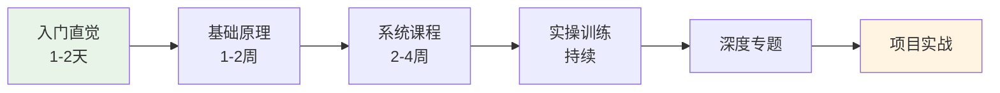

# LLM大模型专项学习路径

面向有软件工程背景的学习者，从直觉理解到工程实践的完整路径。

## 学习阶段

> LLM 学习的六阶段路径：从直觉理解到工程实践，逐步深入大模型技术栈。

## 阶段一：入门直觉（1-2天）

- [[andrej-karpathy|Karpathy]] — Let's build GPT from scratch（2小时视频）
- [[ai-bloggers-blogs#Jay Alammar|Jay Alammar]] — The Illustrated Transformer（图解）

目标：理解Token、Attention、Transformer的核心直觉

## 阶段二：基础原理（1-2周）

- Transformer数学原理：[[ai-bloggers-blogs#苏剑林|苏剑林博客]] 的Attention推导
- [[huggingface|HuggingFace NLP Course]] — Tokenization→Attention→BERT→GPT
- [[li-mu-d2l|d2l]] 前10章 — DL基础

## 阶段三：系统课程（2-4周）

- [[andrew-ng|Andrew Ng]] DeepLearning.AI LLM短课系列（每课~1h）
- Full Stack LLM Bootcamp: [fullstackdeeplearning.com](https://fullstackdeeplearning.com)
  - 覆盖：Prompt→RAG→Finetune→Eval→Deploy→LLMOps

## 阶段四：实操训练（持续）

- [[huggingface|HuggingFace]] Pipeline/Tokenizer/Trainer API
- Ollama ([ollama.ai](https://ollama.ai)) — 一行命令本地运行LLM
- 本地运行开源LLM（Llama/Mistral/Qwen）

## 阶段五：深度专题

- [[ai-bloggers-blogs#Lilian Weng|Lilian Weng]] 博客：Agent、Prompt Engineering、RAG、Hallucination
- 关键论文阅读顺序：
  1. Attention Is All You Need (Transformer)
  2. BERT
  3. GPT-2/GPT-3
  4. InstructGPT (RLHF)
  5. LLaMA
  6. RAG原论文
  7. LoRA

## 阶段六：项目实战

### 入门项目
- 用nanoGPT训练字符级语言模型
- 用HuggingFace Pipeline做文本分类/生成
- 用LangChain构建简单RAG系统

### 进阶项目（结合你的背景）
- 用LoRA微调开源LLM做领域问答
- 构建多Agent协作系统
- 部署LLM服务（vLLM）并做性能优化 — 结合你的K8s经验
- [[vector-database-ai|向量数据库]]集成RAG系统

## 与你的职业结合

- 鸿蒙+AI端侧部署（已有鸿蒙经验）
- MLOps/模型部署（已有K8s+Go+云原生经验）
- 这两个方向市场稀缺，不卷大模型训练

## 关联
- [[li-mu-d2l]] — 中文DL入门首选，论文精读是LLM进阶利器
- [[hylee-genai-ml-2025]] — 李宏毅2025生成式AI课程（系统课程，11讲已收录）
- [[ai-learning-resources]] — 学习资源总导航
- [[vector-database-ai]] — 向量数据库在AI项目中的运用
- [[hexagonal-architecture]] — 六边形架构（可用于LLM应用解耦）
