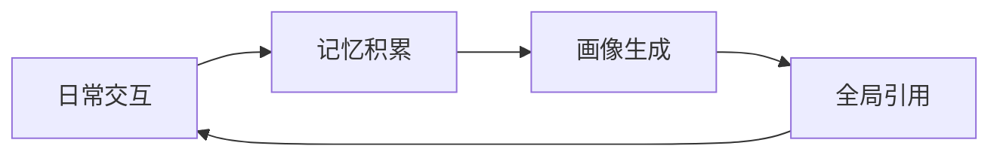
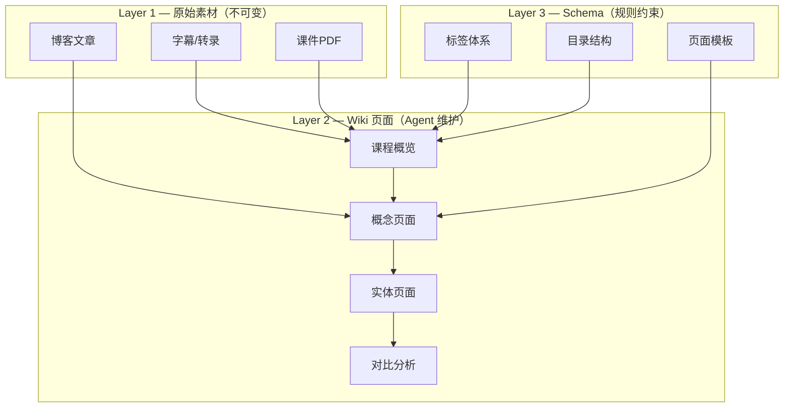
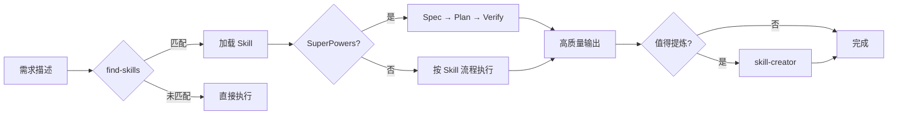
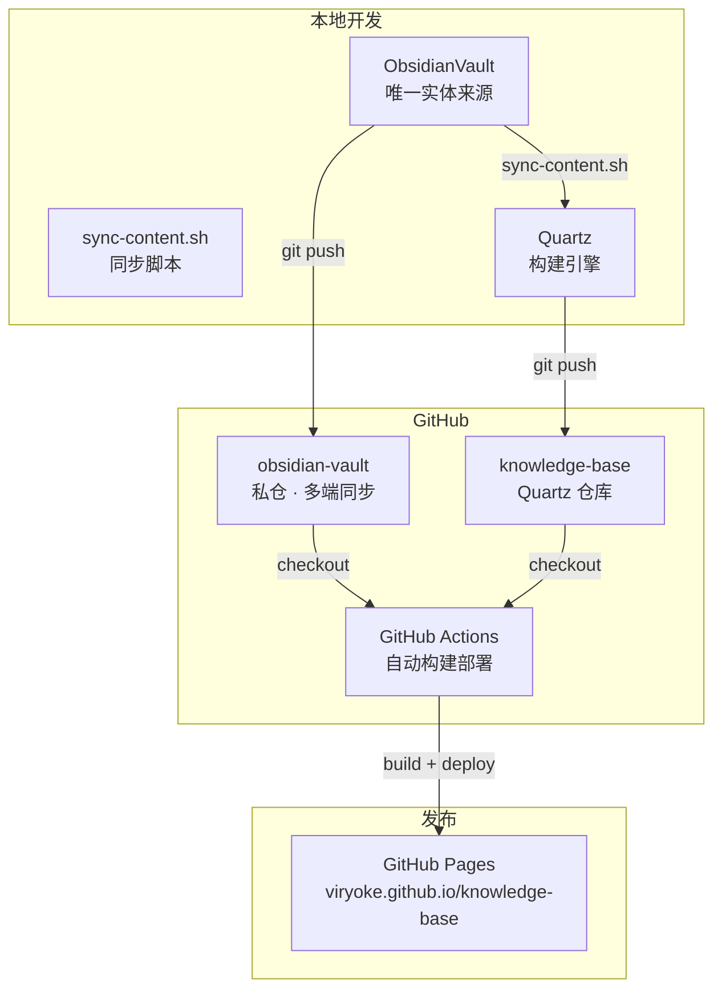
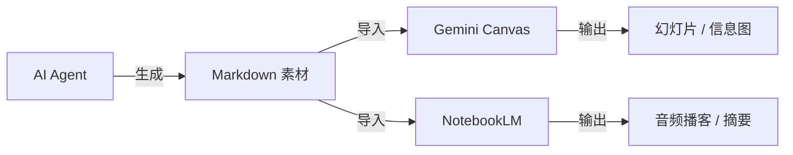

# AI工具使用心得：构建个性化AI工作流

> 六个关键实践，让AI工具从"一次性回答机器"变成真正积累起来的工作伙伴。
> 
> 本文档归档了我在日常工作中使用多款 AI Agent 工具的真实体验，涵盖统一配置、个性化记忆、知识积累、Skill 生态、跨端共享和富文本生成六个方面。

## 背景

作为 12 年研发经验的架构师，我的日常工作流里 AI 已经不是"偶尔问一下"的角色，而是**常驻的工作伙伴**。从写代码、查资料、做架构设计到整理学习笔记，几乎每个环节都有 AI Agent 参与。

但问题来了——**工具太多了**。Claude Code、Copilot、Cursor、Hermes Agent……每个都能干活，但怎么组合使用效率最高？怎么让 AI 不只是"一次性回答机器"，而是真正积累起来？

核心思路：**以知识库为中心，以全局配置为约束，让 AI 工具服务于长期知识积累**。

---

## 1. 统一多个AI工具

**问题**：Claude Code、Copilot、Cursor、Hermes Agent……每个都能干活，但输出风格和质量参差不齐。你告诉 Claude "用 Mermaid 画图"，Copilot 可能给你 ASCII art；你在 Hermes 里定义了暖色调设计，Claude Code 又给你紫色渐变。

**做法**：构建全局 AGENTS.md，定义 AI 角色与个人偏好，让所有工具统一引用。

**配置位置**：

| 工具 | 配置文件 | 作用 |
|------|----------|------|
| Hermes Agent | `SOUL.md` | 灵魂文件，定义人格和行为准则 |
| OpenCode | `~/.agents/AGENTS.md` | 全局 Agent 配置 |
| Claude Code | `~/.claude/CLAUDE.md` | 记忆文件，持久化偏好 |
| Cursor | `.cursorrules` | 项目级规则 |

**AGENTS.md 核心内容**：
- **角色定义**：严谨学者型学习助手，不是通用助手
- **字体偏好**：中文霞鹜文楷、英文 Inter、代码 JetBrains Mono、标题 Instrument Serif
- **设计风格**：Editorial Warm Academic（暖色调 + Bento Grid）
- **图表规范**：Mermaid only，禁止 ASCII art（这条踩过坑）
- **输出要求**：文本优先、具体可执行、注释用中文
- **知识库引用**：何时读取知识库、何时更新知识库

**效果**：所有工具共享同一套规则。你在 Hermes 里说"帮我画个架构图"，Claude Code 里说同样的话，出来的结果风格一致。

**踩坑经验**：
- 最初每个工具单独配偏好，维护成本极高，且容易不一致
- AGENTS.md 不宜太长，控制在 200 行以内，否则每次对话都消耗大量 Token
- 具体可执行的规则（"用 Mermaid"）比模糊的规则（"画漂亮的图"）有效得多

---

## 2. 让AI工具更懂你

**问题**：每次对话都从零开始，AI 不知道你的背景和偏好。你得反复解释"我是架构师"、"我要中文注释"、"我喜欢暖色调"。

**做法**：通过个人画像和持久记忆，让 AI 工具渐进式理解你。

**实现路径**：



> 记忆 → 画像 → 引用 → 交互的闭环，让 AI 越用越懂你。

**记忆积累**（自动）：
- Hermes Agent 在每次交互中自动记录偏好：字体、设计风格、编码习惯、学习进度
- 关键纠正会被优先记忆：用户说"不要 ASCII 图"，下次就不会再犯
- 记忆容量有限（~4000字符），需要定期清理过时信息

**画像生成**（半自动）：
- 基于记忆生成结构化个人画像，存放在 `profile/` 目录
- 画像分为：身份(identity)、偏好(preferences)、技术栈(tech-stack)、目标(goals)、兴趣(interests)
- 由 Agent 渐进式构建，用户审核后写入

**全局引用**：
- 画像配置在 AGENTS.md 中，声明何时引用、何时更新
- 所有工具共享同一份画像，避免重复配置

**示例记忆条目**：
```yaml
# 用户偏好
user.font.cn: 霞鹜文楷
user.font.code: JetBrains Mono
user.design: Editorial Warm Academic
user.chart: Mermaid only, no ASCII

# 用户背景
user.role: 12年研发经验 · 架构师
user.goals: AI/ML · 软考 · 英语
user.style: 文本优先 · 具体可执行

# 环境信息
user.os: macOS
user.timezone: UTC+8
user.proxy: Clash Verge (TUN mode)
```

**核心理念**：记忆是渐进式的。AI 不会一开始就懂你，但通过持续交互和主动提供个人信息文档（简历、技术栈、学习目标），画像会越来越精准。

**踩坑经验**：
- 记忆不是越多越好，过时的记忆反而会误导 AI（比如旧项目的技术栈）
- 主动提供文档比被动积累更高效：把简历丢给 AI 比慢慢聊出来快得多
- 画像需要定期人工审核，AI 可能误解你的意图并"记住"错误的东西

---

## 3. 积累AI产生的素材

**问题**：AI 生成的洞察、方案、设计稿散落各处——在 ChatGPT 对话里、在 Claude 的上下文中、在 Copilot 的注释里。过一周就全忘了，无法复利。

**做法**：基于 [Karpathy LLM Wiki](https://gist.github.com/karpathy/442a6bf555914893e9891c11519de94f) 理念构建本地知识库，让素材形成复利网络。

**核心理念**：传统 RAG（检索增强生成）每次从零发现知识，Wiki 则是一次编译、持续更新。交叉引用已经建好了，矛盾已经标记了，综合反映了所有已摄入的内容。

**三层架构**：



> 三层架构：原始素材不可变，Wiki 页面由 Agent 编译维护，Schema 约束所有行为。

**AGENTS.md 中的声明**：
- **何时引用知识库**：回答问题时、生成内容时、需要交叉引用时
- **何时更新知识库**：新素材摄入时、知识冲突时、定期 lint 检查时
- **页面阈值**：实体/概念出现在 2+ 来源中才创建独立页面

**复利效应**：
- 每门新课的摄入可能触发 5-15 个页面的更新（交叉引用）
- 概念页面聚合多门课程的讲解，形成密集的知识网络
- 知识库价值 = 页面数 × 交叉链接密度 × 内容质量

**定时任务（Hermes Cron）**：
- **AI 双日简报**：自动搜集 AI 领域新闻，识别新概念并创建/更新页面
- **知识库 Lint 检查**：检测孤儿页、断链、标签脱节、stub 页面
- **知识库同步 GitHub**：自动 commit + push，保持多端同步

**待解决问题**：上下文浪费——AI 工具在引用知识库进行交叉引用、Lint 检查、回答查询时，需要读取大量知识库页面作为上下文，消耗巨量 Token。知识库越丰富，每次交互的 Token 成本越高。目前尚未找到优雅的按需加载方案。

**踩坑经验**：
- 最初什么都想建页面，导致大量 stub 页面（只有标题没有内容），比没有还糟
- `raw/` 目录必须严格不可变，哪怕只是"加个摘要"也不行——修正写到 Wiki 层
- 字幕文件命名要用纯文本，全角字符和 emoji 会导致 Obsidian wikilink 解析失败
- Lint 检查要定期跑，标签脱节和断链会随着页面增多而指数级增长

---

## 4. 必装的 Skills

Skill 是 AI 工具生态中**最被低估的能力**——它让 AI 的经验可复用、可积累、可共享。

**五个经过实战验证的 Skill**：

### find-skills — 发现和安装 Skills

当你遇到问题时，先让 AI 搜索有没有现成的 Skill 可以解决。避免重复造轮子。

```
触发：描述问题 → find-skills → 匹配 Skill → 使用
```

### skill-creator — 高质量创建自定义 Skill

当你完成一个复杂任务后，让 AI 提炼出可复用的流程。自动生成标准目录结构（SKILL.md + references/ + scripts/）。

```
触发：复杂任务完成 → skill-creator → 提炼流程 → 用户审核 → 入库
```

### SuperPowers — 四步走确保质量

头脑风暴 → Spec（规格定义）→ Plan（计划）→ Verify（验证）。四步走确保 AI 生成的代码和文档符合预期，而不是"看起来对但跑不通"。

```
触发：新功能开发 → brainstorming → spec → plan → implement → verify
```

### frontend-design — 消除"AI味"

AI 生成的 Web 页面有强烈的模式化特征：紫色渐变、glassmorphism、Space Grotesk 字体、千篇一律的 hero section。这个 Skill 定义了 12 条反 AI 味规则。

```
触发：生成 Web 页面 → frontend-design → 避免 AI 味
```

### ui-ux-pro-max — 高质量设计素材库

50+ 风格模板、161 色彩方案、57 字体配对、500+ 组件参考。搭配 frontend-design 使用：一个设计全局架构，一个生成高质量单页。

```
触发：UI 设计 → ui-ux-pro-max 提供素材 → frontend-design 生成页面
```

**Skill 工作流**：



> Skill 生态形成闭环：发现 → 使用 → 提炼 → 共享 → 发现。

**踩坑经验**：
- Skill 的 `description` 字段最关键——AI 用它决定是否激活，写不好就永远不会被调用
- Skill 不宜太多太细，同类窄 Skill 应合并为 umbrella Skill
- 定期清理过时 Skill，不维护的 Skill 会变成负担

---

## 5. 知识库的跨端共享

**问题**：知识库只在本地 Mac 上，但我想在 iPhone 上复习笔记、在 iPad 上浏览概念、在公司电脑上查阅。

**做法**：GitHub 私仓同步 + Quartz 静态站点发布 + 自动化 CI/CD。

**架构**：



> 两个仓库协作：vault 私仓存实体，Quartz 仓库负责构建发布。CI 自动从 vault 拉取最新内容。

**Quartz 配置**（`quartz.config.yaml`）：
- `baseUrl`: `viryoke.github.io/knowledge-base`
- `ignorePatterns`: `raw/`, `DailyNotes/`, `profile/`, `SCHEMA.md`, `AGENTS.md`, `log.md`
- 字体: Inter + JetBrains Mono
- 主题: 暖色调学术风（与 Obsidian 一致）

**sync-content.sh**（自动同步脚本）：
- 从 vault 复制需要发布的目录：concepts, entities, comparisons, queries, skills, navigation, presentations
- 清理不应发布的文件：`.obsidian`, `.DS_Store`
- 在 GitHub Actions 中自动运行，确保每次部署都是最新的

**图表渲染**：
- 知识库中只用 Mermaid（Obsidian 原生支持）
- 禁止 ASCII art、禁止外部图片链接
- 每个 Mermaid 图表下方附带中文说明

**自动化流程**：
1. 本地编辑 vault → `sync-content.sh` → `npx quartz build` → 本地预览
2. `git push` 到 Quartz 仓库 → GitHub Actions 自动 checkout vault → 同步 → 构建 → 部署
3. Hermes 定时任务：AI 双日简报 → Lint 检查 → 自动同步

**踩坑经验**：
- 最初用软链接（`content/` → `ObsidianVault/`），但 GitHub Actions 无法解析跨仓库软链接
- 改用 sync-content.sh 脚本同步，虽然需要额外步骤，但天然过滤了不需要发布的内容
- Quartz 5 的 `slugifyFilePath` 会去掉 `.html` 扩展名，需要修改 `assets.ts` 保留演示文稿类文件的扩展名
- `presentations/` 目录最初遗漏在同步脚本中，导致部署后幻灯片 404

---

## 6. 富文本的生成

**问题**：没有订阅图片生成模型（Midjourney、DALL·E、Stable Diffusion），也没有 PPT 订阅，如何生成精美的幻灯片和音视频？

**做法**：Markdown 中转——AI 生成结构化 MD 素材，手动导入免费工具生成富文本。

**Pipeline**：



> Markdown 是 AI 和富文本工具之间的桥梁——AI 擅长生成结构化文本，富文本工具擅长渲染。

**工具对比**：

| 工具 | 输入 | 输出 | 适用场景 | 费用 |
|------|------|------|----------|------|
| Gemini Canvas | Markdown | 幻灯片、信息图 | 技术分享、学习笔记 | 免费 |
| NotebookLM | 文档 | 音频播客、对话摘要 | 通勤复习、课程回顾 | 免费 |
| HTML + CSS | Markdown | 交互式幻灯片 | 自定义程度高的演示 | 免费 |

**HTML 幻灯片制作流程**：
1. 在知识库中编写结构化 Markdown（标题、要点、代码块）
2. 让 AI Agent 使用 `frontend-design` + `ui-ux-pro-max` Skill 生成 HTML
3. 保存到 `ObsidianVault/presentations/` 目录
4. 通过 Quartz 发布到 GitHub Pages

**适用场景**：
- 学习笔记 → 幻灯片分享（Gemini Canvas 或 HTML）
- 技术调研 → 团队汇报（HTML 交互式幻灯片）
- 课程笔记 → 音频复习（NotebookLM）
- 读书心得 → 信息图（Gemini Canvas）

**这正是本幻灯片的制作方式**——你正在看的这份 slides 就是这套流程的产物：
1. 先在知识库中编写 `queries/ai-tools-workflow-insights.md`
2. AI Agent 使用 frontend-design Skill 生成 `presentations/ai-tools-insights.html`
3. 通过 sync-content.sh + Quartz 发布到 GitHub Pages

**踩坑经验**：
- AI 直接生成的 HTML 幻灯片通常有浓重的"AI味"，必须配合 frontend-design Skill
- Gemini Canvas 的排版风格偏商务，适合正式汇报；HTML 自定义更灵活
- NotebookLM 的音频质量取决于输入文档的结构化程度，越结构化效果越好

---

## 总结：核心理念

这六个实践的共同核心是**复利思维**：

| 实践 | 复利方式 |
|------|----------|
| 统一配置 | 一次配置，所有工具受益 |
| 个人画像 | 一次描述，所有对话受益 |
| 知识库 | 一次摄入，所有查询受益 |
| Skill | 一次提炼，所有任务受益 |
| 跨端共享 | 一次发布，所有设备受益 |
| 富文本 | 一次编写，多种格式受益 |

AI 工具的最大价值不是"帮你写代码"，而是**帮你积累知识**。代码会过时，但知识会复利。

---

## 关联

- [[ai-agent-tooling-team-sharing]] — AI Agent 工具链踩坑与收获（团队经验分享，更详细的实战细节）
- [[skills/frontend-design/SKILL.md|frontend-design]] — 前端设计 Skill
- [[skills/ui-ux-pro-max/SKILL.md|ui-ux-pro-max]] — UI/UX 设计素材库
- [[skills/quartz-obsidian-wiki/SKILL.md|quartz-obsidian-wiki]] — Quartz + Obsidian Wiki 发布
- [[skills/find-skills/SKILL.md|find-skills]] — 发现和安装 Skills
- [[skills/skill-creator/SKILL.md|skill-creator]] — Skill 创建指南
- [[andrej-karpathy]] — Karpathy LLM Wiki 理念的提出者

---

## 演示文稿

本心得的演示文稿版本：[AI工具使用心得 Slides](https://viryoke.github.io/knowledge-base/presentations/ai-tools-insights.html)
