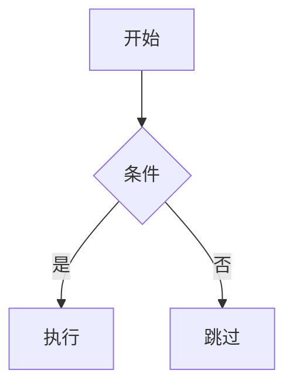
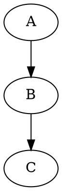

# Quartz 5 + Obsidian Vault → GitHub Pages

将 Obsidian 知识库发布为静态网站，使用 Quartz 5 构建，通过 GitHub Actions 自动部署到 GitHub Pages。

## When to Use

- 用户要求发布 Obsidian 知识库到网页
- 更新已发布的内容（同步 vault → 构建 → 推送）
- 自定义 Quartz 主题、字体、配色
- 添加/美化图表（Mermaid、ASCII、PlantUML、GraphViz）
- 排查 Quartz 构建或部署问题

**重要**：始终使用 Quartz 发布 Obsidian vault。不要从零用 Astro/Next.js/Hugo 构建——Quartz 原生支持 wikilinks、backlinks、graph view、全文搜索、LaTeX，开箱即用。

## Prerequisites

- Node.js v22+、npm v10.9.2+
- Git + GitHub CLI (`gh`)
- Obsidian vault（markdown 文件）

## Architecture

```
~/Documents/
├── ObsidianVault/          # 知识库源（SINGLE SOURCE OF TRUTH）
│   ├── concepts/           # ← 发布（Markdown → Quartz 渲染）
│   ├── entities/           # ← 发布
│   ├── comparisons/        # ← 发布
│   ├── queries/            # ← 发布
│   ├── skills/             # ← 发布
│   ├── navigation/         # ← 发布
│   ├── presentations/      # ← 发布（HTML/PDF/PPTX，Assets emitter 复制）
│   ├── index.md            # ← 发布
│   ├── raw/                # ✗ ignorePatterns 排除
│   ├── profile/            # ✗ 排除
│   ├── DailyNotes/         # ✗ 排除
│   └── SCHEMA/AGENTS/log   # ✗ 排除
│
└── quartz/                 # Quartz 项目
    ├── content/            # ← 普通目录（sync-content.sh 从 vault 复制）
    ├── sync-content.sh     # 同步脚本（vault → content/）
    ├── static/             # Quartz 自有静态资源（图标、JS 等）
    ├── quartz.config.yaml  # 站点配置
    └── .github/workflows/  # CI/CD
```\n\n**关键设计决策**：
- **Vault 是唯一实体来源**：所有人类可读内容（包括 HTML 幻灯片、PDF）都存放在 vault 中，Quartz 不存储实体文件
- **presentations/ 是 vault 一级目录**：存放 HTML 幻灯片、PDF、PPTX 等适合人类观看的素材
- **content/ 是普通目录，不是 symlink**：GitHub Actions 无法解析跨仓库 symlink，所以必须用脚本复制（`sync-content.sh`）
- **单一同步脚本**：只有 `sync-content.sh` 负责将 vault 内容复制到 Quartz，不再使用 symlink

## Procedure

### 1. 安装 Quartz

```bash
cd ~/Documents
git clone https://github.com/jackyzha0/quartz.git obsidian-quartz
cd obsidian-quartz
npm i
npx quartz plugin install --from-config
```

如果 `git clone` 超时（代理环境），用 curl 下载 zip：
```bash
curl -L -o quartz.zip https://github.com/jackyzha0/quartz/archive/refs/heads/v5.zip
unzip quartz.zip && mv quartz-v5 obsidian-quartz && rm quartz.zip
cd obsidian-quartz && npm i
```

### 2. 创建内容同步脚本

在 `obsidian-quartz/` 根目录创建 `sync-content.sh`：

```bash
#!/bin/bash
# 支持环境变量覆盖（CI 环境需要）
VAULT_DIR="${VAULT_DIR:-../ObsidianVault}"
CONTENT_DIR="content"

echo "Syncing vault content from $VAULT_DIR to $CONTENT_DIR..."

rm -rf "$CONTENT_DIR"
mkdir -p "$CONTENT_DIR"

# 同步 7 个发布目录（新增目录加在这里）
for dir in concepts entities comparisons queries skills navigation presentations; do
  [ -d "$VAULT_DIR/$dir" ] && echo "  Copying $dir/" && cp -R "$VAULT_DIR/$dir" "$CONTENT_DIR/"
done

# 同步发布文件（排除内部文件：SCHEMA.md, log.md, AGENTS.md）
for file in index.md; do
  [ -f "$VAULT_DIR/$file" ] && echo "  Copying $file" && cp "$VAULT_DIR/$file" "$CONTENT_DIR/"
done

# 清理不应发布的文件（双重保险）
find "$CONTENT_DIR" -name ".obsidian" -type d -exec rm -rf {} + 2>/dev/null || true
find "$CONTENT_DIR" -name ".DS_Store" -delete 2>/dev/null || true

echo "Sync complete!"
echo "Content summary:"
find "$CONTENT_DIR" -type f -name "*.md" | wc -l | xargs echo "  Markdown files:"
find "$CONTENT_DIR" -type f ! -name "*.md" | wc -l | xargs echo "  Non-markdown files:"
find "$CONTENT_DIR" -type d | wc -l | xargs echo "  Directories:"
```

```bash
chmod +x sync-content.sh
./sync-content.sh
```

**重要**：`content/` 是**普通目录，不是 symlink**。GitHub Actions 无法解析跨仓库 symlink，所以必须用脚本复制。

### 3. 配置 quartz.config.yaml

**个人偏好（"Midnight Scholar" 主题）**：

```yaml
configuration:
  pageTitle: Viryoke's Knowledge Base
  pageTitleSuffix: " | VKB"
  enableSPA: true
  enablePopovers: true
  analytics:
    provider: none
  locale: zh-CN
  baseUrl: viryoke.github.io/knowledge-base
  ignorePatterns:
    - private
    - templates
    - .obsidian
    - raw
    - profile
    - DailyNotes
    - node_modules
    - SCHEMA.md
    - AGENTS.md
    - log.md
    - LINT-RULES.md
  theme:
    fontOrigin: googleFonts
    cdnCaching: true
    typography:
      header: Fraunces          # editorial serif
      body: DM Sans             # clean sans
      code: JetBrains Mono      # monospace
    colors:
      lightMode:
        light: "#faf9f6"        # 暖白
        lightgray: "#e8e4df"
        gray: "#94a3b8"
        darkgray: "#334155"
        dark: "#0f172a"         # 深靛蓝
        secondary: "#0d9488"    # 深青绿（链接）
        tertiary: "#0891b2"     # 青色（hover）
        highlight: "rgba(13, 148, 136, 0.08)"
        textHighlight: "rgba(250, 204, 21, 0.25)"
      darkMode:
        light: "#0b1120"        # 午夜蓝
        lightgray: "#1a2332"
        gray: "#475569"
        darkgray: "#c8d2df"     # 柔薰衣草
        dark: "#e8edf4"
        secondary: "#818cf8"    # 靛紫（链接）
        tertiary: "#a78bfa"     # 薰衣草（hover）
        highlight: "rgba(129, 140, 248, 0.1)"
        textHighlight: "rgba(250, 204, 21, 0.15)"
```

**插件配置**：使用 `npx quartz plugin install --from-config` 从 YAML 安装。关键插件：
- `obsidian-flavored-markdown` — wikilinks、callouts、Mermaid
- `graph` — 关系图谱
- `search` — 全文搜索
- `backlinks` — 反向链接
- `latex` — KaTeX 数学公式
- `syntax-highlighting` — 代码高亮（github-light/dark）
- `encrypted-pages` — 密码保护页面

### 4. 自定义样式（custom.scss）

`quartz/styles/custom.scss` 是主要的定制入口。当前主题 "Midnight Scholar" 的关键样式模式：

**标题装饰线**：H1 下方动态宽度装饰线
```scss
h1::after {
  content: "";
  position: absolute;
  bottom: 0; left: 0;
  width: 3rem; height: 3px;
  background: var(--secondary);
  border-radius: 2px;
  transition: width 0.3s ease;
}
h1:hover::after { width: 5rem; }
```

**组件统一风格**：Explorer、TOC、Backlinks 使用圆角卡片
```scss
.explorer, .toc, .backlinks {
  border: 1px solid var(--lightgray);
  border-radius: 8px;
  background: color-mix(in srgb, var(--lightgray) 15%, var(--light));
}
```

**暗色模式特化**：
```scss
[saved-theme="dark"] {
  pre:hover { box-shadow: 0 2px 16px color-mix(in srgb, var(--secondary) 8%, transparent); }
}
```

**其他定制**：渐变分割线、自定义滚动条、图片 hover 微浮起、`prefers-reduced-motion` 支持。

完整样式见 `~/Documents/obsidian-quartz/quartz/styles/custom.scss`。

### 5. 图表美化

#### Mermaid（原生支持）

Quartz 的 `obsidian-flavored-markdown` 插件内置 Mermaid 渲染。主题色通过 CSS 变量自动适配：



custom.scss 中对 Mermaid 容器做了美化：圆角、背景色、hover 边框高亮。

#### ASCII 字符图

使用 `` ```ascii `` 或 `` ```text-diagram `` 代码块，custom.scss 提供等宽字体 + 圆角容器：

```ascii
┌────────┐    ┌────────┐
│ Input  │───▶│ Process│───▶ Output
└────────┘    └────────┘
```

#### PlantUML / GraphViz（kroki.io）

通过 `quartz/static/kroki-diagrams.js` 客户端渲染。在 Markdown 中使用：

````markdown
```plantuml
@startuml
class Transformer { +forward(input): output }
@enduml
```


````

脚本自动检测 `language-plantuml` / `language-dot` / `language-graphviz` 代码块，调用 kroki.io API 渲染为 SVG，并提供 "Show source" 切换按钮。

**注意**：kroki.io 是免费公共服务，需要联网。渲染在客户端完成，不影响构建。

### 6. 配置 GitHub Actions 部署

**重要**：如果 vault 是 private repository，需要 Personal Access Token (PAT)。

创建 `.github/workflows/deploy.yml`：

```yaml
name: Deploy Quartz site to GitHub Pages

on:
  push:
    branches: [main]
  workflow_dispatch:

permissions:
  contents: read
  pages: write
  id-token: write

concurrency:
  group: "pages"
  cancel-in-progress: false

jobs:
  build:
    runs-on: ubuntu-latest
    steps:
      - name: Checkout Quartz
        uses: actions/checkout@v4
        with:
          fetch-depth: 0

      - name: Checkout Obsidian Vault
        uses: actions/checkout@v4
        with:
          repository: viryoke/obsidian-vault  # 替换为你的 vault repo
          token: ${{ secrets.VAULT_PAT }}     # 必须是 PAT，不是 GITHUB_TOKEN
          path: vault                         # 必须在 workspace 内

      - name: Sync content from vault
        run: VAULT_DIR=vault bash sync-content.sh

      - uses: actions/setup-node@v4
        with:
          node-version: "22"
          cache: "npm"

      - name: Install dependencies
        run: npm ci

      - name: Install plugins
        run: npx quartz plugin install --from-config

      - name: Build Quartz
        run: npx quartz build

      - name: Upload artifact
        uses: actions/upload-pages-artifact@v3
        with:
          path: public

  deploy:
    needs: build
    runs-on: ubuntu-latest
    environment:
      name: github-pages
      url: ${{ steps.deployment.outputs.page_url }}
    steps:
      - name: Deploy to GitHub Pages
        id: deployment
        uses: actions/deploy-pages@v4
```

**设置 PAT secret**：

```bash
# 生成 PAT（需要 repo scope）
gh auth token

# 添加到 Quartz repo secrets
gh secret set VAULT_PAT --repo your-username/knowledge-base
```

**关键要求**：
1. **必须使用 PAT**：`GITHUB_TOKEN` 无法访问其他 private repository
2. **vault 必须在 workspace 内**：`path: vault`，不能是 `../vault` 或其他位置
3. **使用环境变量覆盖**：`VAULT_DIR=vault` 让 sync-content.sh 知道 vault 位置

启用 GitHub Pages：
```bash
gh api repos/{owner}/{repo}/pages -X POST -f build_type=workflow
```

### 7. 首次部署

```bash
# 初始化 git（如果是全新项目）
rm -rf .git && git init
git add -A && git commit -m "Initial commit"

# 创建 public repo 并推送
gh repo create knowledge-base --public --description "..." --source . --push
```

### 8. 日常更新流程

```bash
cd ~/Documents/obsidian-quartz
./sync-content.sh                    # 同步 vault 内容
npx quartz build                     # 本地验证（可选）
git add -A && git commit -m "..."
git push                             # 自动触发 GitHub Actions
```

## Quick Reference

| 命令 | 用途 |
|------|------|
| `./sync-content.sh` | 从 vault 复制公开内容到 Quartz |
| `npx quartz build` | 构建到 `public/` |
| `npx quartz build --serve --port 8080` | 构建 + 本地预览 |
| `npx quartz plugin install --from-config` | 从 YAML 安装插件 |
| `npx quartz plugin list` | 列出已安装插件 |
| `git push` | 推送触发 GitHub Actions 自动部署 |
| `gh run list --repo viryoke/knowledge-base` | 查看部署状态 |

## Personal Preferences

| 偏好 | 值 |
|------|-----|
| 站点名称 | Viryoke's Knowledge Base |
| 语言 | zh-CN |
| 标题字体 | Fraunces（editorial serif） |
| 正文字体 | DM Sans（clean sans） |
| 代码字体 | JetBrains Mono |
| 亮色模式 | 暖白底 + 深靛蓝文字 + 深青绿强调 |
| 暗色模式 | 午夜蓝底 + 柔薰衣草文字 + 靛紫强调 |
| 排除目录 | raw, profile, DailyNotes, .obsidian |
| 部署方式 | GitHub Actions（非 `npx quartz sync`） |
| 内容同步 | 复制脚本（非 symlink，GitHub Actions 限制） |
| Repo 策略 | vault private + quartz public（分离，需要 PAT） |
| 图表渲染 | Mermaid 原生 + kroki.io（PlantUML/GraphViz） |
| Footer | GitHub 链接 |

## Knowledge Base First Workflow (Critical)

**核心原则**：知识库是唯一实体来源（single source of truth），HTML 页面只是发布产物。

### 正确流程

1. **归档到知识库**：将内容写入 `queries/`、`concepts/`、`entities/` 等目录
2. **更新索引**：`index.md` 添加条目 + 更新总数，`log.md` 追加操作记录
3. **生成 HTML（如需要）**：放入 `quartz/static/presentations/` 或 `quartz/static/` 目录
4. **知识库页面链接 HTML**：在 wiki 页面中添加指向发布后 HTML 的链接
5. **Quartz 构建**：`npx quartz build` 生成静态站点
6. **部署**：`git push` 触发 GitHub Actions

### 绝对不要

- ❌ 跳过知识库归档直接生成 HTML
- ❌ 将 HTML 作为信息的唯一载体
- ❌ 让 HTML 内容与知识库脱节

### 为什么

- 知识库是长期资产，可被搜索、引用、交叉链接
- HTML 是展示层，服务于特定场景（演示、分享）
- 未来可以重新生成 HTML，但知识库条目一旦缺失就丢失了上下文

### Static HTML Artifacts

`quartz/static/` 目录用于存放不参与 Quartz 渲染的静态文件（HTML 幻灯片、交互式 demo 等）。URL pattern: `quartz/static/presentations/foo/index.html` → `https://<baseUrl>/presentations/foo/`。

## Pitfalls

1. **git clone 超时**：代理环境下用 `curl + unzip` 替代。**不要**设置 `git config --global http.proxy`（TUN 模式下会冲突）。

2. **SCSS @import 顺序**：`custom.scss` 中 `@use` 必须在最前面。不要用 `@import url()` 加载字体——用 `theme.fontOrigin: googleFonts` 配置。

3. **CSS 变量名**：Quartz 用 `--bodyFont`、`--headerFont`、`--codeFont`，**不是** `--font-body`、`--font-header`。

4. **symlink + git 警告**：用 `content/` symlink 时，git 会显示大量 "deleted" 状态（因为从普通目录变成了链接）。**不要** `git add -A`——只 stage 实际修改的文件（如 `quartz/plugins/emitters/assets.ts`）。

5. **插件 barrel 文件**：`.quartz/plugins/index.ts` 必须存在。如果 `npx quartz plugin install` 超时，手动创建最小 barrel。

6. **satori 依赖**：og-image 插件需要 `npm install satori`。

7. **ignorePatterns**：排除 `raw/`、`DailyNotes/`、`profile/`、`.obsidian`——**不要**排除 `presentations/`（那是需要发布的演示文稿）。

8. **GitHub Pages 需要 public repo**：免费账户的 GitHub Pages 只能在 public repo 上启用。vault repo 保持 private，用独立 public repo 存放 Quartz 项目。

9. **kroki.io 需要联网**：PlantUML/GraphViz 渲染在客户端调用 kroki.io API，离线环境不工作。Mermaid 和 ASCII 不受影响。

14. **Kroki.io diagram rendering — use POST API, not GET URLs**:
    - **GET URLs with deflate+base64url encoding frequently return 400 errors**, especially with Chinese characters, complex syntax, or encoding mismatches.
    - **POST API is reliable**: send plain text source in the request body, get SVG back.
    - Some diagram languages (blockdiag, seqdiag, actdiag) return HTTP 200 with **empty response body** — they have service issues on the public Kroki instance. Replace with working alternatives (nomnoml, etc.).
    - Test each diagram language with curl before embedding: `curl -X POST -H "Content-Type: text/plain" -d '<source>' https://kroki.io/<lang>/svg`

**Recommended Kroki template** (POST-based, verified working):

```html
<!DOCTYPE html>
<html lang="zh-CN">
<head>
    <meta charset="UTF-8">
    <title>Kroki Diagrams</title>
    <style>
        .diagram-body.loading { background: #f0f0f0; color: #999; font-family: monospace; }
        .diagram-body img { max-width: 100%; height: auto; }
    </style>
</head>
<body>
    <div id="mermaid-diagram" class="diagram-body loading">Loading...</div>
    
    <script>
    const diagrams = {
        'mermaid-diagram': {
            lang: 'mermaid',
            source: `graph TD
    A[Client] --> B[Server]
    B --> C[Database]`
        }
        // Add more diagrams here
    };

    // Use POST requests — no encoding needed, no pako dependency
    window.addEventListener('load', async () => {
        for (const [id, { lang, source }] of Object.entries(diagrams)) {
            const container = document.getElementById(id);
            try {
                const response = await fetch(`https://kroki.io/${lang}/svg`, {
                    method: 'POST',
                    headers: { 'Content-Type': 'text/plain' },
                    body: source
                });
                if (!response.ok) {
                    throw new Error(`HTTP ${response.status}: ${response.statusText}`);
                }
                const svgText = await response.text();
                if (!svgText) throw new Error('Empty response from Kroki');
                const blob = new Blob([svgText], { type: 'image/svg+xml' });
                const url = URL.createObjectURL(blob);
                const img = new Image();
                img.onload = () => {
                    container.classList.remove('loading');
                    container.appendChild(img);
                };
                img.src = url;
            } catch (error) {
                container.innerHTML = `<span style="color:red;">渲染失败: ${error.message}</span>`;
                console.error(`Error for ${lang}:`, error);
            }
        }
    });
    </script>
</body>
</html>
```

**Why POST over GET**:
1. No encoding complexity (no deflate, no base64url, no pako dependency)
2. Chinese characters and special syntax work correctly
3. Easier to debug (plain text in request body)
4. Still works for all supported diagram languages

**Known service issues** (public kroki.io instance, may change):
- blockdiag: returns 200 with empty body
- seqdiag: returns 200 with empty body
- actdiag: returns 200 with empty body
- Use nomnoml, mermaid, plantuml, d2, graphviz, c4plantuml as reliable alternatives

10. **Quartz 5 Assets emitter 丢失 HTML 扩展名**：`slugifyFilePath()` 会去掉 `.html`，导致 `public/presentations/foo.html` 变成 `public/presentations/foo`。必须 patch `quartz/plugins/emitters/assets.ts` 的 `copyFile` 函数，对 `.html/.htm/.pdf/.pptx/.ppt/.key` 保留扩展名。见下方 "Assets Emitter Extension Fix" 章节。

11. **GitHub Actions 无法访问 private vault**：`GITHUB_TOKEN` 只能访问当前 repository，无法 checkout 其他 private repository。**必须使用 Personal Access Token (PAT)**。创建 PAT 后通过 `gh secret set VAULT_PAT` 添加到 Quartz repo secrets。

12. **GitHub Actions checkout path 必须在 workspace 内**：vault checkout 的 `path` 必须是 workspace 内的相对路径（如 `vault`），不能是 `../vault` 或其他位置，否则会报错 "Repository path is not under workspace"。

13. **sync-content.sh 需要环境变量支持**：CI 环境中 vault 位置可能不是默认的 `../ObsidianVault`，脚本必须支持 `VAULT_DIR` 环境变量覆盖：`VAULT_DIR="${VAULT_DIR:-../ObsidianVault}"`。

## Assets Emitter Extension Fix

**问题**：Quartz 5 的 `Assets` emitter 使用 `slugifyFilePath()` 从 `@quartz-community/utils`，该函数会去掉文件扩展名。对于 HTML 幻灯片，这导致输出文件没有 `.html` 后缀，浏览器无法正确识别。

**修复**：修改 `quartz/plugins/emitters/assets.ts` 中的 `copyFile` 函数：

```typescript
const copyFile = async (argv: Argv, fp: FilePath) => {
  const src = joinSegments(argv.directory, fp) as FilePath
  
  // 保留演示文稿类文件的扩展名（HTML、PDF 等）
  const ext = path.extname(fp).toLowerCase()
  const preserveExtensions = ['.html', '.htm', '.pdf', '.pptx', '.ppt', '.key']
  
  let name: string
  if (preserveExtensions.includes(ext)) {
    const slugified = slugifyFilePath(fp)
    name = (slugified + ext) as FilePath
  } else {
    name = slugifyFilePath(fp)
  }
  
  const dest = joinSegments(argv.output, name) as FilePath
  const dir = path.dirname(dest) as FilePath
  await fs.promises.mkdir(dir, { recursive: true })
  await fs.promises.copyFile(src, dest)
  return dest
}
```

**验证**：构建后检查 `public/presentations/` 目录，HTML 文件应有 `.html` 扩展名。

## Verification

### 本地验证
- `./sync-content.sh` 显示同步统计（markdown/non-markdown/directories）
- `npx quartz build` 无错误完成
- `http://localhost:8080` 显示知识库首页
- Wikilinks 正确解析
- Graph view 显示节点和连线
- 搜索返回已知关键词结果
- 暗色模式切换正常
- Mermaid 图表正确渲染

### GitHub Actions 验证
- `git push` 后 GitHub Actions 构建成功
- `gh run view` 显示所有步骤均为 ✓（特别是 "Checkout Obsidian Vault" 和 "Sync content from vault"）
- `gh run view --log` 显示 `Syncing vault content from vault to content...` 和同步统计
- GitHub Pages 部署后，访问 `https://username.github.io/knowledge-base/` 显示正确内容
- 访问 `https://username.github.io/knowledge-base/presentations/foo.html` 确认 HTML 幻灯片可访问（有 `.html` 扩展名）

## References

- `references/setup-pitfalls.md` — 详细排障记录
- `references/github-pages-setup.md` — GitHub Pages 配置与自定义域名
- `references/github-actions-pat-setup.md` — GitHub Actions 访问 private vault 的 PAT 配置指南
