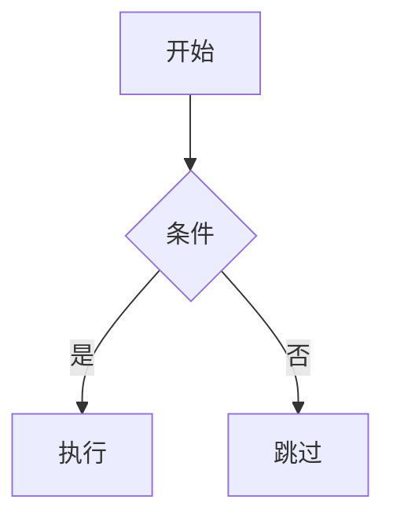
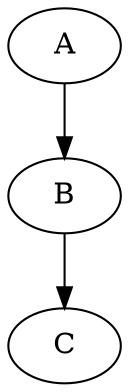

# Quartz 5 + Obsidian Vault → GitHub Pages

将 Obsidian 知识库发布为静态网站，使用 Quartz 5 构建，通过 GitHub Actions 自动部署到 GitHub Pages。

## When to Use

- 用户要求发布 Obsidian 知识库到网页
- 更新已发布的内容（同步 vault → 构建 → 推送）
- 自定义 Quartz 主题、字体、配色
- 添加/美化图表（Mermaid、ASCII、PlantUML、GraphViz）
- 排查 Quartz 构建或部署问题

**重要**：始终使用 Quartz 发布 Obsidian vault。不要从零用 Astro/Next.js/Hugo 构建——Quartz 原生支持 wikilinks、backlinks、graph view、全文搜索、LaTeX，开箱即用。

## Prerequisites

- Node.js v22+、npm v10.9.2+
- Git + GitHub CLI (`gh`)
- Obsidian vault（markdown 文件）

## Architecture

```
~/Documents/
├── ObsidianVault/          # 知识库源（private repo）
│   ├── concepts/           # ← 发布
│   ├── entities/           # ← 发布
│   ├── comparisons/        # ← 发布
│   ├── queries/            # ← 发布
│   ├── skills/             # ← 发布
│   ├── navigation/         # ← 发布
│   ├── index.md            # ← 发布
│   ├── SCHEMA.md           # ← 发布
│   ├── raw/                # ✗ 不发布
│   ├── profile/            # ✗ 不发布
│   ├── DailyNotes/         # ✗ 不发布
│   └── presentations/      # ✗ 不发布
│
└── obsidian-quartz/        # Quartz 项目（public repo）
    ├── content/            # ← sync-content.sh 复制目标
    ├── quartz.config.yaml  # 站点配置
    ├── quartz/styles/custom.scss  # 自定义样式
    ├── quartz/static/kroki-diagrams.js  # 图表渲染脚本
    ├── .github/workflows/deploy.yml  # CI/CD
    └── sync-content.sh     # 内容同步脚本
```

**关键设计决策**：
- Vault repo 保持 private，Quartz repo 为 public
- 内容通过 `sync-content.sh` 复制（非 symlink），确保 git 追踪正常
- GitHub Actions 自动构建部署，不依赖 `npx quartz sync`

## Procedure

### 1. 安装 Quartz

```bash
cd ~/Documents
git clone https://github.com/jackyzha0/quartz.git obsidian-quartz
cd obsidian-quartz
npm i
npx quartz plugin install --from-config
```

如果 `git clone` 超时（代理环境），用 curl 下载 zip：
```bash
curl -L -o quartz.zip https://github.com/jackyzha0/quartz/archive/refs/heads/v5.zip
unzip quartz.zip && mv quartz-v5 obsidian-quartz && rm quartz.zip
cd obsidian-quartz && npm i
```

### 2. 创建内容同步脚本

在 `obsidian-quartz/` 根目录创建 `sync-content.sh`：

```bash
#!/bin/bash
VAULT_DIR="../ObsidianVault"
CONTENT_DIR="content"

rm -rf "$CONTENT_DIR"
mkdir -p "$CONTENT_DIR"

for dir in concepts entities comparisons queries skills navigation; do
  [ -d "$VAULT_DIR/$dir" ] && cp -R "$VAULT_DIR/$dir" "$CONTENT_DIR/"
done

for file in index.md SCHEMA.md; do
  [ -f "$VAULT_DIR/$file" ] && cp "$VAULT_DIR/$file" "$CONTENT_DIR/"
done
```

```bash
chmod +x sync-content.sh
./sync-content.sh
```

### 3. 配置 quartz.config.yaml

**个人偏好（"Midnight Scholar" 主题）**：

```yaml
configuration:
  pageTitle: Viryoke's Knowledge Base
  pageTitleSuffix: " | VKB"
  enableSPA: true
  enablePopovers: true
  analytics:
    provider: none
  locale: zh-CN
  baseUrl: viryoke.github.io/knowledge-base
  ignorePatterns:
    - private
    - templates
    - .obsidian
    - raw
    - profile
    - DailyNotes
    - presentations
    - node_modules
  theme:
    fontOrigin: googleFonts
    cdnCaching: true
    typography:
      header: Fraunces          # editorial serif
      body: DM Sans             # clean sans
      code: JetBrains Mono      # monospace
    colors:
      lightMode:
        light: "#faf9f6"        # 暖白
        lightgray: "#e8e4df"
        gray: "#94a3b8"
        darkgray: "#334155"
        dark: "#0f172a"         # 深靛蓝
        secondary: "#0d9488"    # 深青绿（链接）
        tertiary: "#0891b2"     # 青色（hover）
        highlight: "rgba(13, 148, 136, 0.08)"
        textHighlight: "rgba(250, 204, 21, 0.25)"
      darkMode:
        light: "#0b1120"        # 午夜蓝
        lightgray: "#1a2332"
        gray: "#475569"
        darkgray: "#c8d2df"     # 柔薰衣草
        dark: "#e8edf4"
        secondary: "#818cf8"    # 靛紫（链接）
        tertiary: "#a78bfa"     # 薰衣草（hover）
        highlight: "rgba(129, 140, 248, 0.1)"
        textHighlight: "rgba(250, 204, 21, 0.15)"
```

**插件配置**：使用 `npx quartz plugin install --from-config` 从 YAML 安装。关键插件：
- `obsidian-flavored-markdown` — wikilinks、callouts、Mermaid
- `graph` — 关系图谱
- `search` — 全文搜索
- `backlinks` — 反向链接
- `latex` — KaTeX 数学公式
- `syntax-highlighting` — 代码高亮（github-light/dark）
- `encrypted-pages` — 密码保护页面

### 4. 自定义样式（custom.scss）

`quartz/styles/custom.scss` 是主要的定制入口。当前主题 "Midnight Scholar" 的关键样式模式：

**标题装饰线**：H1 下方动态宽度装饰线
```scss
h1::after {
  content: "";
  position: absolute;
  bottom: 0; left: 0;
  width: 3rem; height: 3px;
  background: var(--secondary);
  border-radius: 2px;
  transition: width 0.3s ease;
}
h1:hover::after { width: 5rem; }
```

**组件统一风格**：Explorer、TOC、Backlinks 使用圆角卡片
```scss
.explorer, .toc, .backlinks {
  border: 1px solid var(--lightgray);
  border-radius: 8px;
  background: color-mix(in srgb, var(--lightgray) 15%, var(--light));
}
```

**暗色模式特化**：
```scss
[saved-theme="dark"] {
  pre:hover { box-shadow: 0 2px 16px color-mix(in srgb, var(--secondary) 8%, transparent); }
}
```

**其他定制**：渐变分割线、自定义滚动条、图片 hover 微浮起、`prefers-reduced-motion` 支持。

完整样式见 `~/Documents/obsidian-quartz/quartz/styles/custom.scss`。

### 5. 图表美化

#### Mermaid（原生支持）

Quartz 的 `obsidian-flavored-markdown` 插件内置 Mermaid 渲染。主题色通过 CSS 变量自动适配：



custom.scss 中对 Mermaid 容器做了美化：圆角、背景色、hover 边框高亮。

#### ASCII 字符图

使用 `` ```ascii `` 或 `` ```text-diagram `` 代码块，custom.scss 提供等宽字体 + 圆角容器：

```ascii
┌────────┐    ┌────────┐
│ Input  │───▶│ Process│───▶ Output
└────────┘    └────────┘
```

#### PlantUML / GraphViz（kroki.io）

通过 `quartz/static/kroki-diagrams.js` 客户端渲染。在 Markdown 中使用：

````markdown
```plantuml
@startuml
class Transformer { +forward(input): output }
@enduml
```


````

脚本自动检测 `language-plantuml` / `language-dot` / `language-graphviz` 代码块，调用 kroki.io API 渲染为 SVG，并提供 "Show source" 切换按钮。

**注意**：kroki.io 是免费公共服务，需要联网。渲染在客户端完成，不影响构建。

### 6. 配置 GitHub Actions 部署

创建 `.github/workflows/deploy.yml`：

```yaml
name: Deploy Quartz site to GitHub Pages
on:
  push:
    branches: [main]
  workflow_dispatch:
permissions:
  contents: read
  pages: write
  id-token: write
concurrency:
  group: "pages"
  cancel-in-progress: false
jobs:
  build:
    runs-on: ubuntu-latest
    steps:
      - uses: actions/checkout@v4
        with: { fetch-depth: 0 }
      - uses: actions/setup-node@v4
        with: { node-version: "22", cache: "npm" }
      - run: npm ci
      - run: npx quartz plugin install --from-config
      - run: npx quartz build
      - uses: actions/upload-pages-artifact@v3
        with: { path: public }
  deploy:
    needs: build
    runs-on: ubuntu-latest
    environment:
      name: github-pages
      url: ${{ steps.deployment.outputs.page_url }}
    steps:
      - uses: actions/deploy-pages@v4
```

启用 GitHub Pages：
```bash
gh api repos/{owner}/{repo}/pages -X POST -f build_type=workflow
```

### 7. 首次部署

```bash
# 初始化 git（如果是全新项目）
rm -rf .git && git init
git add -A && git commit -m "Initial commit"

# 创建 public repo 并推送
gh repo create knowledge-base --public --description "..." --source . --push
```

### 8. 日常更新流程

```bash
cd ~/Documents/obsidian-quartz
./sync-content.sh                    # 同步 vault 内容
npx quartz build                     # 本地验证（可选）
git add -A && git commit -m "..."
git push                             # 自动触发 GitHub Actions
```

## Quick Reference

| 命令 | 用途 |
|------|------|
| `./sync-content.sh` | 从 vault 复制公开内容到 Quartz |
| `npx quartz build` | 构建到 `public/` |
| `npx quartz build --serve --port 8080` | 构建 + 本地预览 |
| `npx quartz plugin install --from-config` | 从 YAML 安装插件 |
| `npx quartz plugin list` | 列出已安装插件 |
| `git push` | 推送触发 GitHub Actions 自动部署 |
| `gh run list --repo viryoke/knowledge-base` | 查看部署状态 |

## Personal Preferences

| 偏好 | 值 |
|------|-----|
| 站点名称 | Viryoke's Knowledge Base |
| 语言 | zh-CN |
| 标题字体 | Fraunces（editorial serif） |
| 正文字体 | DM Sans（clean sans） |
| 代码字体 | JetBrains Mono |
| 亮色模式 | 暖白底 + 深靛蓝文字 + 深青绿强调 |
| 暗色模式 | 午夜蓝底 + 柔薰衣草文字 + 靛紫强调 |
| 排除目录 | raw, profile, DailyNotes, presentations, .obsidian |
| 部署方式 | GitHub Actions（非 `npx quartz sync`） |
| 内容同步 | 复制脚本（非 symlink） |
| Repo 策略 | vault private + quartz public（分离） |
| 图表渲染 | Mermaid 原生 + kroki.io（PlantUML/GraphViz） |
| Footer | GitHub 链接 |

## Pitfalls

1. **git clone 超时**：代理环境下用 `curl + unzip` 替代。**不要**设置 `git config --global http.proxy`（TUN 模式下会冲突）。

2. **SCSS @import 顺序**：`custom.scss` 中 `@use` 必须在最前面。不要用 `@import url()` 加载字体——用 `theme.fontOrigin: googleFonts` 配置。

3. **CSS 变量名**：Quartz 用 `--bodyFont`、`--headerFont`、`--codeFont`，**不是** `--font-body`、`--font-header`。

4. **symlink + git 警告**：如果用 symlink 方式链接内容，git 会报 untracked 警告。改用复制脚本可避免。

5. **插件 barrel 文件**：`.quartz/plugins/index.ts` 必须存在。如果 `npx quartz plugin install` 超时，手动创建最小 barrel。

6. **satori 依赖**：og-image 插件需要 `npm install satori`。

7. **ignorePatterns**：始终排除 `raw/`、`DailyNotes/`、`profile/`、`presentations/`、`.obsidian`——这些是内部文件。

8. **GitHub Pages 需要 public repo**：免费账户的 GitHub Pages 只能在 public repo 上启用。vault repo 保持 private，用独立 public repo 存放 Quartz 项目。

9. **kroki.io 需要联网**：PlantUML/GraphViz 渲染在客户端调用 kroki.io API，离线环境不工作。Mermaid 和 ASCII 不受影响。

## Verification

- `npx quartz build` 无错误完成
- `http://localhost:8080` 显示知识库首页
- Wikilinks 正确解析
- Graph view 显示节点和连线
- 搜索返回已知关键词结果
- 暗色模式切换正常
- Mermaid 图表正确渲染
- `git push` 后 GitHub Actions 构建成功
- `gh run view` 显示 build + deploy 均为 ✓

## References

- `references/setup-pitfalls.md` — 详细排障记录
- `references/github-pages-setup.md` — GitHub Pages 配置与自定义域名
